# xdec

**通用、自包含的多级 IL 反编译器** — 将 AArch64 机器码提升为类型化中间表示，化简混淆控制流与 MBA 表达式，输出可读的结构化 C 代码。

当前回归状态：**eval 98/98**（baseline）· **eval 38/38**（typed）· **samples 9/9** · **695 个单元测试**

---

## 核心能力

| 能力 | 说明 |
|------|------|
| **多级 IL** | Lifted → Local → CFG → SSA → Resolved → Vars → Structured → Typed；每个成熟度层级可独立查看、文本可 round-trip |
| **OLLVM 扁平化** | 识别 dispatcher hub、scatter-dispatcher 区域、内联 switch case handler、生成 `while(true) + switch(state)` |
| **MBA 化简** | 代数重写规则（随机绑定 oracle 证明正确性）折叠混淆算术；mega-block 安全路径避免 5000+ 指令块 hang |
| **间接分支解析** | 跳转表识别、边界分析（含互补 cset、loop-carried phi）、迭代 driver 发现并提升新可达代码 |
| **Syscall 恢复** | `svc` → 带类型的 `sys_write(...)` 命名调用（AArch64 Linux 系统调用表） |
| **类型导入** | 可选 C 头文件预设（`android-ndk`）改善函数签名、结构体字段访问、callee 命名 |
| **结构化 C 输出** | `if/else`、`while`、`switch` — 能恢复的结构就不输出 goto；短名 helper 通过 `xdec_helpers.h` 提供 |
| **库 API** | `decompile()`（Vars IL）与 `decompileToC()`（完整流水线 → C 文本），供测试、插件宿主、自动化工具直接调用 |
| **插件系统** | `--plugin` 加载外部 pass；核心保持通用，样本特化逻辑留在插件侧（见 [docs/00-core-vs-plugin-prompt.md](docs/00-core-vs-plugin-prompt.md)） |

---

## 目标平台

| | 状态 |
|---|---|
| **架构** | AArch64（主要支持） |
| **二进制格式** | ELF64（`.so`、可执行文件）、Mach-O（iOS/macOS 可执行文件与 dylib）、dyld shared cache（只读元数据 + 按需加载） |
| **平台配置** | Android NDK / AArch64 Linux / iOS Mach-O — 由 `TargetProfile` 从镜像自动推断，无需手动指定 |
| **EntryReg** | iOS 平台 loader 泄漏的入口寄存器（x21/x22 dyld 基址、x28 内核残留）通过 sidecar / companion 镜像解析（见 [docs/21-entry-reg-platform.md](docs/21-entry-reg-platform.md)） |
| **混淆类型** | OLLVM 控制流扁平化、scatter-dispatcher、MBA、不透明谓词 |

x86 及其他架构暂不支持；IL 与 spec 框架可通过新增 `.xspec` 与 target profile 扩展。

---

## 快速开始

### 环境要求

- **CMake** ≥ 3.24、**Ninja**、**C++20** 编译器（已测试 GCC 14+ / Clang 16+）
- **Catch2** — 本地未安装时自动拉取

### 构建

```powershell
cd xdec
cmake --preset gcc-debug          # 或：cmake -B build/dev -G Ninja
cmake --build build/dev
```

CLI 位于 `build/dev/bin/xdec.exe`。构建时会将 `xdec_helpers.h` 复制到同目录，供反编译输出直接 `#include`。

### 反编译一个函数

**Android ELF `.so`** — 类型表与 syscall 表自动推断：

```powershell
.\build\dev\bin\xdec.exe decompile libsdk_bc_lib.so 0x2a2428 -o sub_2a2428.c
```

**iOS Mach-O** — 可选 companion 镜像（dyld）与 entry sidecar 改善 EntryReg 解析：

```powershell
# 将 dyld 文件放在 absd 同目录，或提供 absd.entry.json sidecar
.\build\dev\bin\xdec.exe decompile absd 0x100023290 -o start.c --rounds 4 --allow-unresolved
```

常用选项：

```
-o <file.c>                  输出到文件
--rounds <n>                  不动点轮次上限（默认 8；显式指定时不再自动延长）
--allow-unresolved            将无法解析的间接分支标记为 opaque，而非失败退出
--discovery-cap <n>           单条分支每轮最多贡献的目标数（0 = 无限制）
--max-span <bytes>            硬性丢弃超出 entry+bytes 的发现（enforce fence）
--types <header|preset>       导入 C 声明（可重复指定）
--syscall-table <name|none>   系统调用编号表（默认 aarch64-linux）
--helpers-header <path|none>  helper 头文件路径（默认 xdec_helpers.h）
--arg-naming <indexed|reg>    参数命名风格（默认 indexed: arg1, arg2, ...）
--security-hints <comment|keep>  安全相关 hint 输出为注释或保留
--dump-il                     在 C 输出前打印最终 IL
--reuse-report                统计同块内子表达式重复
--emit-report                 统计 emit 阶段冗余临时量形状
--no-annotate                 省略基本块地址注释
```

环境变量：

| 变量 | 用途 |
|------|------|
| `XDEC_LOG=pass=debug,local=debug` | pass 级诊断日志 |
| `XDEC_SPEC=<file.xspec>` | 覆盖架构 spec |
| `XDEC_ENTRY_SIDECAR=<path>` | 指定 EntryReg sidecar JSON |
| `XDEC_SAMPLE_<KEY>=<path>` | L1 样本二进制路径（见 [samples/README.md](samples/README.md)） |

---

## 反编译流水线

```mermaid
flowchart LR
  BIN["ELF / Mach-O / dyld cache"] --> LOAD["BinaryImage\n+ CompositeByteReader"]
  LOAD --> LIFT["提升 Lift\n(specs/arm64)"]
  LIFT --> LOCAL["局部化简\nMBA + copyprop"]
  LOCAL --> RESOLVE["间接分支解析\n跳转表 + EntryReg"]
  RESOLVE --> SSA["SSA 构建\n+ 优化"]
  SSA --> VARS["变量恢复\n+ 类型应用\n+ 栈槽指针提升"]
  VARS --> STRUCT["结构化\nif/while/switch"]
  STRUCT --> ERE["ERE 预扫描\ndead spill + load 内联"]
  ERE --> EMIT["C 输出\n+ store/CSE 合并"]
  EMIT --> OUT["*.c + xdec_helpers.h"]
```



**Driver**（`decompile/driver.cpp`）以不动点循环运行 lift → simplify → resolve：每轮解析出的新分支可能暴露更多代码，继续提升与化简，直到收敛或达到轮次上限。单轮内还有 settle 循环 — 同一轮中持续发现新目标时继续提升，避免「每跳一层多耗一轮」。

**BinaryImage**（`src/binary/`）统一 ELF、Mach-O、dyld cache 的段/符号/重定位视图；Mach-O 支持 rebase/bind 解释、LC_DYLD_CHAINED_FIXUPS 解码；companion 镜像通过 `CompositeByteReader` 叠加到主镜像之上，供 EntryReg 与跨镜像指针解析使用。

**stack-load-fold**（`analysis/stack_load_fold.h`，见 [docs/12-stack-load-fold.md](docs/12-stack-load-fold.md)）不是流水线里的独立 pass，而是 VARS 与 EMIT 两处共用的一份分析。

**ERE**（Emit Redundancy Elimination，见 [docs/14-emit-redundancy.md](docs/14-emit-redundancy.md)）是 `CContext` 构造阶段跑的一组预扫描，在打印真正开始前消除冗余栈槽 load、死 spill store 等。

---

## 库 API

核心反编译不依赖 CLI，可直接链接 `xdec_decompile`：

```cpp
#include "xdec/decompile/emit.h"

xdec::pass::Registry registry;
xdec::passes::registerBuiltinPasses(registry);

xdec::decompile::DecompileToCOptions opts;
opts.driver.maxRounds = 8;
opts.driver.sealUnresolvedBranches = true;

auto result = xdec::decompile::decompileToC(engine, reader, entry, registry, opts);
// result->cSource       — 结构化 C 文本
// result->function      — Vars 成熟度 IL
// result->structured    — Stmt AST（不经 maturity ratchet）
// result->driverReport  — 轮次、发现地址、收敛状态
```

`decompile()`（[include/xdec/decompile/driver.h](include/xdec/decompile/driver.h)）只驱动到 Vars IL；`decompileToC()`（[include/xdec/decompile/emit.h](include/xdec/decompile/emit.h)）在其后串联 stack frame、dominators、structurizer、C printer。

---

## CLI 命令

| 命令 | 用途 |
|------|------|
| `decompile <binary> <addr>` | 完整流水线 → 结构化 C |
| `observe <binary> <addr>` | 逐步运行 pass，dump 每个成熟度层级 |
| `lift <binary> <addr> <n>` | 提升 *n* 条指令，打印 IL |
| `disasm <binary> <addr> <n>` | 反汇编 *n* 条指令 |
| `info / sections / symbols / relocs` | 查看二进制镜像信息 |
| `read <binary> <addr> <size>` | hex dump 统一内存视图 |
| `memdump <binary> <out>` | 导出重定位后的内存视图（供模拟器使用） |
| `exec <binary> <workload>` | 对脚本化状态执行基本块 |
| `types parse <header>...` | 解析并报告导入的 C 类型 |
| `coverage <binary>` | 报告 spec 未覆盖的指令模式 |
| `spec <file.xspec>` | 校验架构 spec |
| `decode` | 从 stdin 解码 hex 字（fuzzer 接口） |

运行 `xdec help` 查看完整命令列表。

---

## 反编译 C 输出

生成的 `.c` 文件包含标准头文件，按需附加：

```c
#include "xdec_helpers.h"   /* rotr32, bswap64, cc_lt32, ... */
```

可移植语义（`rotr32`、`bswap32`、`popcount64`、溢出精确条件码）在头文件中完整定义；目标相关 stub（`xdec_clz32`、`xdec_mulhiu64`、浮点运算）仅声明，由 embedder 实现。详见 [docs/11-helpers-header.md](docs/11-helpers-header.md)。

---

## 项目结构

```
xdec/
├── specs/arm64/        架构 spec 模块（branch、loadstore、simd 等 .xspec）
├── include/xdec/       公共头文件 + xdec_helpers.h
├── src/
│   ├── binary/         ELF / Mach-O / dyld cache 加载、TargetProfile、CompositeByteReader
│   ├── spec/           提升引擎（DSL → 机器语义）
│   ├── il/             中间表示
│   ├── passes/         优化与去混淆 pass
│   ├── analysis/       CFG、支配树、跳转表、dispatcher 形状、EntryReg 等
│   ├── decompile/      多轮发现 driver + decompileToC API
│   ├── emit/           结构化器 + C 打印器
│   ├── plugin/         插件 ABI 与加载器
│   └── tools/          xdec CLI
├── types/              类型数据库、syscall 表、NDK 预设
├── eval/               L0 回归：98 个有 ground-truth 的函数
├── samples/            L1 回归：9 个真实混淆二进制（ELF + Mach-O）
├── tests/              695 个 Catch2 单元测试
├── tools/              iOS 调试辅助脚本等
└── docs/               设计文档（00–21）
```

CMake 库目标（由细到粗）：`xdec_support` → `xdec_binary` → `xdec_il` → `xdec_spec` → `xdec_types` → `xdec_analysis` → `xdec_pass` → `xdec_passes` → `xdec_emit` → `xdec_decompile` → `xdec`（CLI）。

---

## 测试

### 单元测试

```powershell
cmake --build build/dev --target xdec_tests
.\build\dev\bin\xdec_tests.exe
```

### L0 — eval（ground-truth 语料）

用 Android NDK 从已知 C 源码编译，对照 `eval/manifest.json` 中的结构期望评分。

```powershell
cd eval
.\build.ps1           # 需要 Android NDK
.\run.ps1             # baseline：98/98
.\run.ps1 -Typed      # typed：  38/38
```

默认 NDK 路径：`%LOCALAPPDATA%\Android\Sdk\ndk\27.2.12479018`（可用 `build.ps1 -NdkRoot` 覆盖）。

### L1 — samples（真实二进制）

对本地提供的混淆二进制评分反编译*形状*（goto 数、switch 数、行数等）——二进制不入库。

```powershell
# 复制 samples/local.example.json → samples/local.json 并填写二进制路径
# iOS Mach-O 可选：samples/fixtures/absd.entry.json.example → absd.entry.json
.\samples\run.ps1     # 9/9
```

添加新 case 见 [samples/README.md](samples/README.md)。

---

## 文档

| 文档 | 主题 |
|------|------|
| [00-core-vs-plugin-prompt.md](docs/00-core-vs-plugin-prompt.md) | 核心 vs 插件边界、开发约束 |
| [01-il-spec.md](docs/01-il-spec.md) | IL 设计：hash-cons 表达式、惰性标志位、文本 round-trip |
| [05-deobfuscation.md](docs/05-deobfuscation.md) | MBA 代数、跳转表、发现循环 |
| [06-type-import.md](docs/06-type-import.md) | 头文件导入与类型绑定 |
| [07-syscall.md](docs/07-syscall.md) | Syscall ABI 建模与恢复 |
| [08-tailcall.md](docs/08-tailcall.md) | 尾调用识别 |
| [09-expression-reuse.md](docs/09-expression-reuse.md) | CSE / 子表达式共享 |
| [10-import-resolution.md](docs/10-import-resolution.md) | PLT/GOT 导入 callee 命名 |
| [11-helpers-header.md](docs/11-helpers-header.md) | Helper 命名与 `xdec_helpers.h` |
| [12-stack-load-fold.md](docs/12-stack-load-fold.md) | 栈槽 load 内联 |
| [14-emit-redundancy.md](docs/14-emit-redundancy.md) | Emit 冗余消除 |
| [16-guard-cascade.md](docs/16-guard-cascade.md) | Guard cascade 结构化 |
| [17-dispatch-region.md](docs/17-dispatch-region.md) | DispatchRegion 分析 |
| [19-scatter-dispatch-target-shape.md](docs/19-scatter-dispatch-target-shape.md) | Scatter-dispatcher 目标形状 |
| [20-absd-entry-registers.md](docs/20-absd-entry-registers.md) | iOS absd EntryReg 分析 |
| [21-entry-reg-platform.md](docs/21-entry-reg-platform.md) | EntryReg 平台锚点与 sidecar 机制 |
| [eval/FINDINGS.md](eval/FINDINGS.md) | 回归历史、性能记录、OLLVM 优化日志 |

架构 spec DSL 参考：[docs/02-dsl-ref.md](docs/02-dsl-ref.md)、[docs/03-spec-compiler.md](docs/03-spec-compiler.md)。

---

## 许可证

仓库尚未包含 License 文件。使用条款请联系仓库维护者。
