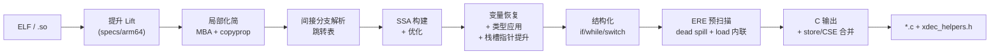

# xdec

**通用、自包含的多级 IL 反编译器** — 将 AArch64 机器码提升为类型化中间表示，化简混淆控制流与 MBA 表达式，输出可读的结构化 C 代码。

当前回归状态：**eval 96/96**（baseline）· **eval 36/36**（typed）· **samples 4/4** · **483 个单元测试**

---

## 核心能力

| 能力 | 说明 |
|------|------|
| **多级 IL** | Lifted → Local → CFG → SSA → Resolved → Vars → Structured → Typed；每个成熟度层级可独立查看、文本可 round-trip |
| **OLLVM 扁平化** | 识别 dispatcher hub、内联 switch case handler、生成 `while(true) + switch(state)`、抑制 live-register phi 噪声 |
| **MBA 化简** | 代数重写规则（随机绑定 oracle 证明正确性）折叠混淆算术；mega-block 安全路径避免 5000+ 指令块 hang |
| **间接分支解析** | 跳转表识别、边界分析、迭代 driver 发现并提升新可达代码 |
| **Syscall 恢复** | `svc` → 带类型的 `sys_write(...)` 命名调用（AArch64 Linux 系统调用表） |
| **类型导入** | 可选 C 头文件预设（`android-ndk`）改善函数签名、结构体字段访问、callee 命名 |
| **结构化 C 输出** | `if/else`、`while`、`switch` — 能恢复的结构就不输出 goto；短名 helper 通过 `xdec_helpers.h` 提供 |

---

## 快速开始

### 环境要求

- **CMake** ≥ 3.24、**Ninja**、**C++20** 编译器（已测试 GCC 14+ / Clang 16+）
- **Catch2** — 本地未安装时自动拉取

### 构建

```powershell
cd xdec
cmake --preset gcc-debug          # 或：cmake -B build/dev -G Ninja
cmake --build build/dev
```

CLI 位于 `build/dev/bin/xdec.exe`。构建时会将 `xdec_helpers.h` 复制到同目录，供反编译输出直接 `#include`。

### 反编译一个函数

```powershell
.\build\dev\bin\xdec.exe decompile path\to\lib.so 0x2a2428 -o out.c
```

对 AArch64 Android `.so`，类型表与 syscall 表会自动推断，无需额外参数：

```powershell
.\build\dev\bin\xdec.exe decompile libsdk_bc_lib.so 0x2a2428 -o sub_2a2428.c
```

常用选项：

```
-o <file.c>              输出到文件
--rounds <n>              不动点轮次上限（默认 8）
--allow-unresolved        将无法解析的间接分支标记为 opaque，而非失败退出
--types <header|preset>   导入 C 声明（可重复指定）
--syscall-table <name>    系统调用编号表（默认 aarch64-linux）
--helpers-header <path>   helper 头文件路径（默认 xdec_helpers.h）
--dump-il                 在 C 输出前打印最终 IL
--no-annotate             省略基本块地址注释
```

设置 `XDEC_LOG=pass=debug,local=debug` 可开启 pass 级诊断日志。

---

## 反编译流水线



**Driver**（`decompile/driver.cpp`）以不动点循环运行 lift → simplify → resolve：每轮解析出的新分支可能暴露更多代码，继续提升与化简，直到收敛或达到轮次上限。

**stack-load-fold**（`analysis/stack_load_fold.h`，见 `docs/12-stack-load-fold.md`）不是流水线里的独立 pass，而是 VARS 与 EMIT 两处共用的一份分析：识别只被同一 block 内、load 之后、没有中间写入的单次读者消费的栈槽 `Load`，EMIT 阶段把它折叠成直接打印槽位变量名，VARS 阶段在该读者是地址操作数时把槽位本身提升为指针类型。

**ERE**（Emit Redundancy Elimination，见 `docs/14-emit-redundancy.md`）是 `CContext` 构造阶段跑的一组预扫描，在打印真正开始前把每种"打印出来是冗余的"发现都归到三个字段之一（`deadOps` 整句不打印、`inlinedStackLoads`/`inlinedMemoryLoads` 用固定文本替换临时量、`deadLocalStackDeltas` 不声明整条已死的局部）：栈槽/非栈地址的单读 `Load` 内联（`stack_load_fold.h`/`load_inline.h`）、写了从不读的死 spill store（`stack_store_fold.h`）。唯一不挂在 `CContext` 上的一环是 `ExprPrinter::materializeAs`（H2，写端 CSE 合并）——是否需要给一个节点命名是打印时按 scope 做的引用计数决定的，不是预扫描能提前算出的 IL 事实，所以它直接改写 `ExprPrinter` 自己的命名逻辑，而不是往 `CContext` 上再加一个字段。

---

## CLI 命令

| 命令 | 用途 |
|------|------|
| `decompile <binary> <addr>` | 完整流水线 → 结构化 C |
| `lift <binary> <addr> <n>` | 提升 *n* 条指令，打印 IL |
| `observe <binary> <addr>` | 逐步运行 pass，dump 每个成熟度层级 |
| `disasm <binary> <addr> <n>` | 反汇编 *n* 条指令 |
| `info / sections / symbols` | 查看二进制镜像信息 |
| `types parse <header>...` | 解析并报告导入的 C 类型 |
| `coverage <binary>` | 报告 spec 未覆盖的指令模式 |
| `spec <file.xspec>` | 校验架构 spec |

运行 `xdec help` 查看完整命令列表。

---

## 反编译 C 输出

生成的 `.c` 文件包含标准头文件，按需附加：

```c
#include "xdec_helpers.h"   /* rotr32, bswap64, cc_lt32, ... */
```

可移植语义（`rotr32`、`bswap32`、`popcount64`、溢出精确条件码）在头文件中完整定义；目标相关 stub（`xdec_clz32`、`xdec_mulhiu64`、浮点运算）仅声明，由 embedder 实现。详见 [docs/11-helpers-header.md](docs/11-helpers-header.md)。

---

## 项目结构

```
xdec/
├── specs/              架构 spec（arm64.xspec）
├── include/xdec/       公共头文件 + xdec_helpers.h
├── src/
│   ├── spec/           提升引擎（DSL → 机器语义）
│   ├── il/             中间表示
│   ├── passes/         优化与去混淆 pass
│   ├── analysis/       CFG、支配树、跳转表、dispatcher 形状分析等
│   ├── decompile/      多轮发现 driver
│   ├── emit/           结构化器 + C 打印器
│   └── tools/          xdec CLI
├── types/              类型数据库、syscall 表、NDK 预设
├── eval/               L0 回归：96 个有 ground-truth 的函数
├── samples/            L1 回归：真实混淆 .so
├── tests/              483 个 Catch2 单元测试
└── docs/               设计文档（01–11）
```

---

## 测试

### 单元测试

```powershell
cmake --build build/dev --target xdec_tests
.\build\dev\bin\xdec_tests.exe
```

### L0 — eval（ground-truth 语料）

用 Android NDK 从已知 C 源码编译，对照 `eval/manifest.json` 中的结构期望评分。

```powershell
cd eval
.\build.ps1           # 需要 Android NDK
.\run.ps1             # baseline：96/96
.\run.ps1 -Typed      # typed：  36/36
```

默认 NDK 路径：`%LOCALAPPDATA%\Android\Sdk\ndk\27.2.12479018`（可用 `build.ps1 -NdkRoot` 覆盖）。

### L1 — samples（真实二进制）

对本地提供的混淆 `.so` 评分反编译*形状*（goto 数、switch 数、行数等）——二进制不入库。

```powershell
# 复制 samples/local.example.json → samples/local.json 并填写 .so 路径
.\samples\run.ps1     # 4/4
```

添加新 case 见 [samples/README.md](samples/README.md)。

---

## 文档

| 文档 | 主题 |
|------|------|
| [01-il-spec.md](docs/01-il-spec.md) | IL 设计：hash-cons 表达式、惰性标志位、文本 round-trip |
| [05-deobfuscation.md](docs/05-deobfuscation.md) | MBA 代数、跳转表、发现循环 |
| [06-type-import.md](docs/06-type-import.md) | 头文件导入与类型绑定 |
| [07-syscall.md](docs/07-syscall.md) | Syscall ABI 建模与恢复 |
| [08-tailcall.md](docs/08-tailcall.md) | 尾调用识别 |
| [09-expression-reuse.md](docs/09-expression-reuse.md) | CSE / 子表达式共享 |
| [10-import-resolution.md](docs/10-import-resolution.md) | PLT/GOT 导入 callee 命名 |
| [11-helpers-header.md](docs/11-helpers-header.md) | Helper 命名与 `xdec_helpers.h` |
| [eval/FINDINGS.md](eval/FINDINGS.md) | 回归历史、性能记录、OLLVM 优化日志 |

架构 spec DSL 参考：[docs/02-dsl-ref.md](docs/02-dsl-ref.md)、[docs/03-spec-compiler.md](docs/03-spec-compiler.md)。

---

## 目标平台

| | 状态 |
|---|------|
| **架构** | AArch64（主要支持） |
| **二进制格式** | ELF64（`.so`、可执行文件） |
| **平台配置** | Android NDK / AArch64 Linux（自动推断） |
| **混淆类型** | OLLVM 控制流扁平化、MBA、不透明谓词 |

x86 及其他架构暂不支持；IL 与 spec 框架可通过新增 `.xspec` 与 target profile 扩展。

---

## 许可证

仓库尚未包含 License 文件。使用条款请联系仓库维护者。
