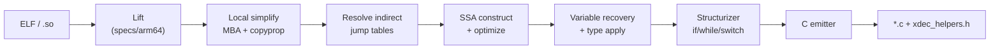

# xdec

**A general-purpose, self-contained, multi-level IL decompiler** — lift AArch64 machine code into a typed intermediate representation, simplify obfuscated control flow and MBA expressions, and emit readable structured C.

Current regression status: **eval 96/96** (baseline) · **eval 36/36** (typed) · **samples 4/4** · **483 unit tests**

---

## Highlights

| Capability | What it does |
|------------|--------------|
| **Multi-level IL** | Lifted → Local → CFG → SSA → Resolved → Vars → Structured → Typed; each maturity level is inspectable and round-trippable |
| **OLLVM flattening** | Recognizes dispatcher hubs, inlines switch case handlers, wraps `while(true) + switch(state)`, suppresses live-register phi noise |
| **MBA simplification** | Algebra rewrite rules (proven by random-binding oracle) collapse obfuscated arithmetic; mega-block safe paths avoid hang on 5k+ op blocks |
| **Indirect branch resolution** | Jump-table recognition, bound analysis, iterative driver discovers and lifts newly reachable code |
| **Syscall recovery** | `svc` → named `sys_write(...)` with typed arguments via AArch64 Linux syscall table |
| **Type import** | Optional C header presets (`android-ndk`) improve signatures, struct field access, and callee naming |
| **Clean C output** | Structured `if/else`, `while`, `switch` — no gotos where recoverable; short helper names via `xdec_helpers.h` |

---

## Quick start

### Requirements

- **CMake** ≥ 3.24, **Ninja**, **C++20** compiler (GCC 14+ or Clang 16+ tested)
- **Catch2** — fetched automatically if not installed locally

### Build

```powershell
cd xdec
cmake --preset gcc-debug          # or: cmake -B build/dev -G Ninja
cmake --build build/dev
```

The CLI lands at `build/dev/bin/xdec.exe`. A copy of `xdec_helpers.h` is placed next to it for decompiled output to include.

### Decompile a function

```powershell
.\build\dev\bin\xdec.exe decompile path\to\lib.so 0x2a2428 -o out.c
```

For AArch64 Android `.so` files, type and syscall tables are inferred automatically — no extra flags needed:

```powershell
.\build\dev\bin\xdec.exe decompile libsdk_bc_lib.so 0x2a2428 -o sub_2a2428.c
```

Common options:

```
-o <file.c>              write output to file
--rounds <n>              fixpoint round cap (default 8)
--allow-unresolved        seal unknown indirect branches instead of failing
--types <header|preset>   import C declarations (repeatable)
--syscall-table <name>    syscall numbering table (default aarch64-linux)
--helpers-header <path>   helper include path (default xdec_helpers.h)
--dump-il                 print final IL before C emission
--no-annotate             omit block address comments
```

Set `XDEC_LOG=pass=debug,local=debug` for pass-level diagnostics.

---

## Pipeline



The **driver** (`decompile/driver.cpp`) runs lift → simplify → resolve in a fixpoint loop: each resolved branch may expose new code, which gets lifted and simplified in turn until convergence or the round cap.

---

## CLI commands

| Command | Purpose |
|---------|---------|
| `decompile <binary> <addr>` | Full pipeline → structured C |
| `lift <binary> <addr> <n>` | Lift *n* instructions, print IL |
| `observe <binary> <addr>` | Run passes step-by-step, dump each maturity |
| `disasm <binary> <addr> <n>` | Disassemble *n* instructions |
| `info / sections / symbols` | Inspect the binary image |
| `types parse <header>...` | Parse and report imported C types |
| `coverage <binary>` | Report undecoded instruction patterns |
| `spec <file.xspec>` | Validate an architecture spec |

Run `xdec help` for the full list.

---

## Decompiled C output

Generated `.c` files include standard headers plus, when needed:

```c
#include "xdec_helpers.h"   /* rotr32, bswap64, cc_lt32, ... */
```

Portable semantics (`rotr32`, `bswap32`, `popcount64`, overflow-exact condition codes) are fully defined in the header. Target-dependent stubs (`xdec_clz32`, `xdec_mulhiu64`, float ops) are declared for the embedder to implement. See [docs/11-helpers-header.md](docs/11-helpers-header.md).

---

## Project layout

```
xdec/
├── specs/              Architecture specs (arm64.xspec)
├── include/xdec/       Public headers + xdec_helpers.h
├── src/
│   ├── spec/           Lift engine (DSL → machine semantics)
│   ├── il/             Intermediate representation
│   ├── passes/         Optimization & deobfuscation passes
│   ├── analysis/       CFG, dominators, jump tables, dispatcher shape, ...
│   ├── decompile/      Multi-round discovery driver
│   ├── emit/           Structurizer + C printer
│   └── tools/          xdec CLI
├── types/              Type database, syscall tables, NDK preset
├── eval/               L0 regression: 96 functions with ground-truth C
├── samples/            L1 regression: real obfuscated .so files
├── tests/              483 Catch2 unit tests
└── docs/               Design notes (01–11)
```

---

## Testing

### Unit tests

```powershell
cmake --build build/dev --target xdec_tests
.\build\dev\bin\xdec_tests.exe
```

### L0 — eval (ground-truth corpus)

Built from known C via Android NDK, scored against structural expectations in `eval/manifest.json`.

```powershell
cd eval
.\build.ps1           # requires Android NDK
.\run.ps1             # baseline: 96/96
.\run.ps1 -Typed      # typed:   36/36
```

Requires NDK at `%LOCALAPPDATA%\Android\Sdk\ndk\27.2.12479018` (override with `build.ps1 -NdkRoot`).

### L1 — samples (real binaries)

Scores decompilation *shape* (gotos, switches, line count) on obfuscated `.so` files you provide locally — binaries are not checked in.

```powershell
# Copy samples/local.example.json → samples/local.json and set .so paths
.\samples\run.ps1     # 4/4
```

See [samples/README.md](samples/README.md) for adding cases.

---

## Documentation

| Doc | Topic |
|-----|-------|
| [01-il-spec.md](docs/01-il-spec.md) | IL design: hash-consed expressions, lazy flags, text round-trip |
| [05-deobfuscation.md](docs/05-deobfuscation.md) | MBA algebra, jump tables, discovery loop |
| [06-type-import.md](docs/06-type-import.md) | Header import and type binding |
| [07-syscall.md](docs/07-syscall.md) | Syscall ABI modelling and recovery |
| [08-tailcall.md](docs/08-tailcall.md) | Tail-call recognition |
| [09-expression-reuse.md](docs/09-expression-reuse.md) | CSE / subexpression sharing in emit |
| [10-import-resolution.md](docs/10-import-resolution.md) | PLT/GOT import callee naming |
| [11-helpers-header.md](docs/11-helpers-header.md) | Helper naming and `xdec_helpers.h` |
| [eval/FINDINGS.md](eval/FINDINGS.md) | Regression history, performance notes, OLLVM work log |

Architecture spec DSL reference: [docs/02-dsl-ref.md](docs/02-dsl-ref.md), [docs/03-spec-compiler.md](docs/03-spec-compiler.md).

---

## Target support

| | Status |
|---|--------|
| **Architecture** | AArch64 (primary) |
| **Binary format** | ELF64 (`.so`, executables) |
| **Platform profile** | Android NDK / AArch64 Linux (auto-inferred) |
| **Obfuscation** | OLLVM control-flow flattening, MBA, opaque predicates |

x86 and other architectures are not supported today; the IL and spec framework are designed to be extensible via new `.xspec` files and target profiles.

---

## License

No license file is included yet. Contact the repository owner for usage terms.
