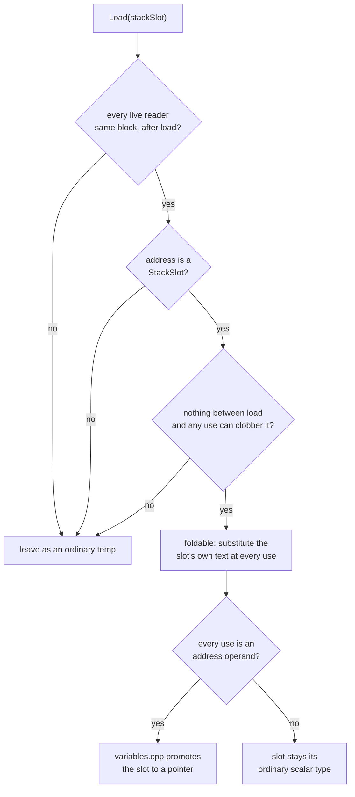

# 12 — Stack-load folding

`nameResultTemps` (`emit/c_printer.cpp`) gives every `Load`'s result a
temporary unconditionally, because in general the temporary's one reader
could be arbitrarily far downstream. Most of the time it is not: a compiler's
own register spill reads a slot back exactly once, right where it is needed,
and the temporary between the two adds nothing but a line and a name to keep
track of. This document is about the emit-layer prepass that recognises that
case and prints the slot's own name in its place — see `docs/09` shape F for
the taxonomy entry and the concrete before/after on `0x2a2428`.

## Why this is not an IL pass

The obvious-looking fix is a rewrite pass: find the single-use `Load`, delete
it, substitute its address expression at the one use. That is the wrong
shape for what is actually redundant here. The `Load` is exactly the one
memory read the machine code performs — deleting it is not an optimization,
it is asserting the read never happened, and IL has no way to write "this
value, but also print the variable name that happens to alias it," because a
stack local's *name* is a fact `analysis::VariableTable` recovers well after
IL passes have finished running. Forcing that fact earlier would mean
threading variable-recovery output back into the pass pipeline, or inventing
an IL expression form whose only job is to carry a printed spelling — both
solve a presentation problem by complicating the thing that is supposed to
stay presentation-agnostic.

So the `Load` stays. What changes is a decision `CContext` makes once, while
assembling the emit-layer's shared state: whether a given `Load`'s statement
needs to print at all, and what text its result substitutes for wherever it
is read. The same shape `emit::deadJumpTableLoad` already uses for a
resolved jump table's now-orphaned address computation (`docs/09` shape E) —
neither IL rewrite is safe or necessary, and both are emit-time facts about
what nothing print-side needs.

## The analysis: `findFoldableStackLoads`

`include/xdec/analysis/stack_load_fold.h` / `src/analysis/stack_load_fold.cpp`.

For every `Load` in the function, in block order:

1. **Has at least one live reader.** A reader already in the caller's
   `deadOps` set (an op some other prepass has decided never prints) is not
   a real use — see the "already dead" case below, which is exactly why this
   check exists rather than trusting raw SSA use count.
2. **Every live reader is in the same block, after the load.** SSA's own
   dominance guarantee is trusted, not re-verified; a use recorded at or
   before the load's own position is treated as a disagreement with SSA and
   the load is left alone rather than acted on. A reader in a different
   block — most often the far side of a merge a flattened dispatcher's
   loop-carried state closes through — is exactly the cross-block forwarding
   this analysis does not attempt (see Non-goals).
3. **The load's address classifies as a `StackSlot`** (`analysis::StackFrame`).
   Never a `Global` — an image address can be observed from outside this
   function — and never `Other` — an unclassified pointer's aliasing is
   unknown by definition, so nothing between load and use could be ruled out
   as a clobber.
4. **Nothing between the load and any of its live readers could have
   clobbered the slot.** A `Store` the frame's `mayAlias` cannot rule out as
   touching the same slot, or a `Call`/`Intrinsic`/`Unimplemented` (any of
   which may write through a pointer this analysis has no way to reason
   about) blocks the fold — the same barrier `stack_prop.cpp` gives a reload
   it is forwarding.

A load can have more than one live reader; each is checked independently,
and the fold applies once every one of them clears the freshness check —
nothing here requires there to be exactly one reader, only that every reader
there is is safe.

The result also records `usedAsAddress`: true when *every* live reader uses
the load's value as another `Load`/`Store`'s address operand rather than an
ordinary value — the shape a spilled pointer takes. `variables.cpp`'s
pointer refinement (below) uses this to decide whether the slot itself
should be typed as a pointer.

## Where the finding is consumed

**`CContext`'s constructor** (`emit/c_context.cpp`) calls
`findFoldableStackLoads` once, after `deadOps` has been populated by the
structured-tree walk (`collectDeadOps`) so that an already-dead reader is
correctly excluded from the eligibility check above. For each finding, it
resolves the slot's own printed text through `stackSlotLvalue`
(`emit/c_context.cpp`) — the same lvalue text an ordinary memory access
through that slot would use — and records it in `inlinedStackLoads`, keyed
by the `Load`'s result `ValueId`. The `Load`'s own `OpId` joins `deadOps`,
so neither `nameResultTemps` nor `StmtPrinter::printBlock` ever produces a
declaration or an assignment for it.

**`ExprPrinter::value`** (`emit/c_expr.cpp`) checks `inlinedStackLoads`
before falling back to the ordinary temporary lookup: a folded load's result
resolves straight to the slot's text, at every site that reads it, with no
separate materialization step. The existing `memoryLvalue` fallback for a
`Store`'s address operand needs no separate "peel" logic of its own to
produce `(*(T*)var_980)` in place of `(*(T*)t294)`: substituting the local's
name into an already-generic cast is all that pattern requires once
`ExprPrinter::value` supplies the name.

**`analysis::VariableTable::recover`** (`analysis/variables.cpp`) calls the
same analysis (with an empty `deadOps`, since variable recovery runs earlier
than the `emit` stage that finishes populating it) to extend its existing
pointer-refinement loop: a stack local whose value is read back only to
serve as another access's address — the same evidence an argument or a temp
base is promoted from — gets `pointerDepth = 1` and a `pointeeWidth` from
the widest access made through it, exactly like an argument would. This
turns `var_980 = a2; ...; (*(uint32_t*)var_980) = ...;` into
`uint32_t* var_980; ...; var_980 = (uint32_t*)a2; ...; *var_980 = ...;`.
`emit/c_stmt.cpp`'s `Store` case injects the explicit `(T*)` cast this
promotion requires on the *write* to the slot itself: the IL's stored value
is still an ordinary integer computation, and C never implicitly converts
one to the pointer type the declaration now carries.

## Non-goals

- **Cross-block forwarding.** A load read again after a merge needs a
  dataflow analysis that reasons about every path into that merge, not a
  single block-local scan — the same boundary `stack_prop.cpp`'s own
  store-to-load forwarding draws, and for the same reason: getting this
  wrong in the unsafe direction changes behaviour, and the reward (one more
  slot folded on a shape that mostly shows up as loop-carried dispatcher
  state anyway) does not justify the added surface.
- **Duplicate elimination.** This is not `docs/09`'s shape B (a second
  `Load` of an address the first one already read) — that is `stack_prop.cpp`
  and `analyzeExpressionReuse`'s territory, a genuinely repeated read, not a
  single read printed twice.
- **Anything but `StackSlot` addresses.** A `Global` or unclassified `Other`
  base is excluded outright (see rule 3 above); nothing about this analysis
  reasons about non-frame memory.

## Interaction with stack-prop

`passes/stack_prop.cpp` runs at the IL level, earlier in the pipeline, and
forwards a `Store`'s value straight into a matching `Load` of the same
address — when it succeeds, the `Load` this document is about never exists
in the first place. Stack-load-fold picks up what is left after that: a
`Load` stack-prop's own rules did not forward (most often because the
address was reached through the slot's own name rather than a literal
store/load pair stack-prop's pattern matches, or because the load's value
still needs a name for a value distinct from what was last stored). The two
never compete for the same `Load` — by the time stack-load-fold's analysis
runs, whatever stack-prop could forward already has been.

## Tests

- `tests/analysis/test_stack_load_fold.cpp` — the safety rules directly
  against `findFoldableStackLoads`: a load with one fresh reader folds; an
  intervening store, call, or cross-block reader each independently block
  it; a load classified against a global is left alone; two live readers in
  the same block both fold; an already-dead reader does not count against
  eligibility; `usedAsAddress` is true only when every live reader treats
  the value as an address.
- `tests/emit/test_c_stack_load_inline.cpp` — the end-to-end printed C: a
  scalar single-use load names the local directly with no temporary; a
  load used only as a store's address gets its slot promoted to a pointer
  type; two live readers in one block both name the local without either
  needing its own copy.

## Metrics (`bc_lib` `0x2a2428`, 2026-08-10)

| Metric | Before | After |
|--------|-------:|------:|
| Lines | 4103 | 3715 |
| `tN = var_XXX;` | 385 | 95 |
| `(*(T*)tN) = ...` | 42 | 1 |
| Pointer-typed stack locals | 0 | 10 |

`eval/` baseline 96/96 and typed 36/36, `samples/` 4/4 (including
`sample_core_mba`, the same `0x2a2428`), and `xdec_tests.exe`'s full suite
all pass unchanged — see `eval/FINDINGS.md`'s dated entry for the run log.
The remaining 95 `tN = var_XXX` lines read a slot from a different block or
write to it again before the next use — exactly the cases rules 2 and 4
above correctly decline, not a gap in the implementation.
