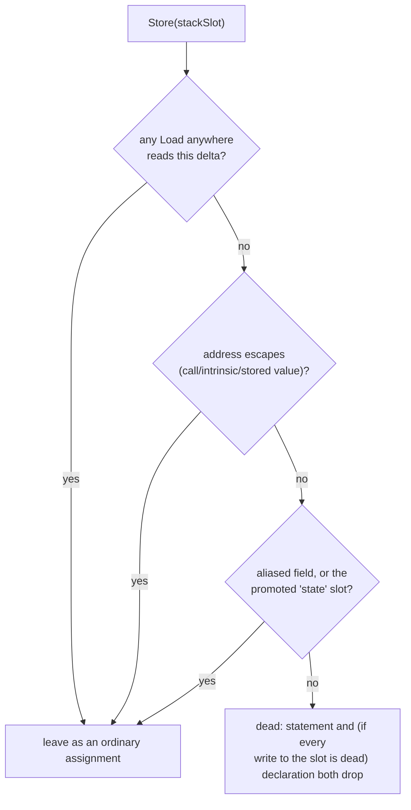

# 13 — Stack-store folding

`printOp`'s `Store` case (`emit/c_stmt.cpp`) prints every `Store` statement
unconditionally, on the same "a reader might be arbitrarily far away"
assumption `nameResultTemps` makes for a `Load`'s result (`docs/12`). Most of
the time a spill to a stack slot *is* read back somewhere. When it is not —
nothing in the whole function ever loads that slot, and its address never
escapes anywhere this analysis can still reason about — the assignment buys
nothing: `var_aa8 = _cse8;` right after `_cse8 = bswap32(t32);` says nothing
a reader needs, because `var_aa8` never appears again. This document is
about the emit-layer prepass that recognises that case and drops the
statement (and, when every write to the slot turns out dead this way, the
slot's own declaration) — see `docs/09` shape H1 for the taxonomy entry.

## Why this is not an IL pass, and why it is function-wide

Same reasoning as `docs/12`'s: the `Store` is exactly the one memory write
the machine code performs, so there is nothing to delete at the IL level,
only a printing decision. What differs from stack-load-fold is scope. A
load's redundancy is a fact about *one* reader, checked against *one*
load — the load's live range is exactly the span between the two. A store's
redundancy is a fact about the *whole rest of the function*: a spill is dead
only when **nothing anywhere** ever reads it back, not just along whatever
path a block-local scan happens to look down. Two stores to the same
never-read slot are dead together, in whatever order they run, because
nothing observes either write regardless.

## The analysis: `findDeadStackStores`

`include/xdec/analysis/stack_store_fold.h` / `src/analysis/stack_store_fold.cpp`.

For every `Store` in the function whose address classifies as a `StackSlot`
(`analysis::StackFrame`):

1. **No `Load` anywhere in the function reads the same delta.** Live or
   already folded into its reader's text by stack-load-fold (`docs/12`) —
   either way the read still happens as far as this analysis is concerned,
   only spelled differently, so it still disqualifies the slot.
2. **The slot's address never escapes.** A single function-wide scan records,
   for every op's every operand, any stack address that shows up somewhere
   other than as the address operand of its own Load or Store: a
   `Call`/`Intrinsic`/`Unimplemented` argument (any of which may read
   through a pointer this analysis has no way to reason about), or a value
   stored into some *other* location, which this analysis has no way to
   trace further. Either escape makes every store to that delta ineligible.
3. **The slot is not an aliased field** (`Variable::aliasBase`) — an aliased
   local's liveness is tied to its base slot's own accesses, which this
   analysis does not model.
4. **The slot is not the one `VariableTable::recover` promoted to `state`.**
   That promotion is deliberately store-only (see its own note in
   `variables.cpp`): a flattening dispatcher's real state value often lives
   in a register/phi between the spill and its use, so the slot is never
   read back at all, on purpose. Folding its store away would erase the one
   thing the promotion exists to show a reader — which stack slot is the
   dispatcher's own state — so this analysis leaves it alone even though
   nothing else here reads it either.

## Where the finding is consumed

**`CContext`'s constructor** (`emit/c_context.cpp`) calls
`findDeadStackStores` once, right after the stack-load-fold prepass, and
inserts every finding's `OpId` into `deadOps` — the same set `printOp`
already skips for a `Store` (`c_stmt.cpp`) and the same set
`StmtPrinter::printBlock`'s CSE-root collection already skips before calling
`addExprRoots` (see docs/09 shape I1 for why that ordering, not a second
mechanism, is what closes the reference-count cascade). Because
`findDeadStackStores` proves a *slot* dead, never just one of several writes
to it, every dead `Store`'s own delta is recorded in a new
`deadLocalStackDeltas` set; `c_printer.cpp`'s `declarations()` skips a local
there too, so a slot nothing assigns or reads any more gets no declaration
either.

## Tests

- `tests/analysis/test_stack_store_fold.cpp` — the safety rules directly
  against `findDeadStackStores`: an unread store is dead; a store a later
  load reads is not; a store whose address is passed to an intrinsic, or
  stored elsewhere as a value, is not; two stores to the same unread slot
  are both dead; a store to a global is left alone; the promoted `state`
  slot is left alone even with no reader.
- `tests/emit/test_c_printer.cpp` and `tests/emit/test_c_expr_reuse.cpp` —
  three existing fixtures that happened to construct exactly this
  now-optimized shape (a diamond's write-only merge, an assigned select, a
  dispatcher's own state-store-plus-switch-index pairing) were updated to
  read the slot back before returning, so each still tests what it was
  written to test instead of hitting the new fold as an incidental side
  effect. See each test's own comment for why.

## Metrics (`bc_lib` `0x2a2428`, 2026-08-10)

| Metric | Before Phase 1 | After Phase 1 |
|--------|---------------:|--------------:|
| Lines | 3715 | 3446 |
| `var_X = _cseN;` (shape H1/H2) | 277 | 185 |
| `_cseN = ...` (shape I3, minus I1's cascade) | 1179 | 1138 |
| Write-only locals (declared, never assigned or read) | 105 | 0 |

The 92-line drop in `var_X = _cseN;` is every H1 dead spill this pass finds
in this function; the 41-line drop in `_cseN = ...` is the I1 cascade —
`beginScope`'s existing `deadOps`-skip closing the reference-count
inflation those same dead spills caused, with no separate mechanism needed
(see `docs/09` shape I1 and `docs/14-emit-redundancy.md`'s Phase 2 entry).
The write-only-local
count reaching zero is `deadLocalStackDeltas`: once every write to a slot is
provably dead, the slot's declaration goes with it.

`eval/` baseline 96/96 and typed 36/36, `samples/` 4/4, and
`xdec_tests.exe`'s full suite all pass — see `eval/FINDINGS.md`'s dated
entry for the run log.
