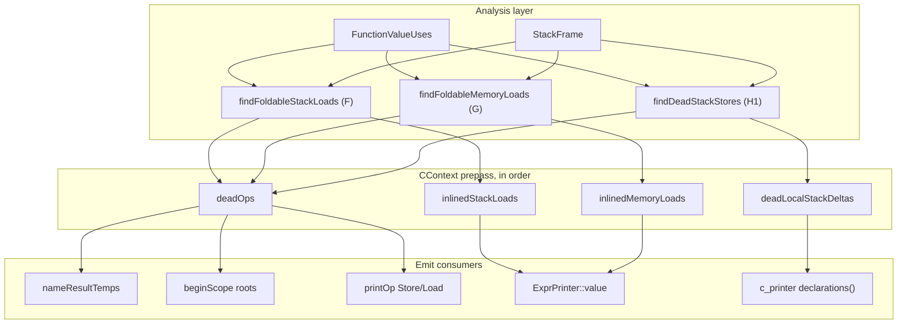

# 14 — Emit Redundancy Elimination (ERE): framework overview

`docs/09-expression-reuse.md`'s taxonomy grew past what its own two
IL-decidable shapes (A/B, `analysis::analyzeExpressionReuse`) can measure:
shapes F through J are each their own emit-layer prepass, each with its own
analysis file, each consumed through `CContext`. This document is the map of
how those prepasses fit together, why they share a shape rather than each
inventing its own, and where the project's own measurements against
`bc_lib`'s `0x2a2428` (a straight-line MBA/SHA-round body — no branches, one
basic block, the shape that makes every one of these redundancies show up in
bulk) currently stand.

## Why one framework, not one patch per shape

Three mechanisms already existed before this plan — `deadOps` (shape E), the
CSE scope machinery (`ExprPrinter::beginScope`), and, as of `docs/12`,
`inlinedStackLoads` (shape F) — and each covered exactly the one shape it was
built for. Extending that pattern indefinitely, one bespoke field per new
finding, has a real cost: the same function-wide "who reads this" analysis
would get reimplemented per shape, `deadOps` ordering versus CSE's own
root-collection would stay an implicit dependency nobody could point at, and
there would be no way to answer "how much of this taxonomy is actually
closed" except by re-reading the source. See the plan this document
summarises for the full account
(`中间变量系统性消除_dbc46949.plan.md`, kept as project history, not edited
by this work).

## Shared analysis primitive

`analysis::FunctionValueUses` (`include/xdec/analysis/value_uses.h`) is the
one function-wide "every op that reads this value" scan every fold in this
family is built on: `findFoldableStackLoads` (docs/12) and
`findFoldableMemoryLoads` (shape G, `include/xdec/analysis/load_inline.h`)
both use it to find a load's live readers. `analysis::StackFrame` is the
other shared primitive — every fold that reasons about an address classifies
through it, never re-deriving `entry(sp) + delta` (or a plain constant) on
its own.

## Three consumption semantics on `CContext`

Every finding from every prepass below resolves into one of three fields on
`CContext` (`emit/c_context.h`), so `Assembler::nameResultTemps`,
`StmtPrinter::printBlock`, and `ExprPrinter::value` each check a fixed,
small set of maps rather than growing a special case per shape:

1. **`deadOps`** — the op's statement (and, for a `Load`/`Call`, its
   declaration) never prints. Populated by `collectDeadOps` (shape E),
   `findFoldableStackLoads` (shape F), `findFoldableMemoryLoads` (shape G),
   and `findDeadStackStores` (shape H1).
2. **`inlinedStackLoads`** — a `Value`'s result resolves to fixed text (the
   slot's own name) at every use, instead of a temporary. Populated by
   `findFoldableStackLoads`.
3. **`inlinedMemoryLoads`** — a `Value`'s result resolves to a re-rendered
   `(*(T*)...)` dereference (the address/width to re-render, not fixed text,
   since a `Global`/`Other` address has no name to precompute ahead of
   printing) at every use. Populated by `findFoldableMemoryLoads`.
4. **`deadLocalStackDeltas`** — a stack delta gets no declaration at all,
   because every write to it is now in `deadOps`. Populated alongside
   `findDeadStackStores`'s own `deadOps` inserts.

A fifth mechanism sits outside `CContext` entirely, on `ExprPrinter` itself:
**`materializeAs`** (shape H2, `emit/c_expr.h`/`.cpp`) intercepts a `Store`'s
own value operand right where `materialized()` would otherwise mint a fresh
`_cseN` for it, and names it after the store's target local instead. This
could not be a `CContext` prepass finding the way the other four are: whether
a node needs naming at all is a fact of `ExprPrinter`'s own per-scope
reference counting (`isShared`), decided while printing, not something a
prepass over the IL alone can determine ahead of time — a `CContext`
analysis has no CSE scope to ask "would this be shared here." See Phase 4
below.



`findFoldableStackLoads` and `findFoldableMemoryLoads` both run before
`findDeadStackStores` in `CContext`'s constructor so an already-dead reader
is excluded from either load-fold's eligibility check the same way it always
was (docs/12); `findDeadStackStores` in turn must run before anything reads
`deadOps` for CSE-root purposes, which in practice means simply "in the
constructor, before printing starts" — see docs/09 shape I1 for why no
explicit ordering against `beginScope` itself is required.

## `prepareEmitRedundancy`: one aggregator, not six independent scans

Everything the diagram above calls out as "in order" used to mean six
separate calls inline in `CContext`'s constructor (the ldaxr/stlxr fold's two
scans, the two load-folds, and the dead-store fold), each threading the same
growing `deadOps` set by hand. `analysis::prepareEmitRedundancy`
(`include/xdec/analysis/emit_redundancy.h`) is that sequence pulled into one
function, returning an `EmitRedundancyPrep` with every finding plus the final
`deadOps`: `CContext`'s constructor now calls it once and only copies results
into its own members, and `analyzeEmitRedundancy` calls the *same* function
instead of re-deriving `findFoldableStackLoads`/`findFoldableMemoryLoads`
counts against whatever `deadOps` it happened to have on hand (previously an
empty set, which could disagree with what `CContext` actually folds whenever
an exclusive-load/store fold changed a load's live-reader count).

One stage cannot be decided by the aggregator alone: whether a stack-load
fold candidate is actually applied depends on `CContext::stackSlotLvalue`
finding text for its slot, and only the emit layer (typed variables, the
binder) can answer that. `EmitRedundancyPrep::foldableStackLoads` carries
every candidate `findFoldableStackLoads` names regardless; a caller passes a
`StackLoadFilter` to say which ones it actually applies
(`appliedStackLoads`), and only those are folded into `deadOps` before the
memory-load and dead-store stages run — `analyzeEmitRedundancy` passes no
filter, since it has no text to render and every candidate reports as
applied.

This also closes shapes G and J's own gap in the report:
`EmitRedundancyReport` now carries `memoryLoads`/`memoryLoadsFolded` (shape
G, mirroring `stackLoads`/`stackLoadsFolded`) and, where the function
resolves a dispatcher shape at all, `dispatcherRelaySlots`/
`dispatcherRelayUnneededSlots` (shape J, via `analysis::matchDispatcherShape`
+ `LiveRegisterFrame`/`unanimousPassthroughSlots`) — `nullopt` for every
function with no dispatcher, present for one that has one.

## Status by shape (see `docs/09-expression-reuse.md` for the taxonomy)

| Shape | What | Status |
|-------|------|--------|
| E | Orphaned jump-table load | Done (pre-dates this plan) |
| F | Single-use stack `Load` | Done (`docs/12`) |
| G | Single-use non-stack `Load` | Done (`include/xdec/analysis/load_inline.h`) |
| H1 | Dead stack-slot spill | Done (`docs/13`) |
| H2 | Live spill, mergeable into one line | Done (`ExprPrinter::materializeAs`) |
| I1 | CSE refcount inflated by a dead spill | Done, no separate mechanism needed (root collection already skips `deadOps`) |
| I2 | Cross-scope duplicate `_cseN` RHS | Quantified (`emit_metrics.ps1`'s `duplicate_cse_rhs_*`); hoist itself intentionally not attempted (optional, see Phase 5) |
| I3 | Genuinely-shared MBA subexpressions | Not a target (see docs/09's own non-goal) |
| J | Dispatcher relay copies | Owned by `analysis::LiveRegisterFrame`; quantified (not folded) in `EmitRedundancyReport::dispatcherRelay*` when a dispatcher shape resolves |

## Measurements (`bc_lib` `0x2a2428`, 2026-08-10)

Two complementary tools produce these numbers: `xdec decompile --emit-report`
(`analysis::analyzeEmitRedundancy`, IL-level — what the analyses above can
prove regardless of how CSE ends up spelling anything) and
`tools/emit_metrics.ps1` (text-level — counts the actual printed `.c`, which
is the only place a CSE-scope fact like `_cseN = ...` exists at all).

| Metric | Baseline | After Phase 0 (F only) | After Phase 1 (F + H1) | After Phase 3 (+ G) | After Phase 4 (+ H2) |
|--------|---------:|-----------------------:|------------------------:|---------------------:|----------------------:|
| Lines | 4103 | 3715 | 3446 | 3253 | **3169** |
| `tN = var_XXX;` (F) | 385 | 95 | 95 | 95 | 95 |
| `tN = (*(T*)...);` (G) | 243 | 243 | 243 | 79 | 79 |
| `var_X = _cseN;` (H1/H2) | — | 277 | 185 | 185 | **60** |
| `_cseN = ...` (I3, minus I1) | — | 1179 | 1138 | 1131 | **1054** |
| Write-only locals | — | 105 | 0 | 0 | 0 |
| IL report: stack loads folded | — | 290/386 | 290/386 | 290/386 | 290/386 |
| IL report: stack stores dead | — | 0/665 | 105/665 | 105/665 | 105/665 |

("Baseline" is the pre-`docs/12` starting point from that document's own
table; the 385/95 row is carried over from there since Phase 0/1 of this
plan did not touch load-folding. "—" marks a metric `tools/emit_metrics.ps1`
did not yet exist to record at that point.) The remaining 79 `tN = (*(T*)...)`
lines are readers in a different block, more than one op apart with an
intervening clobber, or consumed as another access's address (the
`fieldAccess` naming exclusion) — the same categories of decline
`findFoldableStackLoads` documents for shape F. Phase 4's IL-level rows are
unchanged from Phase 3 by construction: `materializeAs` is a pure emit-scope
renaming, with no effect on what `findDeadStackStores`/`findFoldableMemoryLoads`
can prove from the IL alone — only the text-level counts move. The remaining
60 `var_X = _cseN;` lines are cases `materializeAs` correctly declines: the
value was already materialized under `_cseN` by an earlier statement in the
same scope (so the name is already committed elsewhere) or the store target
is not a plain uncast local (a pointer-cast slot, a field access, or an
aliased/width-mismatched local).

`eval/` baseline 96/96, typed 36/36, and `samples/` 4/4 all pass unchanged
through every phase — see `eval/FINDINGS.md`'s dated entries.

**2026-08-11, `prepareEmitRedundancy` aggregation.** Re-running
`--emit-report` against the same `0x2a2428` after moving `CContext`'s six
independent scans behind the one aggregator above (no analysis logic
changed, only where the calls live) reports `stack loads: 290/386 folded,
memory loads: 164/243 folded, stack stores: 105/665 dead, 105 write-only
local(s), dispatcher relay: 0/8 slot(s) unanimous passthrough` — the same
290/386 and 105/665 this table already had, plus the newly-exposed
`memoryLoadsFolded` (164 of the 243 non-stack loads the "After Phase 3"
row above counts) and a `dispatcherRelay` line this function's own
flattened dispatcher now reports for the first time (0 of 8 relayed
registers are unanimous passthrough — every one of them is changed by at
least one handler, so nothing here is foldable, a fact `EmitRedundancyReport`
can now say instead of only `LiveRegisterFrame`'s own callers knowing it).
The emitted `.c` for both `0x2a2428` and `bc_lib`'s `sub_2f9a38` (docs/15,
docs/16) is byte-identical before and after this refactor; 549+ unit tests
and 98/98 eval both pass unchanged.

## Phase 5: cross-scope duplication, quantified but not hoisted

The originating plan splits this phase into a required analysis half
(size the duplication) and an explicitly optional emit half (hoist it into
a shared dispatcher prologue). Only the first half is implemented here.
`tools/emit_metrics.ps1`'s `duplicate_cse_rhs_groups`/
`duplicate_cse_rhs_occurrences` group every `_cseN = <expr>;` line by its
literal printed RHS text; `0x2a2428` currently has 19 groups covering 181
occurrences, matching the plan's own order-of-magnitude estimate ("20 种
RHS 重复 ≥2 次").

The hoist itself stays undone, deliberately: unlike Phases 1–4, which are
each a printing decision provably safe from IL facts alone (a load's
readers, a store's readers, a scope's own reference count), a cross-scope
hoist is a genuine code-motion — moving a computation from inside several
mutually-exclusive `switch` arms out to a shared prologue that runs on
*every* path, including ones that used to skip it entirely. The plan's own
safety constraint (docs/09 shape D) requires proving that **every** path
reaching the switch has already executed an equivalent computation before
it is safe to assume the hoisted copy is redundant with what each arm used
to compute — a whole-function reachability argument, not a local check
`ExprPrinter`'s per-scope reference counting (the primitive every other
phase in this plan is built on) can make. Getting that proof wrong silently
changes behaviour rather than just readability, which is a different risk
class from every other shape in this taxonomy. Given the plan lists this
transform as its own "可选 emit" and the metric above already answers "how
much is left" without it, the hoist is left as future work rather than
implemented under time pressure against a correctness-sensitive check.

## Using the tools

```
xdec decompile <binary> <address> --emit-report
```

prints the IL-level counts in one line, safe to diff before/after any change
to an analysis or to `CContext`'s prepass ordering.

```
pwsh tools/emit_metrics.ps1 -Path build/out_0x2a2428.c
```

prints the text-level counts for a specific emitted file — the one place a
phase's actual effect on CSE materialization and declaration count is
visible, since neither is an IL-level fact.

## Related: Address Form Canonicalization (AFC)

Shapes K and L (`docs/09-expression-reuse.md`) are a *form* problem, not a
redundancy one — a pointer-context address prints as arithmetic or a bare
number instead of the name/literal it resolves to — and are addressed by a
sibling framework, `emit::AddressRenderer` and `analysis::ImageLiteralRecovery`
(`docs/15-address-form.md`). AFC shares this framework's primitives
(`analysis::StackFrame::classify`, `CContext`) but is a distinct consumption
path: nothing here declares an op dead or renames a `Value`'s result, so the
two frameworks touch disjoint code and can be read independently.

## Non-goals (unchanged from the originating plan)

- Eliminating genuinely-shared MBA `_cseN` values (shape I3) — by
  construction these are read from more than one site and materializing
  them once is the correct, minimal output.
- Cross-block stack slot store→load forwarding — `passes/stack_prop.cpp`'s
  own boundary (docs/12's non-goals apply here identically).
- Deleting `Load`/`Store` ops at the IL level — every fold here is a
  printing decision, never a rewrite (docs/12's "why this is not an IL
  pass" applies to every shape in this family, not just F).
