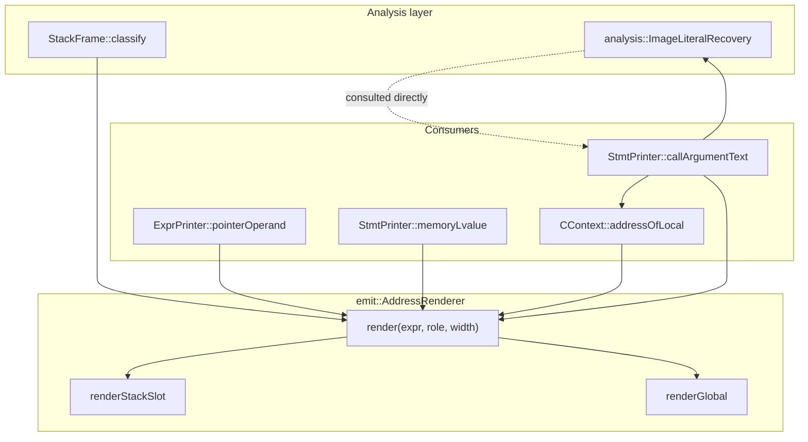

# 15 — Address Form Canonicalization (AFC)

Shapes K and L of `docs/09-expression-reuse.md`'s taxonomy: a pointer-context
address expression prints as the arithmetic or bare number that classifies it
instead of the name or literal a reader would recognize. This document is the
map of the framework that closes both — `emit::AddressRenderer` and
`analysis::ImageLiteralRecovery` — and how it relates to the ERE framework
(`docs/14-emit-redundancy.md`) it sits beside.

## The two gaps this closes

`bc_lib`'s `sub_2f9a38` exposed both at once:

```c
t1 = __system_property_get(0x20f98, (__entry_sp - 0x70));
t2 = strncmp((__entry_sp - 0x70), 0x2137c, 0xa);
```

| Symptom | IL fact | What already existed | What was missing |
|---------|---------|----------------------|-------------------|
| `(__entry_sp - 0x70)` instead of `&var_70` | `Sub(entry_sp, 0x70)`, a `StackFrame`-classifiable `StackSlot` | `stackSlotLvalue`, used by `Load`/`Store` targets | `ExprPrinter::pointerOperand` and `StmtPrinter::printCall` never asked `StackFrame::classify` at all — a stack address handed to a callee fell straight through to raw arithmetic |
| `0x20f98` instead of `"ro.arch"` | `Const(0x20f98)`, `.rodata`, immutable | `BinaryImage::readCString`, `MemoryFacts::isImmutable` | Never consulted from the emit layer; `globalName` only ever produced a symbol's *name*, not its *contents* |

After this framework:

```c
t1 = __system_property_get("ro.arch", &var_70);
t2 = strncmp(&var_70, "exynos9810", 0xa);
```

## Architecture



### `AddressRenderer` (`src/emit/address_render.h`/`.cpp`)

The one place a `StackSlot` or `Global` address (per
`analysis::StackFrame::classify`) becomes C text, whatever context it is used
in:

```cpp
enum class AddressRole : uint8_t {
  MemoryLvalue,  // *(T*)addr — a Load/Store's own target
  PointerValue,  // (T*)addr, or nothing when addr already denotes a pointer
  AddressOf,     // &local — an explicit request for one local's own address
};

struct AddressRenderResult {
  std::string text;
  bool pointer = false;
};

class AddressRenderer {
 public:
  explicit AddressRenderer(CContext& context);
  std::optional<AddressRenderResult> render(il::ExprId expr, AddressRole role,
                                             uint32_t width) const;
};
```

`render` returns nothing for an `Other` address, or for a `StackSlot`/`Global`
with nothing recovered there (no local name, no global name) — the caller's
own pre-existing fallback (raw arithmetic, or a cast dereference) applies
exactly as if `AddressRenderer` had never been consulted. This is what keeps
every call site's behaviour unchanged wherever nothing new was recovered, and
is the same "absent means no evidence" contract `addresses` and `symbols`
already had on `COptions`.

`renderStackSlot` reuses `CContext::stackSlotLvalue` for `MemoryLvalue`, and
for `PointerValue`/`AddressOf` looks up the local through
`VariableTable::localAt` and prints `&name` — bare, uncast, whatever the local
is declared as. `renderGlobal` reuses `CContext::globalName` for the name and
either the existing cast-dereference/array-index logic (`MemoryLvalue`) or
the bare name, which already decays to a pointer (`PointerValue`/`AddressOf`).
Neither branch attempts literal recovery on its own — see below.

### `ImageLiteralRecovery` (`include/xdec/analysis/image_literals.h`/`src/analysis/image_literals.cpp`)

Recovers a constant address's referent as a readable literal, against the
same immutability question `passes/const_fold_memory.h` asks of a *load*
address — but this is deliberately not an IL rewrite. Nothing here
dereferences a pointer the code merely passes along without reading itself,
and folding that at the IL level would require inventing an IL notion of
string literal only the emitter would ever consume. Recovery happens once, on
demand, from the emit layer.

```cpp
enum class ImageLiteralKind : uint8_t { CString /* future: WString, Utf8Blob */ };

struct ImageLiteral {
  ImageLiteralKind kind;
  std::string text;  // decoded, not yet C-escaped
};

class ImageLiteralRecovery {
 public:
  ImageLiteralRecovery(ByteReader reader, MemoryFacts facts);
  std::optional<ImageLiteral> at(uint64_t va) const;
};

std::string quoteCString(std::string_view text);
```

Safety rules, all required, mirroring `const_fold_memory`'s own:

1. Every byte read must be `MemoryFacts::isImmutable` — mapped, never
   writable, not patched by the loader.
2. Printable ASCII only (`0x20`..`0x7e`) up to the terminating NUL. A
   non-ASCII byte means this is not a C string worth guessing the encoding
   of, so recovery fails rather than emitting something wrong.
3. Bounded length (`kMaxLength`, 4096). No terminator within the bound fails
   closed rather than reading past the section.

A run that terminates at offset zero (an "empty string") also fails: every
immutable zero byte would otherwise recover as `""`, which tells a reader
nothing the bare address's fallback hex could not already. Failing any rule
returns nothing, and the caller's fallback — the address, unchanged — is
exactly what printed before this existed.

**Extending it:** a new literal kind (a wide string, a length-prefixed blob)
is a new `ImageLiteralKind` value and a new decode branch inside `at`; no
caller needs to change, since every consumer already treats the result as an
opaque `text` to quote.

### CContext wiring

`COptions::imageReader` (`include/xdec/emit/c_printer.h`) is the one new
field: a `ByteReader` over the raw image, absent by default. `CContext`'s
constructor builds `literals` from it and `options.memory` unconditionally —
an absent reader makes every `ImageLiteralRecovery::at` call answer nothing,
so a pipeline or unit test that never supplies one is byte-for-byte unchanged
from before this existed:

```cpp
literals(theOptions.imageReader, theOptions.memory),
```

The CLI wires this in `cmd_pipeline.cpp` via `session.cpp`'s `imageReaderOf`,
which wraps `BinaryImage::read` — the same adaptation shape `memoryFactsOf`
and `addressDescriberOf` already used for `options.memory`/`options.addresses`.

## Consumption points

| Site | Role used | What changed |
|------|-----------|---------------|
| `ExprPrinter::pointerOperand` (`c_expr.cpp`) | `PointerValue` | Tries `AddressRenderer` first; falls back to its pre-existing `value()` + cast logic when it returns nothing |
| `StmtPrinter::memoryLvalue` (`c_stmt.cpp`) | `MemoryLvalue` | Tries `AddressRenderer` after the pre-existing `fieldAccess` check (a header-described struct field is a different question `AddressRenderer` has no opinion on); falls back to the pre-existing cast-dereference otherwise |
| `CContext::addressOfLocal` | `AddressOf` | Delegates entirely to `AddressRenderer`, restricted to `StackSlot` (a `Global`/`Other` address is not this accessor's business to guess at, unchanged from before) |
| `StmtPrinter::callArgumentText` (new, `c_stmt.cpp`) | see below | New: the single entry point `printCall`'s argument loop uses per argument |

### `callArgumentText`: why a call argument is not just one `AddressRenderer::render` call

A call argument is the one context where *which* role applies depends on
what the callee's own prototype says about that position — printing `&var_70`
for a `struct timeval*` parameter is right, but literal-izing a `Global`
argument the callee's signature never claims is a pointer would turn an
ordinary integer constant into a fabricated string the moment it happened to
double as a readable rodata address. `callArgumentText` is the gate that
keeps those two evidence sources — the address's own classification, and the
callee's declared shape — from being conflated:

```cpp
std::string StmtPrinter::callArgumentText(const types::TypeEntry* callee, std::size_t paramIndex,
                                          il::ExprId operand, std::string& out) {
  if (std::string address = ctx_.addressOfLocal(operand); !address.empty()) {
    return address;
  }
  if (const uint32_t pointeeWidth = paramPointeeWidth(ctx_, callee, paramIndex); pointeeWidth != 0) {
    const analysis::AddressInfo info = ctx_.frame.classify(operand);
    if (info.kind == analysis::AddressKind::Global) {
      if (const std::optional<analysis::ImageLiteral> literal = ctx_.literals.at(info.address)) {
        return analysis::quoteCString(literal->text);
      }
    }
    if (const auto rendered = AddressRenderer(ctx_).render(operand, AddressRole::PointerValue, pointeeWidth)) {
      return rendered->text;
    }
  }
  return exprText(operand, out);
}
```

1. **A `StackSlot`'s own address always prints as `&local`**, unconditional
   of the callee's declared type — `addressOfLocal` already applied this
   rule before AFC existed (for a header-typed struct pointer parameter),
   and generalizing it to *every* recovered local's address, for every
   callee, is exactly `sub_2f9a38`'s own fix: `__system_property_get`'s
   second argument gets `&var_70` whether or not a header describes
   `__system_property_get` at all.
2. **Only past that** does the position's *declared* type start to matter,
   via `paramPointeeWidth` (`callee->params[paramIndex]`, resolved through
   `TypeDatabase::resolveTypedef`, non-zero only when the resolved type is
   `Pointer`-shaped). A `Global` address at a pointer-shaped position tries
   `ImageLiteralRecovery` first, then falls back to `AddressRenderer`'s
   `PointerValue` role (a named global with no literal, e.g. a function
   pointer) if that fails.
3. **`exprText`** (the pre-existing arbitrary-expression path) is the final
   fallback — an `Other` address, a plain integer, or anything neither step
   recovered.

`printCall` resolves `callee` once via `ctx_.calleeType(operands[0])` — the
same `TypeBinder::prototypeAt` a computed call's own cast already used — and
passes it to `callArgumentText` for every argument, so nothing here
re-implements the direct/computed-call split that already existed.

## Relationship to ERE (`docs/14-emit-redundancy.md`)

AFC and ERE share primitives (`StackFrame::classify`, `CContext`) but are
disjoint concerns: ERE decides whether an op's *statement* prints at all, or
whether a `Value`'s *result* resolves to fixed text at each use; AFC only
changes how an *address expression already being printed* is spelled. Neither
framework's findings feed the other, and a change to one's prepass ordering
has no bearing on the other's correctness.

## Tests

- `tests/analysis/test_image_literals.cpp` — `ImageLiteralRecovery`'s
  boundary rules in isolation: a NUL-terminated printable run recovers, no
  reader / non-immutable / non-ASCII / unterminated / immediately-NUL all
  decline, and `quoteCString` escaping.
- `tests/emit/test_c_address_form.cpp` — the consumption path end to end: a
  stack slot argument prints `&local`; a rodata argument prints its literal
  only when the callee declares the position a pointer *and* an image reader
  is configured *and* the address is immutable; otherwise it stays the bare
  address it always was.

## Non-goals

- **Regex peephole over the printed text.** Every fix here works from IL
  facts (`StackFrame::classify`, `MemoryFacts::isImmutable`) forward to text,
  never the reverse.
- **A special case for `__system_property_get`.** Nothing in
  `AddressRenderer`, `ImageLiteralRecovery`, or `callArgumentText` names that
  function; any callee with a `char*`/`const char*` parameter over an
  immutable address gets the same treatment.
- **Literal recovery for a `Global` address outside a call argument.** A
  `Load`/`Store` target or a bare pointer expression still prints through
  `globalName`, unchanged — literal-izing there would need the same
  parameter-type gate `callArgumentText` applies, and nothing analogous to a
  callee's prototype exists at a plain dereference.
- **An IL-level `StringLit` expression.** Recovery stays entirely at the
  emit layer; SCCP and every other IL-level pass sees the same `Const` it
  always did (see `image_literals.h`'s header comment for why).
