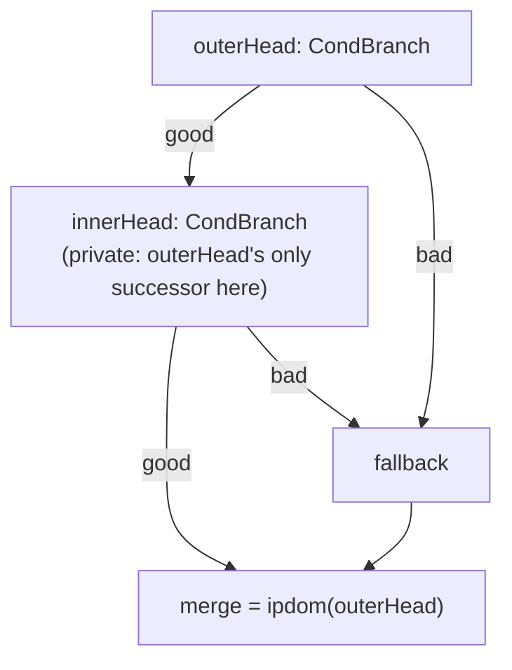
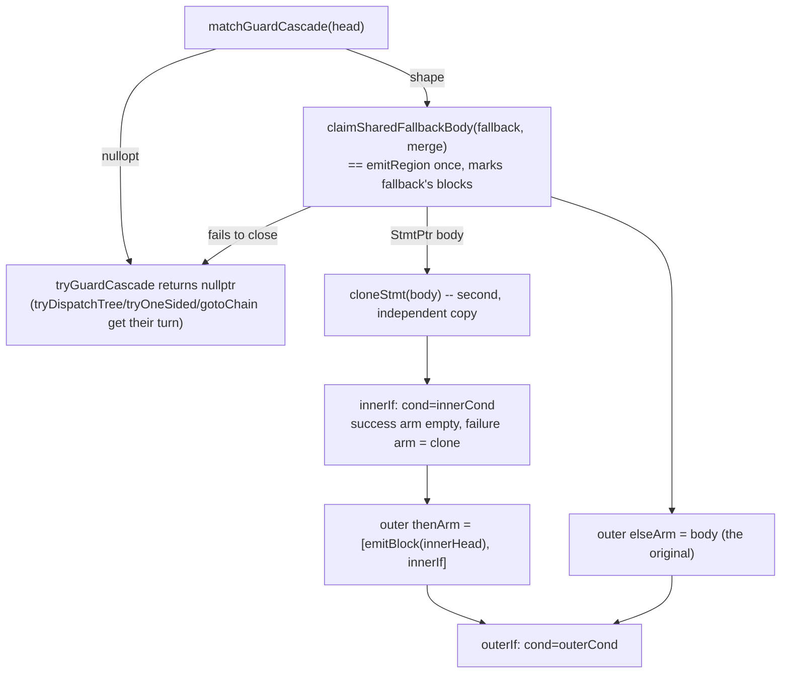

# 16 — Guard Cascade / Shared Fallback (GCSF)

Two nested guard conditions whose failure arms both land on the same
fallback block — a shape `tryDiamond` and `tryOneSided` (`docs` for the
structurizer's own design lives in `src/emit/structure.cpp`'s header
comment) cannot represent, because it is not a diamond at all: a diamond's
arms each claim their *own* blocks, and a block two different branches both
want to claim is not that. This document is the map of
`analysis::GuardCascadeShape` and `Structurizer::tryGuardCascade`, the
pattern that closes it.

## The shape

`bc_lib`'s `sub_2f9a38` has it in its smallest form:

```c
if (property_get(...) <= 0) {
  goto fallback;
}
if (strncmp(...) == 0) {
  t0 = 0;
  goto merge;
}
fallback:
  t3 = getauxval(...);
  ...
  t0 = sub_2f949c(...);
merge:
  return t0;
```

Both the outer guard's failure arm and the inner guard's failure arm reach
`fallback` directly. `tryDiamond`, asked about the outer guard, walks its
"good" arm down through the inner guard and finds the inner guard's own
failure arm wants `fallback` too — but by the time it gets there in a
diamond's own arm-then-arm walk, one of the two attempts has usually already
claimed it (or, on the very first pass, `regionClosed` refuses the claim
outright, since `fallback` has a predecessor — the *other* guard — that is
not part of either arm's own region). Either way `tryDiamond` and
`tryOneSided` both fail for both guards, and `emitRegion`'s only remaining
option is `gotoChain`: exactly the two labelled gotos the shape above shows,
for a function with no loop and no genuinely irreducible control flow at
all.

## `analysis::GuardCascadeShape`

`include/xdec/analysis/guard_cascade.h` / `src/analysis/guard_cascade.cpp`.

```cpp
struct GuardCascadeShape {
  il::BlockId outerHead;
  il::BlockId innerHead;
  il::BlockId fallback;  // the body both guards' failure arms share
  il::BlockId merge;     // where every path reconverges
  il::ExprId outerCond;
  il::ExprId innerCond;
  bool innerSuccessIsTaken;
};

std::optional<GuardCascadeShape> matchGuardCascade(
    const il::Function& function, const PostDominators& postDominators, il::BlockId head);
```

`matchGuardCascade(function, postDominators, head)` requires, all at once:

1. `head` is a `CondBranch` and `merge = postDominators.ipdom(head)` is valid
   and not `head` itself.
2. `head`'s two targets split into a private inner guard and a fallback:
   whichever assignment is tried, the inner guard must be reachable from
   nowhere but `head` (`predecessors.size() == 1`).
3. The inner guard is itself a `CondBranch` whose two targets split into
   `merge` (its success arm — the field `innerSuccessIsTaken` records which
   target that is) and that very same `fallback`.
4. `fallback`'s own predecessors are *exactly* `{head, innerHead}` — nothing
   else may jump into it, or a duplicated copy (see below) would silently
   drop that entry point's own way in.
5. `fallback`'s own single successor is `merge` — the fact that makes it
   safe to treat as a shared body rather than its own separate exit.

A fallback reached from only *one* guard is already a diamond arm (rule 4
alone rules this pattern out for it, since `predecessors.size()` would be
1, not 2) — GCSF and `tryDiamond` are deliberately disjoint patterns, not a
priority order over the same shape.



`outerHead`'s own polarity (which target is `innerHead`, which is
`fallback`) is not carried in the struct: `tryGuardCascade` is called from
`emitRegion`'s own `CondBranch` case with `head`'s targets already parsed,
exactly as `tryDiamond` is, so comparing either target against
`shape->innerHead` says the same thing a stored bool would. `innerHead`'s
own polarity *is* carried (`innerSuccessIsTaken`), because nothing outside
`matchGuardCascade` has inspected `innerHead`'s terminator by the time the
shape is returned.

## `Structurizer::tryGuardCascade` and `claimSharedFallbackBody`

`src/emit/structure.cpp`. Wired into `emitRegion`'s `CondBranch` case
directly after `tryDiamond`, ahead of `tryDispatchTree`/`tryOneSided`/
`gotoChain` — a diamond gets first pick of the same site, same as every
other pattern's own priority there.

The fallback can only be **walked and marked once** (`claimSharedFallbackBody`,
built the same way `claimDispatcherCaseBody` claims a dispatcher's shared
tail: `emitRegion(fallback, merge, depth)`, requiring `regionEnd_ == merge`
and `regionClosed(snapshot, fallback)`), but it has to be **printed twice**
— once under each guard's failure arm — since ordinary `if`/`else`
fallthrough is what lets both paths reach `merge` afterward with no `goto`
at all. The second printing is a deep copy of the first result
(`cloneStmt`, an anonymous-namespace helper in `structure.cpp`): pure data
duplication, no second CFG walk, so `emitted_`/`trail_` only ever record the
blocks as claimed once, exactly like any other pattern.



Both `if`s are assembled directly rather than through a second recursive
`emitRegion` call for the inner guard: a plain recursive walk would try to
claim `fallback` a second time from the inner guard's own `CondBranch`
handling and fail the exact same way `tryDiamond` already does — the whole
reason this pattern exists is that `fallback` cannot be claimed twice by the
ordinary machinery.

The polarity of each `If`'s `invertCond` is chosen so that the *empty*
side (the inner guard's success, which needs no code of its own — `printIf`
already knows how to print a bare edge's phi copies for a missing arm) ends
up in whichever slot leaves the fallback's own content easiest to reason
about; the existing goto-elision pass at the end of `Structurizer::run`
(`elideFallthroughGotos`'s one-armed-`if` normalization — see
`docs/14-emit-redundancy.md`'s neighbour, or the comment right above that
code) then swaps an empty `thenArm` with a filled `elseArm` into the
canonical "content in `thenArm`, condition inverted" form on its own; GCSF
does not need to special-case that, only build a valid (possibly
"else-only") `If` and let the existing pass do what it already does for
every other pattern.

## Why duplicating `fallback`'s text is the right call here

The alternative that keeps `fallback`'s text unique is a `goto`/label pair —
exactly what this pattern exists to remove. A shared *epilogue* (the way
`analysis::DispatcherShape` runs a dispatcher's shared tail once, after the
whole switch, with each case reaching it by `break`) does not apply here:
that trick works because every case's own control transfer to the tail is
already a `break` out of the enclosing `switch`, a construct with an
existing after-the-fact convergence point. A two-level `if`/`else` cascade
has no equivalent "after the whole thing" text position both a taken *and*
an untaken arm can fall into without one of them jumping past code the
other one runs — the guard's own two failure arms are two different
*textual* branches, not two cases of one dispatch. Printing `fallback`'s
(typically a handful of lines) text twice, once per branch, is what makes
both paths reach it with plain fallthrough and no jump; each copy is an
independent `Stmt` tree with its own storage, so nothing is shared or
aliased at print time; it is a real duplication of the source *text*, not a
bug.

## Interaction with SER (`docs/13-stack-store-fold.md`)

`sub_2f9a38` needed both fixes together to fully resolve: SER
(`analysis::StackEscapeMap`) keeps `var_68`/`var_60`'s stores alive (so
`t3`/`t4` show up as used, not dead spills), and GCSF removes the `goto`s
around the block those stores live in. Neither fix depends on the other —
SER answers "is this store printed at all", GCSF answers "how is the block
containing it structured" — but the sample that motivated both only reads
as intended with both applied:

```c
if (!(property_get("ro.arch", &var_70) <= 0)) {
  if (!(strncmp(&var_70, "exynos9810", 0xa) == 0)) {
    t3 = getauxval(0x10);
    t4 = getauxval(0x1a);
    var_60 = t4;
    var_70 = 0x18;
    var_68 = t3;
    t0 = sub_2f949c((t3 | 0x4000000000000000), &var_70);
  } else {
    t0 = t2;
  }
} else {
  t3 = getauxval(0x10);
  t4 = getauxval(0x1a);
  var_60 = t4;
  var_70 = 0x18;
  var_68 = t3;
  t0 = sub_2f949c((t3 | 0x4000000000000000), &var_70);
}
return t0;
```

Zero `goto`s, zero labelled blocks, and every one of `var_70`/`var_68`/
`var_60`'s three stores (the aggregate SER keeps alive) appears, unchanged,
in both copies of the shared fallback.

## Tests

- `tests/analysis/test_guard_cascade.cpp` — `matchGuardCascade` in
  isolation: the shape matches with either arm-order polarity; an ordinary
  diamond (fallback with one predecessor) is correctly left alone; an inner
  guard whose failure arm reaches a *different* exit, a fallback with a
  third predecessor, a fallback that branches away from `merge`, and an
  inner guard reached from outside the outer guard all correctly fail to
  match; a block with no `CondBranch` terminator is never an outer guard.
- `tests/emit/test_structure.cpp` — end to end against a synthetic CFG
  mirroring `sub_2f9a38`'s exact shape: zero `Goto`s, zero labels, every
  ordinary block appears once and the shared fallback appears exactly
  twice, and the two copies are independent `Stmt` trees (verified by
  pointer identity), not one node aliased into two places; also checks
  `StructuredFunction::matchedPatterns` records `"guard-cascade"` for this
  site (see `include/xdec/emit/structure.h`'s `PatternAttempt`/
  `kCondBranchPatterns`, p3-struct-patterns) rather than inferring which
  pattern fired from the `Stmt` tree's shape.
- `tests/decompile/test_decompile_to_c.cpp` — the same shape end to end
  through a real ARM64 encoding and the full `decompileToC` pipeline (lift →
  passes → structure → print), asserting on the printed C text directly:
  zero `goto`, the fallback's distinct value present, and
  `matchedPatterns == {"guard-cascade"}` again at the pipeline boundary.

## Non-goals

- **More than two guard levels.** `matchGuardCascade` is deliberately a
  fixed two-level match (outer, inner, one shared fallback) rather than a
  general N-level chain. A third nested guard whose own failure arm reaches
  the same fallback is a distinct, larger shape this phase does not attempt
  — extending it is a new recursive case in `matchGuardCascade`, not a
  change to `tryGuardCascade`'s own assembly logic (which already builds
  whatever `If` tree the shape hands it).
- **A shared fallback larger than a “worth duplicating” threshold.** Nothing
  here caps `fallback`'s size before duplicating it — a large fallback body
  would print large twice. In practice `claimSharedFallbackBody`'s own
  `budget_`/`kMaxDepth` bounds already limit how much a single claim can
  walk; an explicit size gate (fall back to a `goto`/label pair past some
  threshold) is future work if a real sample ever needs it.
- **Guards whose fallback arms reach `fallback` through more than one hop.**
  Rule 2's/3's direct-edge requirement (`head`'s bad arm and `innerHead`'s
  bad arm both literally target `fallback`) is deliberate: a fallback
  reached via an intermediate block is a different, larger region this
  match does not attempt to widen into.
