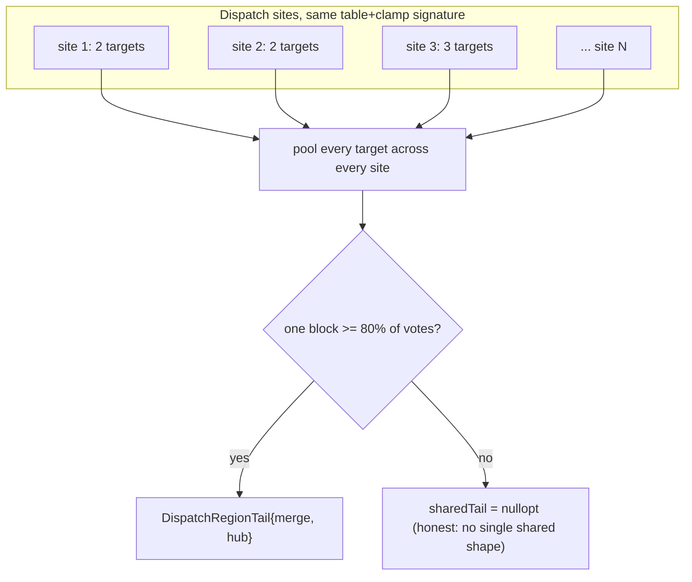
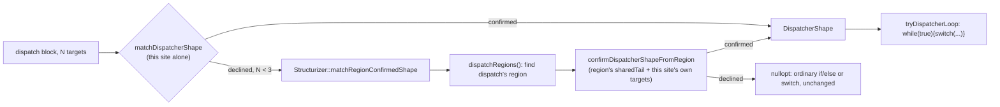

# 17 — DispatchRegion: clustering dispatch sites by table identity

`analysis::matchDispatcherShape` (and the `tryDispatcherLoop`/`switchFor`
machinery built on it) already recovers the shape a flattening obfuscator's
*single* N-way dispatch block takes: one block, at least three resolved
targets, most of them falling into one shared merge before looping back to
one shared hub. That recovery is a per-block vote — it looks at one
`IndirectBranch`'s own target list and nothing else — which is exactly right
when the obfuscator really does emit one big dispatch block, and exactly
blind to a different, equally common shape: hundreds of small, otherwise
unrelated two-way branches, each with its own value-set-narrowed pair of
live targets, that all read through the *same physical jump table*. No
single one of those sites has three targets to vote with; `matchDispatcherShape`
correctly declines every one of them, and correctly reports nothing wrong,
because nothing about any one site's own target list is wrong. What ties
them together is not in any site's own shape at all — it is the fact that
they all dispatch through one table.

`analysis::DispatchRegion` (`include/xdec/analysis/dispatch_region.h`,
`src/analysis/dispatch_region.cpp`) is that missing identity, computed once
per function so a caller can ask "how much of this function is one
flattened state machine, even though it never shows up as one block."

## Why table identity, not control-flow shape

Two dispatch sites can look nothing alike in the CFG — different predecessor
chains, different live registers, no edge between them at all — and still
belong to the same physical dispatcher, because what makes a jump table one
table is where it lives in memory and how an index is turned into an
address into it, not how any one site branches. `DispatchRegion` clusters on
exactly that: `analysis::matchJumpTable`'s own base/stride/entry-width/anchor
tuple, plus, when a site guards its index against going out of range, the
same clamp bound/replacement pair (`matchDispatchClamp`, the general form of
the `(bound < index) ? replacement : index` shape `structure.cpp`'s
`collapseDispatchTree` and `c_expr.cpp`'s `Select` case already print). Two
sites reading the same table through two *different* clamps are, honestly,
reading it under two different range assumptions — kept as separate regions
rather than merged into one that would misreport the clamp either site
actually uses.

```cpp
struct DispatchSite {
  il::BlockId dispatchBlock;
  std::vector<il::BlockId> targets;   // il::Function::targets' own order
  il::ExprId indexExpr;               // the clamp select, or the bare index
  std::vector<uint64_t> caseValues;   // matchDispatchValues' recovery, or empty
};

struct DispatchRegionTail {
  il::BlockId merge;
  il::BlockId hub;
};

struct DispatchRegion {
  uint64_t tableBase; uint32_t tableStride; uint32_t tableEntryBits;
  bool tableRelative; uint64_t tableAnchor; bool tableSignedOffsets;
  std::optional<uint64_t> clampBound;
  std::optional<uint64_t> clampReplacement;
  std::vector<DispatchSite> sites;
  std::optional<DispatchRegionTail> sharedTail;
};

std::vector<DispatchRegion> findDispatchRegions(const il::Function& function);
```

`findDispatchRegions` scans every block ending in a resolved `IndirectBranch`
whose target expression matches `matchJumpTable`, and groups them by that
table/clamp signature — one region per distinct signature, in first-seen
order. A function with no such branch, or one where every indirect branch is
still unresolved, returns no regions at all: there is nothing to
over-report on code this analysis has not actually looked at successfully.

## The region's own shared-tail vote

A region's `sites` are gathered by data identity alone, so nothing so far
says whether they also happen to share a control-flow shape. `sharedTail`
answers that, separately: every target across every site in the region is
pooled into one count, and if one block gets a strong majority (≥80%) of the
votes, that block is the region's `merge`, and the block it unconditionally
branches on to is the region's `hub` — the region-level generalisation of
`DispatcherShape.merge`/`.hub`, built from many two-vote sites instead of one
many-target site. `sharedTail` is `nullopt` the honest, common way just as
often as it resolves: a region can be one real physical table read by
hundreds of otherwise-unrelated small decisions, with no single block that
most of them fall into — libscplugin's own region (`0x1164f8`, 234 sites) is
exactly this case, and reports `sharedTail = nullopt` correctly rather than
guessing one into existence (see `docs/00-core-vs-plugin-prompt.md`'s
"report, never guess" rule).



## Confirming one site from the region's evidence

A region-wide majority is evidence the shared-tail shape exists *somewhere*
in the region — it is not, by itself, evidence about any one site, because a
majority elsewhere says nothing if this particular site's own targets do not
actually reach that tail. `confirmDispatcherShapeFromRegion` makes that
individual check:

```cpp
std::optional<DispatcherShape> confirmDispatcherShapeFromRegion(
    const il::Function& function, il::BlockId dispatch,
    std::span<const il::BlockId> targets, const DispatchRegion& region);
```

`nullopt` when `region` has no `sharedTail` at all, or when any one of
`targets` fails the same private-handler test `matchDispatcherShape` itself
applies to a many-target site — reached from `dispatch` and nowhere else,
and falling straight into `region.sharedTail->merge`. A target that itself
keeps dispatching, or that has some other predecessor besides `dispatch`, is
not "falls into the tail" no matter how the rest of the region votes, and
disqualifies the whole site rather than being silently skipped.

## Where the core consumes it

**`AnalysisCache::dispatchRegions()`** (`include/xdec/analysis/analysis_cache.h`)
computes `findDispatchRegions` lazily and caches it, the same way
`dominators()`/`stackFrame()` already do — invalidated by the `"cfg"` or
`"dispatch"` tags, independent of the dominator tree since region membership
reads jump-table and clamp shapes off the function's expressions and edges
directly, not off either dominance relation.

**`Structurizer::tryDispatcherLoop`** (`src/emit/structure.cpp`) is the one
structural consumer today. Its existing single-block vote,
`matchDispatcherShape(function_, dispatch, dispatchTargets)`, runs first and
unconditionally — a real N-way dispatch block still recovers exactly as it
always did, with no region lookup in the way. Only when that vote declines
(the site has fewer than three targets, the shape this analysis exists for)
does `Structurizer::matchRegionConfirmedShape` get asked: it walks
`dispatchRegions()`, finds the region `dispatch` is a member of, and asks
`confirmDispatcherShapeFromRegion` to confirm this specific site from that
region's pooled evidence. The rest of `tryDispatcherLoop` — the natural-loop
header/latch checks, `claimDispatcherCaseBody`, `LiveRegisterFrame` — is
completely unaware which of the two votes produced its `DispatcherShape`;
region membership only widens *how* a shape gets confirmed, never what is
done with one once confirmed.



### Three more consumers added since (2026-08-12, Track B Phases 2-4)

**`analysis::findDispatchJoins`** (`dispatch_region.h`/`.cpp`, J2e) answers a
question `sharedTail`'s single ≥80%-majority vote cannot: a region can have
*several* independent merge hubs, each fed by only a handful of that
region's sites rather than a region-wide majority. It looks for a block
`hub` that is the target of at least two "private handler tails" — blocks
with exactly one predecessor (a dispatch site inside the region) and exactly
one successor (`hub`) — and additionally requires every one of `hub`'s own
predecessors to be accounted for by such a tail, so a hub with some
unrelated fourth predecessor from outside the region is correctly refused
rather than half-claimed. `Structurizer::switchFor` consults
`joinHubByTail()` (a per-run cache over `findDispatchJoins`) once
`matchDispatcherShape` itself declines: the first unclaimed `DispatchJoin`
whose `hub` a switch's own targets reach is printed as that switch's
epilogue, same as a `DispatcherShape`-confirmed merge would be, just without
`stmt->frame` (the live-register-frame machinery still requires the fuller
`DispatcherShape` proof). See `tests/emit/test_structure_join_epilogue.cpp`.

**`Structurizer::collapseRegionDispatchTree`** (`structure_dispatch_region.cpp`,
J2) is the `collapseRegionDispatchTree` this document's own "Non-goals"
section once called future work — implemented, but deliberately narrower
than "re-derive the obfuscator's state machine from table identity alone."
It only flattens a nested `Switch`-inside-a-`Switch` case body when both
switches are `tableMode`, share the *exact same* `il::ExprId` discriminant,
and the inner switch carries no `epilogue` of its own — i.e. it proves two
adjacent dispatch levels are reading the same index, rather than inferring a
shared index across sites that never provably shared one. Gated behind
`StructureOptions::regionStructuring` (default `false`); on
`sample_libscplugin` it fires zero times, because that function's 234 sites
each dispatch on their own state expression, never the same `ExprId` a
sibling site already tested — a sound "nothing to merge" result, not a
missed one. See `tests/emit/test_structure_region_switch.cpp`.

**`Structurizer::collapseLabeledNaturalLoops`** (`structure.cpp`, J2f) is not
a `DispatchRegion` consumer directly, but closes the gap this document's
`tryDispatcherLoop` section describes above: a natural loop whose header
terminates in a resolved dispatch (not a `CondBranch`) never matches
`tryLoop`'s or `tryDispatcherLoop`'s shapes, and `wrapAsLoop` only looks for
a back edge inside the one switch it just built for that header — never one
arriving from an entirely separate top-level group reached through several
other blocks first. Run once after `Structurizer::run()`'s ordinary sweeps,
it finds loops whose every member block still prints as its own untouched,
labelled top-level group, splits the header's own group at the point its
code begins (so an unrelated prefix — e.g. the function's real entry block
falling straight into the loop header — never ends up re-running inside the
loop), and folds the qualifying remainder into one `while (true)`, rewriting
back edges to `continue` via `Structurizer::continueAtBackEdges`. On
`sample_libscplugin` this raised `while(true)` from 2 to 49 and cut `goto`
from 407 to 388 — a smaller net reduction than the plan's standalone
60-100 estimate because most of the back edges it targets overlap with
`J2e`'s own hub claims. See `tests/emit/test_structure_labeled_loop.cpp`.

## What this does and does not change for libscplugin

Run against `samples/build/out/sample_libscplugin.c`'s source function
(`0x1164f8`), `findDispatchRegions` reports exactly what the diagnosis in
the plan this phase implements expected: **one region, 234 sites, `sharedTail
= nullopt`** (`xdec decompile ... --emit-report`'s own `dispatch-regions:`
line). That absence is not a bug in this analysis — the 234 sites' own
targets genuinely do not converge on one shared block; each one dispatches
into its own distinct next state, the way a real, densely-packed flattened
state machine does when it is not merely *emulating* one big switch through
narrower encoding. Because `sharedTail` is absent, `matchRegionConfirmedShape`
has no region evidence to confirm any individual site from, and libscplugin's
emitted `.c` is unaffected by this phase: still zero `switch` statements,
same `while(true)`/`goto` counts as the pre-Phase-1 baseline. This was
verified directly (byte-comparing the emitted output before and after Phase
1/2 land) rather than assumed.

What this phase's `tryDispatcherLoop` integration is positioned for: once
`dispatch`'s own two targets both cleanly fall into one merge (the same
private-handler, single-successor shape `matchDispatcherShape` itself
requires), and the *rest* of that same table's region already carries
enough independently-confirmed evidence for that exact merge/hub pair, the
loop wrap no longer needs `dispatch` to individually clear the three-target
floor. `tests/analysis/test_dispatch_region.cpp` proves the analysis this
rests on end to end at the IL level (three unrelated two-way sites forming
one region with no shared tail; a region whose pooled targets do converge
and report one; a two-target site individually confirmed, and correctly
refused, from a region's vote). Reaching that same confirmation from inside
`tryDispatcherLoop` for a *second*, genuinely separate site needs that
other site to be reachable only through `header` (or the natural-loop walk
would not even see it as a back edge) while also feeding the exact same
`merge` `dispatch` uses — which necessarily makes it `header`'s other
direct arm, the one slot `tryDispatcherLoop` already tries to claim as a
plain "does its own work, falls into `merge`" tail (see the three-way-merge
case above) via `emitRegion`, whose own `IndirectBranch` handling never
walks through a second resolved dispatch to reach a `stop` block. That
ordering is exactly why libscplugin's own single region, with 234 sites and
no `sharedTail`, does not exercise this integration point today either
(see below) — the fallback's value already proven (individual two-target
confirmation from pooled evidence, correctly refused when not warranted) is
real, but a function shaped so that a *second* real dispatch block supplies
the missing votes for `tryDispatcherLoop` specifically remains unbuilt as a
synthetic fixture, and is called out here rather than asserted with one
that does not actually exercise it end to end.

## Tests

- `tests/analysis/test_dispatch_region.cpp` — `matchDispatchClamp` (signed/
  unsigned positive cases, swapped arms and non-literal bounds as negatives);
  `findDispatchRegions` (one region from several two-way sites, a majority
  vote producing `sharedTail`, different table bases or clamps forced into
  separate regions, an empty function reporting none); `confirmDispatcherShapeFromRegion`
  (a two-target site confirmed from region evidence, and refused when a
  target does not reach the tail, when a target has more than one
  predecessor, or when the region has no `sharedTail` at all).
- `tests/analysis/test_analysis_cache.cpp` — `dispatchRegions()` computed
  once across repeated calls, and correctly recomputed after `invalidate()`
  with no tags or with `"cfg"`/`"dispatch"`.
- `tests/emit/test_structure.cpp`'s existing dispatcher-loop coverage (a
  real single-block dispatch with three or more targets, guarded by a
  header, with and without a three-way merge) is the guarantee that
  `matchDispatcherShape`'s own direct vote is tried first and unconditionally
  — every one of those cases still resolves exactly as before, with no
  region lookup in the way, because `tryDispatcherLoop` only reaches for
  `matchRegionConfirmedShape` once that direct vote has already declined.
  `matchRegionConfirmedShape` itself has no dedicated multi-site
  natural-loop fixture yet: doing so needs a second site's votes to reach
  the *same* physical merge/hub `dispatch`'s own loop uses, and every such
  site is, by construction, backward-reachable into that merge — which
  `emitRegion`'s own `IndirectBranch` case (see `structure.cpp`) always
  treats as a self-contained unit, never a through-route to some other
  block. That is an orthogonal, pre-existing limit on what `emitRegion` can
  walk *through*, not a defect in the region-confirm logic itself, and it
  bounds a synthetic fixture the same way it bounds real code today — see
  "What this does and does not change for libscplugin" above for why
  libscplugin's own 234-site region does not exercise this path either.
  The logic this integration point delegates to —
  `confirmDispatcherShapeFromRegion`'s all-or-nothing per-target check, and
  `findDispatchRegions`'/`matchRegionSharedTail`'s pooled vote — is fully
  covered directly, as listed above.

## Non-goals

- No plugin, no libscplugin-specific address or constant anywhere in
  `dispatch_region.h`/`.cpp` — every rule is stated in terms of
  `matchJumpTable`'s and `matchDispatchClamp`'s own general shapes, per
  `docs/00-core-vs-plugin-prompt.md`.
- `DispatchRegion` does not itself change any emitted C. It is consulted by
  `tryDispatcherLoop` as one more source of evidence for a `DispatcherShape`;
  every actual print decision downstream of that (case bodies, epilogue,
  `LiveRegisterFrame`) is exactly the machinery `bc_lib`'s single-block
  dispatch already went through.
- Building one region-wide `switch` out of sites with no `sharedTail` by
  re-deriving the obfuscator's entire state machine from table identity
  alone remains out of scope: `Structurizer::collapseRegionDispatchTree`
  (added since, see "Three more consumers added since" above) only flattens
  cases that already, provably, share one `il::ExprId` discriminant between
  adjacent dispatch levels — it does not attempt to prove two *sites'*
  otherwise-unrelated indices are secretly the same state variable, which
  would be the materially larger and riskier claim this bullet originally
  ruled out.
