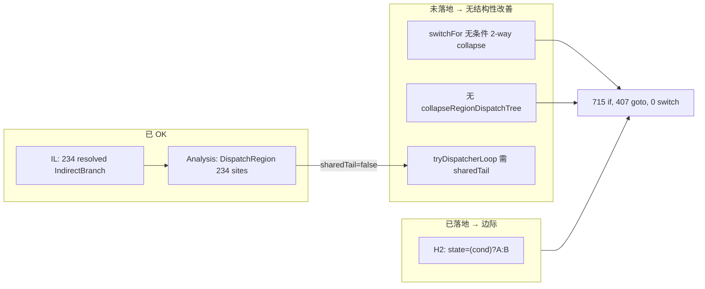
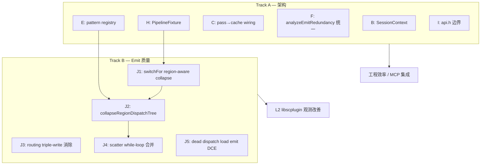

# 18 — xdec 架构优化与反编译质量提升方案

> **文档性质**：Track B/J 的 **详细设计附录**（API 伪代码、算法草图、附录文件表）。**可执行主方案**（路线图、验收、goto 诊断、当前状态）见 [architecture-optimization-eval-prompt.md](architecture-optimization-eval-prompt.md)。
>
> **约束**：遵循 [00-core-vs-plugin-prompt.md](00-core-vs-plugin-prompt.md) —— 核心通用、IL/形状驱动、合成 fixture 证明、禁止样本硬编码。
>
> **关联**：DispatchRegion 分析见 [17-dispatch-region.md](17-dispatch-region.md)；ERE 见 [14-emit-redundancy.md](14-emit-redundancy.md)。

---

## 1. 总体判断

| 维度 | 评分 | 说明 |
|------|------|------|
| **架构成熟度** | **7 / 10** | IL / pass / driver 设计扎实，`decompileToC()` 与 `AnalysisCache` 已落地；**emit structurizer 仍是最大短板**，对 scatter-dispatcher（libscplugin 类）几乎无结构化能力 |
| **IL 层** | 8 / 10 | 234/234 indirect resolve、jump table、MBA 化简、vars 恢复均 OK |
| **分析层** | 7 / 10 | `DispatchRegion`、dispatcher shape、guard cascade 等形状齐全，但 **consumer 不完整** |
| **Emit 层** | **5 / 10** | bc_lib 类 single-hub dispatcher 可恢复；scatter-dispatcher 仍 715 if + 407 goto + 0 switch |
| **工程化** | 7 / 10 | 636 单测 + 98 eval + 5 samples；`PipelineFixture::structureFunction()` 已补，pass→`AnalysisCache` invalidate 已桥接；public API 边界仍缺 |

**一句话结论**：xdec 已是「IL 正确、分析可观测、C 输出对 honest / bc_lib 类样本合格」的框架；下一阶段的 ROI 不在再加 pass，而在 **补齐 structurizer 对 scatter-dispatcher 的消费路径**，并收敛架构债务（SessionContext、pattern registry、ERE 统一入口）。

### 1.1 当前回归基线（2026-08-12，`architecture-optimization-eval-prompt.md` Phase 1-4 落地后）

| 层级 | 内容 | 状态 |
|------|------|------|
| 单元测试 | Catch2，**636** test cases | 全过 |
| L0 eval | **98** 个 NDK ground-truth 函数（baseline）+ 38（typed） | baseline 98/98、typed 38/38 |
| L1 samples | **5** 个真实 `.so` 形状指标 | 4/5（`sample_libscplugin` 因 J2f 新增 `while(true)` 循环推高行数至 6702，超出 `manifest.json` 现有 `max_lines: 6600`；见 §1.2，阈值收紧待用户确认） |
| L2 观测 | `sample_libscplugin` @ `0x1164f8` | 非门禁；见 §2 与 `eval/FINDINGS.md` 2026-08-12 条目 |

### 1.2 自 eval 提示词以来已落地项

| 原方向 | 状态 | 落点 |
|--------|------|------|
| **A：decompileToC API** | ✅ 已完成 | `include/xdec/decompile/emit.h`，`decompileToC()` / `renderToC()` |
| **C：AnalysisCache** | ✅ 已完成 | `include/xdec/analysis/analysis_cache.h`；`dispatchRegions()` 已接入；pass→cache invalidate 已通过 `AnalysisCacheObserver`（`xdec_decompile`）桥接，读取 `PassInfo::invalidates` |
| **H：PipelineFixture** | ✅ 已完成 | `tests/fixture/pipeline_fixture.h` 新增 `structureFunction()`，`test_structure.cpp`/`test_structure_dispatch_region.cpp` 已迁移，消除手写 dominators 样板 |
| libscplugin 核心提升 Phase 0–1 | ✅ 已完成 | `quantify_c.py`、`ObfuscationProfile`、`DispatchRegion` |
| libscplugin 核心提升 Phase 2 | ✅ 已完成 | J1✅ J2d✅（对本样本无可观测收益，见 `eval/FINDINGS.md` 2026-08-12 条目）；J2e✅（`findDispatchJoins` + `switchFor` 挂 join epilogue，见 `17-dispatch-region.md`）|
| libscplugin 核心提升 Phase 3–4 | ✅ 已完成 | J5（`deadJumpTableLoad` 已系统接入）、J3（`deadRoutingStateStore`，`duplicate-routing-if` 10→0）、J2（`collapseRegionDispatchTree`，默认关闭，`sample_libscplugin` 上 0 命中——234 site 各自独立 discriminant，无嵌套同表 switch 可合并）、J2f（`collapseLabeledNaturalLoops`，`sample_libscplugin` goto 407→388、`while(true)` 2→49）均已落地；H2 Select 折叠此前已生效 |

---

## 2. L2 观测：libscplugin 差距诊断（方案输入）

`sample_libscplugin.c`（8253 行）是 **scatter-dispatcher** 形态，与 bc_lib 的 **single-hub dispatcher** 根本不同：

```
profile: 667 blocks, largest SCC 23, dispatcher fan-in 0
         indirect branches 234 (0 unresolved)
dispatch-regions: 1 region, 234 sites, sharedTail=false
```

| 指标 | 方案前 | 当前 | Phase 2 目标 | 达成 |
|------|-------:|-----:|-------------|:----:|
| `switch` | 0 | **234** | ≥1 大 switch 或合并 | △ J1✅ |
| `while(true)` | 39 | **2** | 低即可 | △ 方向性 |
| `goto` | 407 | **407** | <200 | ❌ 待 J2；J2d 已落地但对本样本无收益（region 内共享 handler 几乎全部自身再分发） |
| `state=` | 1192 | 1188 | 下降 | △ |
| 行数 | 8295 | 8253 | — | △ |

**根因分层**：



**典型残留坏模式**（emit 瓶颈，非 IL）：

```c
// 1) switchFor 2-way collapse：244 个 table dispatch → 0 switch
if ((var_901 != 0x0)) { state = 0x1bf; } else { state = 0x1a2; }

// 2) 路由三写：state + while(guard) + goto 同一条件
while (true) {
  if ((var_901 != 0x0)) {
    if ((var_208 == 0x0)) { goto L_...; } else { goto L_...; }
  } else { continue; }
}

// 3) H2 已改善，但 dead load + 碎片 while 仍在
state = ((t103 < 0x4000) ? 0x2a2 : 0xb6);
t104 = load(table[clamp(state)]);   // 无读者，仍打印
while (true) { if (t103 < 0x4000) goto L_...; else continue; }
```

此诊断 **直接驱动** 本方案 Track B（§5）的优先级，高于纯架构 refactor。

---

## 3. 架构优化方向评估（A–I + 新增 J）

评分：收益 / 成本 / 风险 = 1–5（5 最高）。**建议优先级** 综合 ROI 与 libscplugin 阻塞关系调整。

| 方向 | 现状 | 收益 | 成本 | 风险 | 建议优先级 | 理由 |
|------|------|:----:|:----:|:----:|:----------:|------|
| **A** decompileToC API | ✅ 已落地 | 4 | 1 | 1 | **维持** | CLI/MCP/测试已可共用；后续只需薄化 cmd_pipeline |
| **B** SessionContext | ❌ 三处重复 wiring | 4 | 3 | 2 | **P1** | 减少 driver/CLI/plugin 配置漂移；不阻塞质量但减维护成本 |
| **C** AnalysisCache 全自动 | ⚠️ 有 cache，pass 未消费 invalidates | 3 | 2 | 2 | **P2** | Structurizer 已 lazy 用 cache；补 pass→cache 桥接即可 |
| **D** analysis/ 子域划分 | 单库 ~30+ 文件 | 3 | 2 | 1 | **P3** | namespace/子目录文档化；不必拆 CMake target |
| **E** Structurizer pattern 注册表 | 硬编码优先级链 | 4 | 4 | 3 | **P2** | scatter-dispatcher 新 pattern 需要可插拔位；与 Track B 同步 |
| **F** ERE 统一入口 | 分散在 CContext | 3 | 2 | 2 | **P2** | `analyzeEmitRedundancy()` 一次调度；H2 仍留 emit 层 |
| **G** Structured 纳入 pass | maturity 缺口 | 2 | 4 | 3 | **P4** | 已有 `DecompileToCResult::structured`；pass 化 ROI 低 |
| **H** PipelineFixture | 测试各自 register | 4 | 3 | 2 | **P1** | 加速「IL→C 片段」测试；scatter-dispatcher fixture 依赖它 |
| **I** 公共 API 边界 api.h | 头文件面过大 | 3 | 3 | 2 | **P3** | MCP/finetuning 集成前做；非紧急 |
| **J** Scatter-dispatcher structurizer | **缺失** | **5** | **4** | **3** | **P0** | libscplugin 主瓶颈；DispatchRegion 已分析但未消费 |

### 3.1 对原 P0–P4 的调整

| 原优先级 | 原内容 | 调整后 |
|----------|--------|--------|
| P0 | A：decompileToC | **A 已完成** → P0 让给 **J（scatter structurizer）** |
| P1 | B：SessionContext | 维持 P1，与 **H：PipelineFixture** 同批 |
| P2 | C：AnalysisCache | 维持 P2 |
| P3 | D/E/F | E 提升至 P2（为 J 提供扩展点） |
| P4 | G/H/I | H 提升至 P1 |

---

## 4. 双轨策略

本方案分 **Track A（架构清晰度）** 与 **Track B（反编译质量）** 并行，Track B 对 libscplugin 类样本优先级更高。



**原则**：Track B 每一项必须 **合成 fixture + L0/L1 零回归**；libscplugin 仅作 L2 观测，不作门禁特判。

---

## 5. Track B 详细设计：Scatter-Dispatcher Structurizer（方向 J）

### 5.1 问题形式化

**输入**：`DispatchRegion R`，满足：

- `R.sites.size() >= N`（如 N≥8，与 `likelyFlattened` 阈值一致）
- 各 site 为 resolved `IndirectBranch` + `matchJumpTable(R.tableBase, ...)`
- **`R.sharedTail` 可有可无**（libscplugin 为 `nullopt`）

**目标**：在 emit 层恢复 **可读的控制流视图**，不要求还原真实 runtime state machine 语义（那是插件/业务层的事）。

**非目标**：

- 不硬编码 `0x1e70a0` / `0x1164f8`
- 不引入 `xdec_dispatch_index_*` 类专有 helper
- 不在 `sharedTail=false` 时 **猜测** merge/hub

### 5.2 子项 J1：switchFor region-aware 2-way collapse 策略

**现状**（`structure.cpp` L1117–1142）：凡 2-target + `matchDispatchValues` 有 condition → 无条件 `return ifStmt`，table-mode switch 永不生成。

**修正策略**（通用）：

```cpp
// 伪代码 — 插入 switchFor 的 2-way collapse 门控之前
if (targets.size() == 2 && isMemberOfLargeDispatchRegion(block)) {
  // defer：保留 table-mode switch（或标记 deferCollapse 供 J2 消费）
  goto build_table_switch;
}
// 独立 2-way site（非 region 成员，或 region 仅 1–2 site）→ 维持现有 if/else collapse
```

**门控条件**（全部 IL 驱动）：

1. `dispatchRegions()` 中存在 region，`sites` 含 `block`，且 `sites.size() >= kMinRegionSites`（建议 8，与 profile 阈值对齐）
2. **或** `options.deferRegionCollapse == true`（测试/诊断开关）

**预期 L2 效果**：`switch` 0 → ~234（2-case table switch）。可读性有限，但验证 pipeline 并恢复 table 语义。

**测试**：`tests/emit/test_structure_dispatch_region.cpp`

- 3 个同 region 2-way site → 保留 3 个 `Switch`（tableMode=true），非 3 个嵌套 `If`
- 独立 2-way site（不同 table base）→ 仍 collapse 为 `If`（L1 行为不变）

**工期**：~1 周

---

### 5.3 子项 J2：collapseRegionDispatchTree

**目的**：在 **region scope** 把多个 linear compare / 2-way dispatch 链，重建为 **单个 N-way `Switch`**（hex case values 来自 `matchDispatchValues`）。

**与现有 machinery 关系**：

| 现有 | 能力 | 缺口 |
|------|------|------|
| `tryDispatchTree` | ≥3 case 的 compare 二叉树 | 无法处理已 collapse 的 2-way 链 |
| `switchFor` table-mode | 单 block N-target | 每 site 仅 2 target |
| `tryDispatcherLoop` | guard + switch + shared tail | 需 `sharedTail` / ≥3 target vote |

**新 API**（`src/emit/structure_dispatch_region.cpp` 或扩展现有文件）：

```cpp
struct RegionSwitchPlan {
  il::ExprId discriminant;           // 统一 selector（常为 state 局部或 phi）
  std::vector<uint64_t> caseValues;
  std::vector<il::BlockId> handlers;
  std::vector<StmtPtr> caseBodies;   // claim 或 goto
  std::optional<il::BlockId> defaultTarget;
};

std::optional<RegionSwitchPlan> collapseRegionDispatchTree(
    Structurizer& s,
    const analysis::DispatchRegion& region,
    unsigned depth);
```

**算法草图**（保守、可证明）：

1. **Case 收集**：对每个 `DispatchSite`，用 `site.caseValues` + `site.targets`（已 static 则直接用；否则 skip plan）
2. **Discriminant 统一**：要求同一 region 内各 site 的 `indexExpr` 经 `matchDispatchClamp` 剥壳后 **同一 `ExprId` 或同一 state 局部**；否则不合并
3. **Handler 认领**：`claimCaseBody` / `claimOrCloneSharedCaseBody`；多前驱 handler → goto 或 clone（J2d 扩展）
4. **不假设 shared tail**：plan 不含 epilogue merge；各 case body 自行结束（return/goto/下一 dispatch）
5. **插入点**：在 `Structurizer::run()` 的 **region pass**（新阶段）：若 `findDispatchRegions()` 返回 qualifying region，在 **entry 后或首个 region site 之前** 尝试构建 `RegionSwitchPlan`；成功则 **mark 已吸收 sites 为 emitted**，避免 `emitRegion` 重复打印

**`sharedTail=false` 时的诚实行为**：

- **可以** 输出 `switch(state) { case 0x2a2: ... case 0xb6: ... }` 形式的 **局部 mega-switch**（仅覆盖 static 可名的 case 子集）
- **不可以** 包装成 `while(true){ switch }` 除非另找到 natural loop + hub（J4）

**测试 fixture**：

- 7 个同表 2-way site，linear compare 链，caseValues 可静态恢复 → 1 个 ≥7 case switch
- caseValues 不可恢复 site 混在 region 内 → plan 拒绝或 partial（文档化）
- 负例：不同 clamp → 两个 region，不合并

**预期 L2 效果**：`switch` ≥1 且 case 数为可静态恢复子集；`goto` 下降（handler 内联增多）

**工期**：~3 周（最大项）

---

### 5.4 子项 J3：路由三写消除（Phase 3a 补完）

**检测形状**（`emit/c_stmt.cpp` 或 `emit_redundancy`）：

```
Store(state, Select(cond, A, B))   // 或 state=(cond)?A:B
If(cond, goto X, goto Y)           // 紧邻，cond 相同
While(true, If(cond, ...))          // 可选第三层
```

**动作**（仅可证明等价时）：

- 去掉冗余 `state=`（state 为 write-only 且非 switch discriminant 时）
- 或合并 `while(true){ if(cond)...}` 为 `if(cond){...} else {...}`（当 body 无 back-edge）

**测试**：合成 Block+If+While 序列；L0 负例（cond 非等价）不合并

**预期 L2**：`duplicate-routing-if` 10 → 0；`while(true)` 部分下降

**工期**：~1.5  week

---

### 5.5 子项 J4：Scatter while-loop 合并

**形状**：`while(true) { if (C) goto L; else continue; }` 且 `C` 与前一 routing `if/else` 同构。

**与 J3 关系**：J3 处理 statement 级去重；J4 在 structurizer 级识别 **dispatch epilogue loop**（compare + goto hub 的 OLLVM epilogue），尝试：

- 内联为 `if/else` 链（无 loop）
- 或并入 J2 的 switch case body

**不假设** single hub；仅消除 **无 back-edge 的伪 while**。

**工期**：~1 week（依赖 J3）

---

### 5.6 子项 J5：Emit 层 orphan dispatch load DCE

**现状**：IL 层 `removeOrphanedLoads` 已有；emit 仍打印 `t104 = load(table[...])`（无读者）。

**扩展** `deadJumpTableLoad` / `collectDeadOps`：

- Block 内：`state = f(cond); t = load(table[index(state)]);` 且 `t` 无读者、后续 routing 不读 `t` → mark dead
- 保守：任何 `t` 传入 call / 写入 memory 则不删

**预期 L2**：减少 ~37 `dispatch-load-sites` 中的死代码

**工期**：~3 天

---

## 6. Track A 详细设计（架构）

### 6.1 B：SessionContext / PipelineEnvironment

```cpp
struct SessionContext {
  const binary::TargetProfile* profile = nullptr;
  const types::TypeDatabase* types = nullptr;
  const types::SyscallTable* syscalls = nullptr;
  analysis::MemoryFacts memoryFacts;
  // names, discovery, seal callbacks...
};

void configure(pass::Manager& m, const SessionContext& ctx);
void configure(DriverOptions& d, const SessionContext& ctx);
```

**验收**：cmd_pipeline 行数下降；无行为变化（byte-identical C on L1）

**工期**：~1 week

---

### 6.2 H：PipelineFixture

```cpp
class PipelineFixture {
public:
  PipelineFixture();
  il::Function runToVars(il::Function f);
  decompile::DecompileToCResult decompileToC(/* minimal */);
  std::string emitStmt(const emit::Stmt& root, /* CContext deps */);
};
```

**用途**：

- Track B 的 `test_structure_dispatch_region.cpp` 不再复制 dominators/loops 样板
- 未来「IL 文本 → 期望 C 子串」golden 测试

**工期**：~1 week

---

### 6.3 C：pass → AnalysisCache invalidate 桥接

在 `pass::Manager::run` 返回后，若 `PassInfo::invalidates` 含 `"cfg"`/`"dispatch"`，调用 `cache.invalidate(tags)`。

**验收**：`test_analysis_cache.cpp` 增 pass 后 invalidate 用例

**工期**：~2 天

---

### 6.4 E：Structurizer pattern registry

```cpp
struct StructurePattern {
  std::string_view name;
  int priority;  // 越高越先尝试
  std::function<StmtPtr(Structurizer&, BlockId, unsigned depth)> tryMatch;
};

// 注册：diamond, guard_cascade, dispatch_tree, dispatcher_loop,
//       region_dispatch_tree (J2), ...
```

**迁移策略**：现有 `tryDiamond` 等 **wrapper 注册**，行为不变；新 pattern 仅追加。

**工期**：~2 weeks（与 J2 并行）

---

### 6.5 F：analyzeEmitRedundancy 统一

```cpp
struct EmitRedundancyPlan {
  std::unordered_set<uint32_t> deadOps;
  analysis::StackLoadFoldMap stackLoads;
  analysis::MemoryLoadFoldMap memoryLoads;
  // ...
};

EmitRedundancyPlan analyzeEmitRedundancy(
    const il::Function&, const StackFrame&, const VariableTable&,
    const emit::StructuredFunction&, const COptions&);
```

`CContext` 构造改为单次调用。**H2 materializeAs 仍在 StmtPrinter 内**。

**工期**：~1 week

---

### 6.6 I：api.h 公共边界（可选，Month 3）

```cpp
// include/xdec/api.h — 唯一对外 stable 面
namespace xdec {
Result<std::string> decompileFunction(
    ByteReader image, uint64_t entry, DecompileOptions options);
}
```

内部头移出 `include/xdec/` 或标记 `detail/`。

**工期**：~1 week + 文档

---

## 7. 三个月实施路线图

假设 **1–2 人**，Track A/B 交错（B 优先）。

### Month 1 — 基础 + 快速验证

| 周 | Track B | Track A | 验收 |
|----|---------|---------|------|
| W1 | **J1** switchFor region gate | **H** PipelineFixture | L1 5/5；libscplugin `switch` > 0 |
| W2 | **J5** dead dispatch load | **C** cache invalidate 桥接 | 单测；libscplugin dispatch-load-sites ↓ |
| W3–W4 | **J3** routing 三写 | **B** SessionContext 草案 | duplicate-routing-if ↓；cmd_pipeline 瘦身 |

**M1 里程碑**：libscplugin 出现 table-mode switch；路由重复减少；工程 fixture 就绪。

---

### Month 2 — 核心 structurizer

| 周 | Track B | Track A | 验收 |
|----|---------|---------|------|
| W5–W7 | **J2** collapseRegionDispatchTree | **E** pattern registry 骨架 | 合成 7-site region → 1 switch；L0/L1 零回归 |
| W8 | **J4** scatter while 合并 | registry 迁移 diamond/loop | libscplugin while(true) ↓ |

**M2 里程碑**：region 级 switch 在 fixture 端到端；libscplugin goto 下降趋势可量化。

---

### Month 3 — 收敛 + 集成

| 周 | Track B | Track A | 验收 |
|----|---------|---------|------|
| W9 | J2 边界 case + 性能 | **F** ERE 统一 | 大函数 structurizer 时间有界 |
| W10 | L2 报告更新 FINDINGS | **D** analysis 子域文档 | docs/19-analysis-layout.md |
| W11–W12 | 可选 **I** api.h | MCP/finetuning 试点 | 外部调用不经 cmd_pipeline |

**M3 里程碑**：架构债务清单关闭 80%；libscplugin 观测表写入 FINDINGS；是否收紧 manifest 由 **用户** 决定 `-UpdateBaseline`。

---

## 8. 风险与迁移策略

### 8.1 高风险改动

| 改动 | 风险 | 缓解 |
|------|------|------|
| J1 defer 2-way collapse | L1 样本 switch 数变化 | region membership 门控；仅 ≥8 site region |
| J2 region switch 误合并 | 语义错误 | 仅 static caseValues；负例测试；不猜 default |
| J3 routing 合并 | 改变执行顺序 | 仅 `alwaysLeaves` + 同 cond 证明 |
| E pattern registry 重排 | 结构化顺序变化 | 优先级与现链一致；matchedPatterns 对比 |
| B SessionContext | 配置遗漏 | 并行旧路径一版；L1 byte diff |

### 8.2 迁移机制

- **Feature flag**：`DecompileToCOptions::regionStructuring = false` 默认；L2 观测开 true
- **Golden**：`eval/` 签名不变；`samples/` manifest 阈值 **只升不降** 除非用户 `-UpdateBaseline`
- **诊断**：`--emit-report` 增 `region-switch: absorbed N sites` 行
- **回滚**：J2 独立 `.cpp`，可 CMake option 禁用

### 8.3 不应做的改动（重申）

| 方向 | 原因 |
|------|------|
| 为重写 IL | hash-cons + round-trip 是核心资产 |
| 增量 lift | driver 全量 re-lift 论证已成立 |
| ERE H2 pass 化 | CSE scope 必须在打印时决定 |
| libscplugin 硬编码 | 违反 00 号文件 |
| 为 L2 放宽 manifest | 观测样本不作架构输入 |

---

## 9. 遗漏项补充

| 新方向 | 说明 | 优先级 |
|--------|------|--------|
| **K：Structurizer 性能预算** | 667-block 函数 region pass 可能 O(sites²)；需与 `budget_` 统一 | P2 |
| **L：observe / maturity dump API** | `decompileToC` 已有 structured；暴露 `--dump-structured` JSON | P3 |
| **M：profile.dispatcherFanIn 修正** | 当前仅计 **unresolved** indirect；resolved scatter 应另有 `regionSiteCount` | P2 |
| **N：插件 ABI 稳定** | 核心 J2 完成后，OLLVM 特化 pass 放插件 | P4 |
| **O：错误处理 / Result 一致性** | 统一 `Result<T>` 传播至 CLI | P3 |

---

## 10. 与 redecomp v2 / MCP 的关系

| 项目 | 定位 | xdec 本方案如何配合 |
|------|------|---------------------|
| **xdec** | 全自动 IL→C pipeline | Track A `api.h` + `decompileToC` 作嵌入库 |
| **redecomp v2** | 状态块图 = 事实源，C = 渲染 | xdec 输出 `StructuredFunction` + `DispatchRegion` 作 **输入事实**，不重造 CFG 编辑 |
| **decomp_mcp** | 交互式 CFG 分析 | `AnalysisCache` + region 诊断线供 MCP 查询 |
| **finetuning** | 训练数据 | Track B 改善 C 可读性 → 直接提升语料质量 |

**建议**：xdec 偏 **「可嵌入的 IL + structured emit 库」**；全自动与交互式共用 `decompileToC()`，差异在 options 与是否调用 redecomp 下游。

---

## 11. 验收标准汇总

### 11.1 每 Phase 必过门禁

- `xdec_tests` 全过（当前 612+ cases）
- `eval/run.ps1`：98/98，vs baseline 无 regressed
- `samples/run.ps1`：5/5，vs baseline 无 regressed

### 11.2 L2 观测目标（非门禁，directional）

| 指标 | 当前 | M1 | M2 | M3 方向 |
|------|-----:|---:|---:|--------:|
| `switch` | 0 | >0 | ≥1 大 switch 或多数 2-case | 稳定 |
| `while(true)` | 39 | ~35 | ~20 | <15 |
| `goto` | 407 | ~400 | ~300 | <250 |
| `duplicate-routing-if` | 10 | <5 | 0 | 0 |
| `state=` | 1188 | ~1150 | ~900 | 随 switch 下降 |

*M3 数字为方向性目标；未达成不视为方案失败，但须写入 FINDINGS 说明阻塞点。*

---

## 12. 最终建议（维护者 actionable）

1. **立即启动 J1 + H（Week 1）**：最小 diff 验证「region 门控 defer collapse」能在 libscplugin 上产生 `switch > 0`，同时建立 PipelineFixture —— ROI 最高、风险最低。

2. **Month 2 集中 J2**：这是 scatter-dispatcher 的 **唯一** 结构性解法；`DispatchRegion` 分析已就绪，缺的是 structurizer consumer。与 pattern registry（E）同构实施，避免 `structure.cpp` 再膨胀。

3. **Track A 不要阻塞 Track B**：SessionContext / ERE 统一可在 J2 开发间隙并行；**不要** 在 J2 完成前做 Structured maturity pass 化（G）—— 收益低且干扰 emit 迭代。

4. **文档同步**：每完成 J 子项，更新 [17-dispatch-region.md](17-dispatch-region.md) 的「消费点」章节；L2 数字更新 [eval/FINDINGS.md](../eval/FINDINGS.md)。

5. **样本门禁**：`samples/manifest.json` 的 `sample_libscplugin` 阈值 **仅** 在 M3 实测改善后、经用户确认 `-UpdateBaseline` 收紧；核心不为通过 L2 写特化逻辑（00 号文件）。

---

## 附录 A：文件级变更预测

| 文件 / 目录 | Track B | Track A |
|-------------|---------|---------|
| `src/emit/structure.cpp` | J1 门控 | E 迁移 |
| `src/emit/structure_dispatch_region.cpp` | **新建** J2 | — |
| `src/emit/c_stmt.cpp` | J3, J5 | F 消费 plan |
| `src/emit/structurizer.h` | region pass 入口 | pattern registry |
| `include/xdec/analysis/dispatch_region.h` | 可能增 `RegionSwitchPlan` 辅助 | — |
| `src/analysis/profile.cpp` | — | M: regionSiteCount |
| `include/xdec/decompile/session.h` | — | **新建** B |
| `tests/fixtures/pipeline_fixture.h` | — | **新建** H |
| `tests/emit/test_structure_dispatch_region.cpp` | **新建** | — |
| `docs/19-analysis-layout.md` | — | **新建** D |

---

## 附录 B：与 eval 提示词的对照

| eval 提示词 § | 本方案 § |
|---------------|----------|
| 方向 A | §3 已落地；§6 薄化 CLI |
| 方向 B–I | §3 评估 + §6 Track A |
| 方向 J（遗漏） | §5 Track B |
| 评估维度 1–7 | §3、§7、§8、§10 |
| 约束 483/96/4 | §1.1 更新为 612/98/5 |
| libscplugin 计划 | §2、§5、§11.2 |

---

*文档版本：2026-08-12。随实现进展更新 §1.2 落地表与 §11.2 观测数字。*
