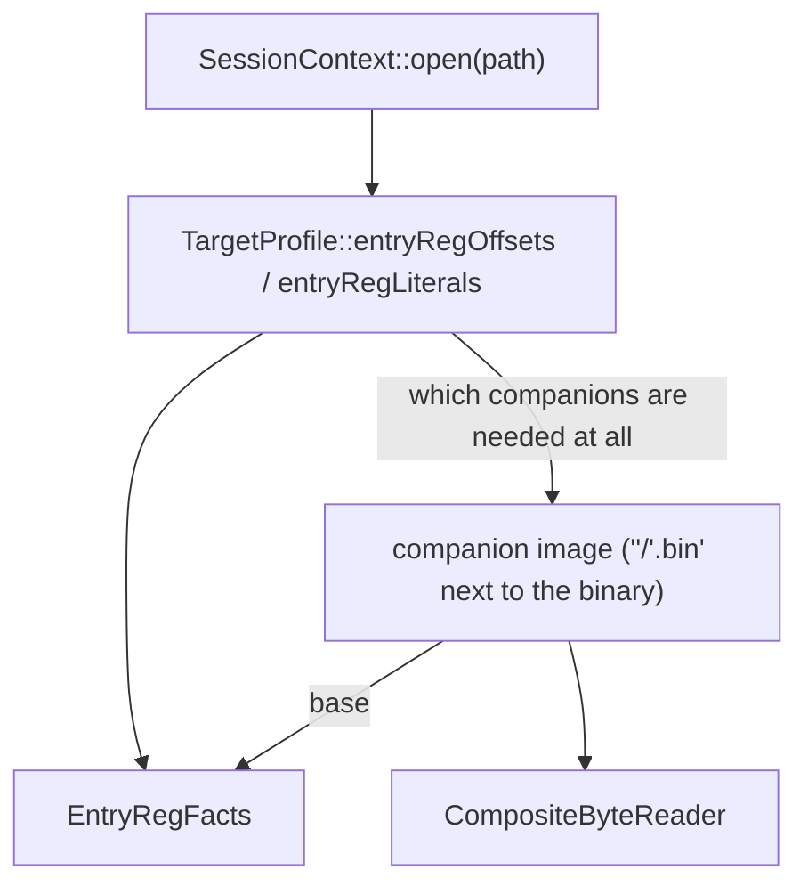

# 21 — EntryReg platform anchors (zero new CLI flags)

`ExprOp::EntryReg` (docs/01-il-spec.md) is `ImageEval`'s (docs/…) honest
answer for "what does this register hold at function entry": *top*, because
in general nothing static can say what a caller put there. absd's obfuscated
`LC_MAIN` entry (`0x100023290`, docs/20-absd-entry-registers.md) is the case
that makes that honesty expensive — it isn't reading a caller's argument, it
is reading **dyld's own leaked globals** (`x21`, `x22`) and **kernel
launch residue** (`x28`), all of it true of the *platform*, not the caller,
before absd's own code has ever run.

This doc is the schema and priority order for telling xdec that fact. It
adds **no** `decompile` CLI flag — `xdec decompile absd 0x100023290
--rounds 4 --discovery-cap 36 --allow-unresolved` is exactly the same
command with or without any of this — the same "infer from the binary, do
not make the user repeat themselves on every invocation" posture
`binary::TargetProfile` already has for `--types` (docs/06-type-import.md).

## 1. Priority order



1. **Platform profile** (`binary::TargetProfile::entryRegOffsets` /
   `entryRegLiterals`, `src/binary/target_profile.cpp`) — formulas and
   literals true of the platform in general. For Mach-O AArch64 today:

   | Register | Binding | Source |
   |----------|---------|--------|
   | `x21` | `dyld` base + `0x54000` (`sConfigBuffer`) | docs/20 §4.4, confirmed §7.4 |
   | `x22` | `dyld` base + `0x68310` (`_NSConcreteStackBlock`) | docs/20 §4.4, confirmed §7.4 |
   | `x28` | literal `0` | docs/20 §7.4 (kernel handoff; not architecturally guaranteed) |

   ELF/Android profiles have no entry-reg table at all — `buildEntryRegFacts`
   returns immediately for them (`profile.entryRegOffsets.empty() &&
   profile.entryRegLiterals.empty()`), so nothing below this even runs; an
   `EntryReg` leaf on those platforms is exactly as top as it always was.

2. **Companion image** — an extra binary a bound register's formula reads
   through (`dyld`, in the one case this exists for). Resolved by
   convention, inside `SessionContext::buildEntryRegFacts`:

   1. `<binary's directory>/<name>` or `<name>.bin` (desktop-dump
      convention: drop a `dyld` file next to your local `absd` copy)
   2. Not found → `note: no companion image named '<name>' found …`; every
      register whose binding needs that companion's base stays unresolved,
      exactly as before this facility existed. A companion is only opened at
      all if some binding in the profile actually names it.

   A companion's own file-declared base (`BinaryImage::memory().lowestAddress()`)
   stands in for its runtime base — correct for a same-session capture, not
   for a stock extract with a different slide (no per-binary override exists
   for that case today; see §4's `0x100023938`/`0x1000239a4` note).

## 2. What this actually resolves (measured, 2026-08-14)

`ImageEval::evalEntryReg` turns a bound `EntryReg` leaf into a
`ValueSet::one`; the C emitter (`src/emit/c_expr.cpp`,
`src/emit/c_printer.cpp`) turns a resolved binding into a `#define` instead
of an `extern`:

```c
#define __entry_x22 0x104fe0310ULL // resolved by platform entry-reg facts
#define __entry_x28 0x0ULL // resolved by platform entry-reg facts
```

Re-running `sample_absd_start_chain`'s exact command
(`--rounds 4 --discovery-cap 36 --allow-unresolved`) against a local `absd`
copy with no `dyld` companion available in this environment leaves the
following sites sealed:

| Site | Load | Why the platform binding alone isn't enough |
|------|------|-------------------------------------|
| `0x100023688` | `*(uint32_t*)((idx << 2) + 0x100080ec0)`, `idx` = raw `(uint32_t)__entry_x22` (or `+1`) | `0x100080ec0` is inside **absd's own image**, but the index is x22's full low 32 bits (`0x04fe0310` in the docs/20 §7.4 capture) — `idx*4` lands far outside anything absd maps. This is not a missing-companion problem; either a masking/range step this build's IL doesn't model yet is missing upstream of `_cse18`, or the real per-boot index is meant to come from a different, smaller-range source. Unresolved either way — flagged here rather than claimed fixed. |
| `0x100023938`, `0x1000239a4` | `*(uint32_t*)(__entry_x22 + (idx << 2))` | `__entry_x22` is now a concrete **dyld** address — this is a genuine cross-image read `CompositeByteReader` exists for, but it needs the real `dyld` file placed next to the local `absd` copy. Untested, not un-fixable: dropping a `dyld` companion next to it is expected to let this resolve, per `test_composite_reader.cpp`/`test_resolve_indirect.cpp`'s "a branch through a bare leaked entry register resolves once EntryRegFacts anchors it" coverage. |
| `0x1000238dc` | heap-derived | Out of scope for this doc — see docs/20 §8 and the plan's own "二期" list. |

**Net effect measured so far:** the mechanism works end-to-end (anchoring,
`#define` emission, no-companion degrade-gracefully note) and regresses
nothing (`samples/manifest.json`'s existing cases score identically with or
without a `dyld` companion present). Closing `0x100023938`/`0x1000239a4`
needs an actual `dyld` companion file next to a real `absd`, which is a
follow-up data-collection step, not a code change; `0x100023688` needs
separate investigation into where its index actually gets bounded on real
hardware. `samples/manifest.json`'s `sample_absd_start_chain` thresholds are
left as they were rather than adjusted on an untested assumption.

## 3. Boundary with `LiveRegisterFrame`

- **EntryReg**: function-entry, callee-saved **platform/loader leakage**
  (`x21`/`x22`/`x28`) — anchored here, once, from outside the IL.
  Read-only.
- **LiveRegisterFrame**: dispatcher-edge `x0`–`x7` **relay** already
  modeled inside the IL (per docs/17-dispatch-region.md).

They are not merged; `EntryRegFacts` only ever anchors an `EntryReg` leaf at
the `ImageEval`/`resolve_indirect` layer.

## 4. Key files

| Concern | File |
|---------|------|
| Fact types | `include/xdec/analysis/entry_reg.h`, `src/analysis/entry_reg.cpp` |
| Platform defaults | `include/xdec/binary/target_profile.h`, `src/binary/target_profile.cpp` |
| Multi-image reads | `include/xdec/support/composite_reader.h`, `src/support/composite_reader.cpp` |
| Auto-assembly (zero CLI) | `src/tools/cli/session.h`, `src/tools/cli/session.cpp` (`SessionContext::buildEntryRegFacts`) |
| Resolution | `src/analysis/image_eval.cpp` (`evalEntryReg`), `src/passes/resolve_indirect.cpp` |
| Emit | `src/emit/c_expr.cpp`, `src/emit/c_printer.cpp`, `src/emit/c_context.h` |
| Tests | `tests/analysis/test_entry_reg.cpp`, `tests/support/test_composite_reader.cpp`, plus the `EntryRegFacts`-aware cases in `tests/analysis/test_image_eval.cpp` and `tests/passes/test_resolve_indirect.cpp` |
