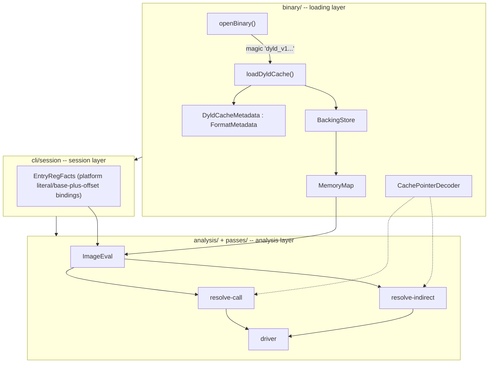
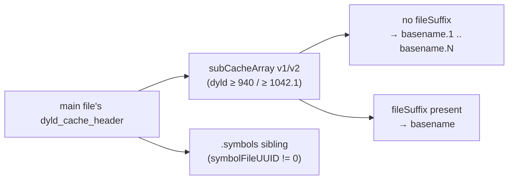

# 22 — dyld shared cache support

A `dyld_shared_cache_arm64[e]` is Apple's single-file-per-architecture image
of every system dylib pre-linked together — hundreds to thousands of
`.dylib`/`.framework` binaries flattened into one shared address space, split
(since iOS 16/macOS 13) across a main file plus several numbered or
suffix-named sibling files. This doc is the architecture for loading one,
what its jump-table pointers actually look like once xdec's own passes have
to resolve through them, and the concrete result of decompiling the function
that motivated all of it: an obfuscated dispatcher inside `AuthKit.framework`
at `0x192464d44`, reached from `-[AKAbsintheSigner
_generateSignatureForRequest:completionHandler:]`, whose control flow IDA's
own decompiler could not resolve past a bare `BR X8`.

Built as a first-class sibling of the ELF/Mach-O loaders — `BinaryFormat::DyldCache`,
not a CLI script wrapping raw reads — because everything downstream
(`resolve-indirect`, `resolve-call`, `ImageEval`, the emitter's symbol
resolver) already only knows how to ask a `BinaryImage` questions; teaching it
one more format is strictly less work than building a parallel path around
it.

## 1. Architecture



Nothing in `analysis/`'s core evaluator (`ImageEval::loadFrom`,
`BinaryImage::read*`) knows the cache exists at all: a `MemoryMap` region
backed by part 4 of 7 reads exactly like a region backed by the only file an
ELF or Mach-O ever has. Everything cache-specific lives in two places —
`src/binary/dyld_cache/` (loading) and the `CachePointerDecoder` fallback two
passes apply (§4) — and nowhere else.

## 2. BackingStore + MemoryMap: multi-file backing

A split cache maps into one shared 64-bit VM region from **several physical
files** — six to seven, on a typical iOS 18 device (main + 5 numbered
subcaches + one unmapped `.symbols` sibling). `MemoryMap` previously assumed
one backing `span<const byte>` for the whole image (true for every ELF/Mach-O
this project had ever loaded); a cache breaks that assumption on day one.

| Type | Responsibility |
|------|----------------|
| `binary::FileBuffer` (`backing_store.h`) | Owns one file's raw bytes (moved here from `image.h`, unchanged otherwise) |
| `binary::BackingStore` | Owns `vector<FileBuffer>`; `addPart(name, buffer)` returns its index, `bytes(index)`/`part(index)`/`spans()` read it back |
| `MemoryRegion::backingIndex` | Which `BackingStore` part this region's `fileOffset` is relative to (`0` for every ELF/Mach-O region — one part, index 0, zero behavior change) |
| `MemoryMap::setBackingParts(spans)` | Replaces the old single-span `setBackingBytes` (still present, and still what ELF/Mach-O call — it just forwards to a one-part `setBackingParts`) |

`MemoryMap::finalize()`/`read()`/`directView()` all index into
`backingParts_[region->backingIndex]` instead of a single span. ELF and
Mach-O construct a one-part `BackingStore` and never see `backingIndex` above
`0` — `tests/binary/test_memory_map.cpp` covers both the new
cross-part-read behavior and that a region naming a non-existent part is
rejected at `finalize()`, the same place an overlapping region already was.

## 3. The `dyld_cache/` module: format, discovery, loader

```
src/binary/dyld_cache/
  dyld_cache_format.h      # named field offsets only, zero logic (mirrors macho_format.h)
  field_reader.h           # shared bounds-checked reader (also used by macho.cpp/elf.cpp)
  dyld_cache_loader.cpp    # loadDyldCache(): the whole orchestration
  dyld_cache_metadata.cpp  # DyldCacheMetadata's own small methods (toString, imageContaining, ...)
include/xdec/binary/
  format_metadata.h        # FormatMetadata polymorphic base -- the extension point
  dyld_cache_metadata.h    # DyldCacheMetadata, DyldCacheImageRecord, DyldCachePartInfo
  cache_pointer.h          # CachePointerDecoder (see §4)
  image.h                  # BinaryFormat::DyldCache; loadDyldCache() declaration
```

`openBinary()` recognizes the magic (`dyld_v1` followed by a space-padded
architecture name — `"dyld_v1   arm64"`, `"dyld_v1  arm64e"`) and dispatches
to `loadDyldCache()`, the same way it already dispatched on ELF/Mach-O
magic. Only `arm64`/`arm64e` are implemented; any other suffix is a named
`UnsupportedArch`, not a silent partial load.

### 3.1 Header parsing: named offsets, not a struct cast

`dyld_cache_header` has only ever grown by appending fields across a decade
of dyld releases. A struct cast trusts every field is present; a cache built
by an older dyld simply has a shorter header, and trusting bytes past its
true end means reading into the mapping table that immediately follows it.
`parsePartHeader()` reads named offsets and gates every field added after
`imagesCount` (the header shape every cache in practice has) behind
`headerCovers(mappingOffset, fieldEnd)` — the mapping table's own offset is
the one number every header vintage carries, so "does the header reach this
field" reduces to "is the mapping table further out than this field's end".

### 3.2 Subcache discovery, all three shapes



Two subcache-array entry encodings exist on disk with **no version tag**
telling them apart: `dyld_subcache_entry_v1` (24 bytes: UUID + `cacheVMOffset`
only) and `dyld_subcache_entry` (56 bytes, adds a 32-byte `fileSuffix`).
`detectSubCacheEntrySize()` uses the same probe real cache tooling does:
read the second entry's would-be `fileSuffix` field and check whether it
looks like a short, NUL-terminated, printable string (`.`, `-`, `_`,
alphanumeric); if not, it wasn't a suffix at all — fall back to v1 and treat
every sibling as `basename.<index+1>`. The cache this project has on disk
(iOS 18-era, 7 parts) uses the v1/legacy-numbered shape; both are covered by
`tests/binary/test_dyld_cache.cpp`.

The `.symbols` sibling is opened whenever `symbolFileUUID` is non-zero,
independent of which subcache-array shape was used — it contributes local
symbols (§3.4) but registers **no** `MemoryRegion`: its own header describes
an address range dyld never actually maps at runtime.

### 3.3 Mappings

Every part's own `dyld_cache_mapping_info` table becomes `MemoryRegion`s with
`va` taken directly from the header (**absolute**, not part-relative —
`sharedRegionStart` plus a part's `vmOffset` is where dyld itself computes
that same absolute address from, but the mapping table already states it
outright) and `backingIndex` set to that part's `BackingStore` index.
`initProt` maps straight onto `MemoryPermissions` — no separate "const data"
flag handling was needed: a real cache's own `dyld_cache_mapping_info`
already reports `__DATA_CONST`/`__AUTH_CONST` regions as read-only in
`initProt` on disk (confirmed against the reference cache: a plain `r--`
mapping sits directly after the `rw-` `__DATA` mapping — see the `xdec info`
output in §7), so `BinaryImage::isImmutable()` — permission-only, format-
agnostic — already gets this right with no cache-specific code at all.
`dyld_cache_mapping_and_slide_info` (rebase/slide bitmaps) is parsed only as
far as locating it; nothing in this project's target function needed rebase
application, so applying slide info to on-disk pointers is not implemented
(see §4 for why the pointers that *did* need decoding are a different thing
entirely).

### 3.4 Images and local symbols

`dyld_cache_image_info` (path + load address) merges with
`dyld_cache_image_text_info` (UUID + `__TEXT` size, when present) into
`DyldCacheMetadata::images`, sorted by load address so
`imageContaining(va)` binary-searches it. On the reference cache this is
2,416 images.

Local symbols (`dyld_cache_local_symbols_info`: an nlist array + string
pool) are read from whichever file actually carries them — the main file's
own `localSymbolsOffset`, pre-split caches, or the `.symbols` sibling's *own*
`localSymbolsOffset` once a cache is split (each has a full header; only the
`.symbols` file's `mappingCount` is zero). Both shapes are exercised in
`tests/binary/test_dyld_cache.cpp`, and both are what the reference cache
actually uses (7 parts, symbols in the `.symbols` sibling). Note the
`dyld_cache_local_symbols_info` field semantics that cost a debugging
detour: `nlistOffset`/`stringsOffset` are **relative to the info struct's own
start**, not to the file — "offset into this chunk" per Apple's own comment,
easy to misread as file-relative since every *other* offset in this format
is.

Every entry's `n_value` is already an absolute cache VA — no per-dylib
`dyld_cache_local_symbols_entry` correlation is needed to use a symbol name,
only to know *which dylib* it belongs to, which this loader does not track
(a symbol's owning image, if wanted, is `imageContaining(symbol.va)`, a
second lookup rather than data carried on `Symbol` itself). Local symbols
carry **no size field** (nlist has none) — `BinaryImage::symbolContaining()`
requires `size != 0` and so never answers for one; `symbolNearestBefore()`
(§5.3) exists specifically because sized containment cannot.

On the reference cache this loads 6,703,614 symbols with real, correctly
resolved names (`__os_eventlink_dispose$VARIANT$mp`, ...) — confirmed by hand
against `xdec symbols`, not merely "some count came out non-zero".

Not implemented: the accelerator table / dylib path trie
(`dyld_cache_accelerator_info`). It exists to make `dlopen`-time
name→image lookup fast; this project already has every image's path from
the plain image list (§3.4's 2,416 entries), which a linear
`imageNamed()` scan handles adequately at this size, so the trie earns
its complexity only if a much larger index or the accelerator's other data
(some ObjC-related offsets) turns out to be needed later. `DyldCacheImageRecord`
does not yet carry `machHeaderVa`-based Mach-O extraction (reading one
dylib out of the cache as its own `BinaryImage`) — no analysis in this
project needed it; the whole cache's unified address space already answers
every read/disassemble/decompile question the way a single dylib's own image
would.

### 3.5 CLI

| Command | Purpose |
|---------|---------|
| `xdec info <cache>` | Existing summary, now with cache uuid/type/platform/shared-region/parts/image-count lines when the opened image is a `DyldCache` |
| `xdec images <cache> [count]` | Lists every indexed image: load address, `__TEXT` size, path |
| `xdec cache-locate <cache> <va>` | Which region/image/symbol an address belongs to — `symbolContaining` first (sized formats), `symbolNearestBefore` fallback (unsized local symbols), labeled as such rather than silently overclaiming coverage |

No new top-level verb pattern: these are exactly `cmd_image.cpp` functions
wired into `dispatch.cpp` the same way `info`/`symbols`/`sections` already
were.

## 4. Cache pointer tagging — what it actually is (and is not)

A jump-table entry in the obfuscated dispatcher this whole plan targets
reads, on disk, as `0x20192464723` where the low 36 bits
(`0x192464723`) are exactly a real code address in the cache and the high
bits (`0x2`, `0x4`, `0x401`, seen at different entries) carry no fixed
meaning this project has decoded.

**This is not documented Apple cache-pointer semantics**, and the header
comment in `include/xdec/binary/cache_pointer.h` says so explicitly, with the
evidence: it is not a PAC diversifier or an arm64e chained-pointer-auth field
(those have an entirely different bit layout — see
`dyld_cache_slide_info3/5` in `dyld_cache_format.h`), and it is not the
cache's own address space either — `sharedRegionStart` fits in 33 bits, so a
real cache pointer never needs 36. Whatever obfuscator generated this
specific table (the same one this project already has "`-2` thunk"-shaped
evidence for, from the standalone `absd` binary — docs/20) chose 36 bits for
its own per-entry tag, unrelated to anything the cache format itself
requires.

That distinction is why `CachePointerDecoder` (a `decode()`/`tag()` pair
masking the low 36 bits) is **not** wired into a general-purpose entry point
like `BinaryImage::readPointer()` — a real, untagged cache pointer read
through such a path would be silently (and wrongly) masked on the rare
occasion its own low bits above 36 happened to be non-zero for an unrelated
reason. Instead it is applied at exactly the two places a computed address
is already being validated as "is this actually code", and kept only when
the *decoded* form passes where the raw form failed:

| Site | What it decodes |
|------|------------------|
| `resolve_indirect.cpp`'s `entriesFor` (table-mode branches) | Each table entry, and — since masking the fully-computed address rather than just the raw slot also covers an offset table whose *anchor* was itself read from a tagged slot — the same fallback after adding the table's per-entry offset |
| `resolve_indirect.cpp`'s `valueSetCandidates` (non-table branches) | Every candidate in a computed value set that fails a plain `readable()` check |
| `resolve_call.cpp`'s `decodeIfNeeded` | A call target that arrives already constant (typically because `const-fold-memory` folded a pointer-slot load before this pass ever saw it) and is not executable as read |

The third row exists because `const-fold-memory` folds a load of *any*
constant, immutable address into a literal — it has no opinion on what that
literal means, correctly; teaching it about cache tags would spread
format-specific logic into a pass that has nothing to do with dyld caches.
The decoding belongs exactly where the literal is about to be *interpreted
as a code address*, which is `resolve-call`, not the fold that produced it.
Without this fix, a call through such a slot resolved to the literal, tagged
address and printed as `sub_20192464f5c` — a real bug this project's own
target function surfaced (§7) — instead of the correct `sub_192464f5c`.
`tests/passes/test_resolve_call.cpp` locks in both directions: a tagged
constant whose untagged form *is* executable gets rewritten, one whose
untagged form is *not* executable is left exactly as the image spelled it.

## 5. Symbol lookups without a size

Two `BinaryImage` methods answer "what is at this address", and they answer
different questions:

- `symbolContaining(va)` — the innermost **sized** symbol covering `va`.
  Correct wherever a size is known (ELF `st_size`, Mach-O's own symbol
  sizing), and silent (`nullptr`) wherever it is not — which for dyld cache
  local symbols is *always*, since nlist carries no length field.
- `symbolNearestBefore(va)` (new) — the widest defined symbol starting at or
  before `va`, no size requirement, no upper bound either. Not a drop-in
  replacement: with no bound it can return a symbol whose real extent ended
  long before `va` (a very large local-symbol table has entries every few
  hundred bytes on average, but nothing enforces that near any one address).
  `xdec cache-locate` labels its answer `(nearest preceding symbol, size
  unknown, +0x...)` rather than presenting it with the same confidence a
  sized containment answer gets.

## 6. `sub_192464d44`'s dispatch index: not a leaked platform register

`sub_192464d44`'s dispatch index is not a leaked platform register (the
`EntryReg` + `TargetProfile::entryRegOffsets` mechanism docs/21 built for
`absd`'s `x21`/`x22`/`x28`) — it is computed from **the caller's own
argument**, `x0`, a per-call-site stack pointer into the caller's frame:

```c
v1 = *(uint32_t*)(a1 + 8) ^ ((a1 ^ 0x182B2851) * 1633790317);
```

`EntryReg(x0)` alone is honestly *top*: nothing static says what a caller
passes, and no per-binary or per-platform fact can say it either — a
different caller passes a different value on every call. An earlier
revision of this project tried to work around that by hand-capturing one
call site's concrete `x0`/`*(x0+8)` values into a sidecar file and freezing
them as facts (`ArgumentPointeeFact`); see docs/24-apple-indirect-dispatch.md
§4 for why that approach was abandoned and removed — it can validate that
*one specific path* decodes correctly, but the same manual capture would be
needed at every one of the thousands of `br`/call sites this obfuscator
produces across `absd` and `AuthKit.framework`, which does not scale to
decompiling the library as a whole. `sub_192464d44`'s own switch, and
`sub_192464f5c`'s tail call into it, are consequently left unresolved by
this project's general-purpose passes, exactly as any other argument-derived
index would be.

## 7. Result: `sub_192464d44`

```powershell
xdec decompile <cache>\dyld_shared_cache_arm64 0x192464D44 `
  --rounds 4 --discovery-cap 36 --allow-unresolved -o sub_192464d44.c
```

- `xdec cache-locate` confirms the target is inside
  `/System/Library/PrivateFrameworks/AuthKit.framework/AuthKit`
  (`0x1923ed000 + 0x77d44`).
- The dispatch `switch` itself does not resolve: its index is computed from
  the caller's own argument (§6), which no general-purpose static pass can
  recover without a per-call-site capture, and this project does not carry
  that kind of capture as a decompilation input (§6, docs/24 §4). The branch
  prints as an opaque, unresolved `br` — the same honest "unknown" IDA's own
  decompiler gave before this project touched the function, not a
  regression from anything documented elsewhere in this file.
- What *does* still hold, independent of the index problem, is everything
  §3–§5 built: the cache loads correctly as a unified address space,
  `CachePointerDecoder` untags a jump-table pointer or call target the
  moment either is checked against `readable()` (`tests/passes/
  test_resolve_call.cpp`, `tests/passes/test_resolve_indirect.cpp` exercise
  this directly, independent of any one target function), and
  `xdec cache-locate`/`xdec images`/`xdec symbols` all answer correctly
  against the real 7-part cache this project was validated against.

## 8. Key files

| Concern | File |
|---------|------|
| Multi-file backing | `include/xdec/binary/backing_store.h`, `src/binary/backing_store.cpp`, `include/xdec/binary/memory_map.h`, `src/binary/memory_map.cpp` |
| Format constants | `src/binary/dyld_cache/dyld_cache_format.h` |
| Loader | `src/binary/dyld_cache/dyld_cache_loader.cpp` |
| Metadata type + accessors | `include/xdec/binary/dyld_cache_metadata.h`, `src/binary/dyld_cache/dyld_cache_metadata.cpp` |
| Format-metadata extension point | `include/xdec/binary/format_metadata.h` |
| Pointer tag decoding | `include/xdec/binary/cache_pointer.h`; applied in `src/passes/resolve_indirect.cpp`, `src/passes/resolve_call.cpp` |
| CLI | `src/tools/cli/cmd_image.cpp` (`commandImages`, `commandCacheLocate`, cache summary in `commandInfo`), `src/tools/cli/dispatch.cpp` |
| Presentation idioms (strcpy fold, stack-canary note) | `include/xdec/analysis/string_store_fold.h`, `include/xdec/analysis/stack_canary.h`, `src/passes/annotate_stack_canary.cpp`; see docs/09-expression-reuse.md shapes M/N |
| Target profile | `src/binary/target_profile.cpp` (`DyldCache` + `AArch64` → `ios-sdk` type presets) |
| Tests | `tests/binary/test_memory_map.cpp`, `tests/binary/test_dyld_cache.cpp`, `tests/passes/test_resolve_call.cpp` |
| Related | docs/20-absd-entry-registers.md (the standalone `absd` binary's own obfuscation, same family), docs/21-entry-reg-platform.md (the platform-level `EntryReg` mechanism this doc's §6 argument-derived index is explicitly *not* an instance of), docs/24-apple-indirect-dispatch.md (why per-call-site capture was abandoned as a decompilation strategy) |
