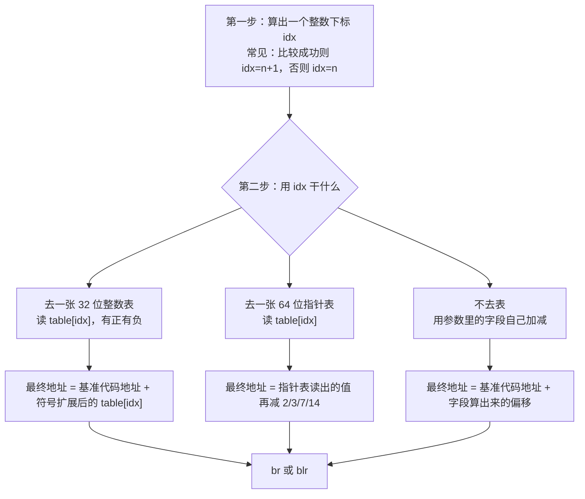

# 24 — Apple 混淆间接跳转：跳到哪里、怎么算、xdec 卡在哪

本文只讲清楚两件事：

1. CPU 执行 `br x8` / `blr x8` 时，`x8` 里的数字是怎么来的。
2. xdec 为什么经常算不出这个数字，于是 C 里出现 `__xdec_unimplemented`。

所有结论都来自对真实文件的 `xdec disasm`、`xdec read`，以及把 absd 整段代码扫了一遍。不要求你先读过其它文档。文中第一次出现的说法都会立刻用汇编说明。

分析过的文件：

- 独立程序 **absd**（iPhone 上的 `/usr/sbin/absd`）
- 系统库打包文件 **dyld shared cache** 里的 **AuthKit.framework**（和 absd 通信、做 Absinthe 签名的那一块）

这两份代码是**同一家混淆器**写的。跳转算法一样，只是「基准代码地址」存在不同的地方、多了或少了一层伪装。

---

## 先把三个容易混的词说清楚

后面不再使用「PC-rel 池」「tagged 全局」「sidecar」这种缩写。它们实际在机器上是下面三件事。

### 1. 「基准代码地址」是什么

普通 `b 0x100004910` 的目标写死在指令里。混淆之后变成 `br x8`：目标在寄存器里，必须现场算。

算的方法几乎总是：

```
最终跳转地址 = 基准代码地址 + 一个（可正可负的）偏移
```

**基准代码地址**就是加偏移之前的那个起点。它不是跳转表本身，也不是 dyld 加载器的基址。抽查结果：这个起点几乎总是**本段混淆代码自己附近的某条指令地址**（常常就是当前这一小段的开头）。

偏移从一张「32 位有符号整数表」里读，或者从函数参数指向的内存里算出来。

### 2. absd 怎么拿到「基准代码地址」

absd 里最常见的写法是：

```asm
ldr    x10, #0x1000a0108
add    x8, x8, x10
br     x8
```

`ldr x10, #0x1000a0108` 的意思是：

- `0x1000a0108` 是 **数据区里的一个固定槽位**（8 字节），不是代码。
- CPU 去这个槽位读出一个 64 位数。
- 我们用 `xdec read absd 0x1000a0108 8` 读到的是 `b0 48 00 00 01 00 00 00`，也就是 `0x1000048b0`。
- `0x1000048b0` 正好是函数 `0x100004878` 里面附近的一条指令。

链接器在装载 absd 时已经把这个槽位改写成最终虚拟地址（普通 Mach-O 重定位），所以读出来就是能跳的代码地址，**没有再伪装**。

每一处 `br` 往往对应数据区里**另一个** 8 字节槽。absd 数据区 `0x1000a0100` 一带密密麻麻全是这种「指向附近代码」的指针。普查扫到 **1734** 个不同的槽地址，几乎一处跳转一个槽。

有少数地方不读数据区，而是用寄存器里已经有的值当起点，例如 `add x24, x24, x22` 然后 `br x24`。这时 `x22` 必须是更早的代码写进去的。如果你把「进程刚启动时 dyld 留在 x22 里的值」误当成这里的 x22，就会加错起点，跳到 dyld 里去（我们已经用错误的 x22 复现过，反编译出了无效指令块）。

### 3. AuthKit（在系统库打包文件里）怎么拿到「基准代码地址」

AuthKit 不写 `ldr x10, #立即数`，而写：

```asm
adrp   x10, #0x1ed244000          ; 把 x10 设成附近 4KB 对齐的页
ldr    x10, [x10, #0x6e0]         ; 再从 0x1ed244000+0x6e0 读 8 字节
add    x9, x9, x10
br     x9
```

数据槽在 `0x1ed2446c0`、`0x1ed2446e0` 这种地址。用 `xdec read` 读到的 8 字节**不是**干净的代码地址，而是类似：

```
0x02019246504c
```

把它拆开看：

- 低 36 位：`0x19246504c` —— 这才是 AuthKit 里真实的指令地址。
- 更高的位：`0x02` —— 混淆器自己塞的记号，**不是** ARM 的指针认证，也**不是** dyld 缓存格式规定的编码。系统加载器不会帮你去掉它。CPU 做 `add` 时把这个带记号的数直接拿去加；因为记号在很高的位，加一个小偏移通常加不进记号区，加完再取低 36 位，仍然能得到正确代码地址。

xdec 里已有一段专门逻辑：当「这个数当作代码地址却进不了可执行段」时，先只留低 36 位再试一次。这段逻辑用在「判断是不是代码」的时候。如果这个带记号的数只是被当成普通加法的一个加数，而偏移又算不出来，整条表达式对 xdec 来说仍然是「未知」。

### 4. 二进制旁边的 `.entry.json`——曾经是什么，为什么已经移除

xdec 曾经允许在二进制同目录放 `absd.entry.json` 这类文件（`ArgumentPointeeFact`/`MemorySeed`，见 docs/22 旧 §6，现已删除），里面写「这个函数入口时，某块内存是某某数」。AuthKit 入口那次能展开成三路 `switch`，靠的就是文件里写了 `x0+8` 的 4 字节。

**这不是完整反编译苹果库的办法，已经确认是错误方案并移除。**

完整反编译要的是：函数里每一条 `br` 连到它**可能跳到的代码**，C 里用 `switch (算出来的下标)` 把这些块列出来。下标表达式可以仍然含有参数、含有输入缓冲区的字节——读者看到的是「按这个字节走这两条路」，不需要知道这次运行字节是 `0x41` 还是 `0x00`。

`.entry.json` 做的是另一件事：把某一次调用的参数冻成常数，于是 `switch` 只剩下**这一次真正走到的那几路**。每个函数、每种命令都要重新抓参数，AuthKit / absd 里成千处 `br` 根本抓不过来，抓错（例如把进程启动时的 x22 填进内部函数）还会连出假目标。

那个 json 最多能当「验证某一条路径」的探针，不能当架构——所以这部分代码（`analysis::EntrySidecar`/`ArgumentPointeeFact`/`MemorySeed`、`tools/ios_lldb_absd_entry.py`、相关 sample case）已经从代码库里删除。iOS 平台真正的、架构级的入口寄存器解析（dyld 泄漏的 `x21`/`x22`、内核残留的 `x28`）保留在 `TargetProfile::entryRegOffsets`（docs/21），因为那是对*平台*的一次性事实，不是对*某次调用*的猜测。后面「完整反编译」一节讲 xdec 应怎样只靠文件里已经有的表和代码，把整段控制流恢复出来。

---

## 0. 看过哪些代码

| 文件 | 扫了什么 |
|------|----------|
| absd | 整段可执行代码 `0x100003b8c` 起，长度 `0x7b3a8`，共 **2767** 条 `br`/`blr` |
| 系统库打包文件里的 AuthKit | `0x192464000` 起连续 `0xe000` 字节（Absinthe 那一簇），共 **68** 条 `br`/`blr` |

人工对过汇编的位置：

| 地址 | 是什么 |
|------|--------|
| absd `0x100004878` | 证书链路里的一段状态机 |
| absd `0x10000463c` | 它的调用方，里面能看到同一批没解开的 `br` |
| absd `0x100023290` | 程序真正入口 `start` |
| absd `0x100017158` | 处理 Mach 端口消息的大函数 |
| absd `0x1000627a8` | 另一张 32 位偏移表、另一套入口算术，但跳转骨架相同 |
| absd `0x10006a314` | 第三张 32 位偏移表 |
| absd `0x10001b01c` | **不读偏移表**，用参数里的数直接加到基准代码地址上 |
| AuthKit `0x192464d44` | Absinthe 命令入口 |
| AuthKit `0x192464f5c` | 同一大段逻辑里后面的一块（自己又存了一次寄存器） |
| AuthKit `0x19246504c`、`0x1924650a8`、`0x192465310`、`0x192465408` | 没有函数开头那种 `stp` 存寄存器，却在 `br`，其实是同一大函数切出来的小段 |

---

## 1. 跳转地址只有三种算法

每一条混淆过的 `br`/`blr` 都落在下面三种之一。普查里剩下的几百条，多数是普通的「调用函数指针」、导入表、栈保护失败，**不是**这套混淆器。



三种算法对应后文的 **A / B / C**。

---

## 2. 普查数字（用来看哪种最常见）

分类办法：看 `br`/`blr` **前面最多 14 条指令**里有没有 `ldrsw`、有没有 `ldr` 指针表、有没有 `sub #2`。这 14 条里有时会夹杂「给**下一道** `blr` 预读指针」的指令，所以个别点会归错类（AuthKit `0x19246500c` 就是：真正的 `br` 不读偏移表，但前面已经在读指针表）。数字用来看大头，定性仍以单条反汇编为准。

### 2.1 absd 全文 2767 条

| 条数 | 机器上实际在做什么 |
|-----:|-------------------|
| **1861** | 读 32 位偏移表，再从数据区 `ldr xN, #固定槽` 取出基准代码地址，相加后 `br`。最常见，约占 67%。 |
| 230 | 同样读 32 位偏移表，但基准代码地址已经在某个寄存器里（常见 `x22`），`add` 后 `br`。 |
| 90 | 读 32 位偏移表，基准代码地址用 `ldr xN, [xM, #偏移]` 从数据区读（absd 里少，AuthKit 里是主流）。 |
| 11 | 偏移表的**表头地址**用 `adr` 写进寄存器。 |
| 138 | 读 64 位指针表，再减 2、3、7 或 14，然后 `blr`/`br`。 |
| 94 | 读了 64 位指针表，前 14 条里没看到减法（减法可能更早，或槽里已经是最终地址）。 |
| 4 | 不读 32 位表，把一个寄存器里的偏移加到从数据区读出的基准代码地址上。 |
| 约 20 | 有减法，但和导入表/其它加载搅在一起。 |
| 321 | 对不上上面几类。不要当成第四种混淆算法。 |

数据区里「指向附近代码」的 8 字节槽，抽查四个：

| 槽地址 | 槽里存的数 | 这个数指向哪里 |
|--------|------------|----------------|
| `0x1000a0108` | `0x1000048b0` | `0x100004878` 函数内部 |
| `0x1000a0120` | `0x100004a1c` | 同一函数里 `br` 前不远处 |
| `0x1000a4428` | `0x1000627c8` | `0x1000627a8` 函数里的 `cmp` |
| `0x1000a0fd0` | `0x1000235c4` | 程序入口 `start` 附近 |

32 位偏移表也不止一张，已见到：

| 表的起始地址 | 谁在用 |
|--------------|--------|
| `0x10007f300` | `0x100004878`（指令：`adr x9, #0x10007f300`） |
| `0x10008f3f0` | `0x1000627a8` |
| `0x10008f9c4` | `0x10006a2f8` 一带 |
| `0x1000a2a10` | `start` 用的 **64 位指针表**（算法 B） |

表在可执行段的只读数据里。每个表项 4 字节，按有符号整数理解。  
`最终地址 = 基准代码地址 + 该表项`。

### 2.2 AuthKit 这一窗 68 条

| 条数 | 机器上实际在做什么 |
|-----:|-------------------|
| **38** | 读 32 位偏移表，再用 `adrp`+`ldr [x, #偏移]` 取出带记号的基准代码地址。这是这一窗的主流。 |
| 13 | 读 64 位指针表再减 2/3/14，然后 `blr` 调真正的函数。 |
| 2 | 基准代码地址已在寄存器里。 |
| 2 | 不读 32 位表、带减法的变体。 |
| 13 | 栈保护、普通间接调用等。 |

带记号的基准代码地址集中存放，从 `0x1ed2446c0` 开始，每个 8 字节：

```
槽 0x1ed2446c0  存 0x020192464dec  → 真地址 0x192464dec
槽 0x1ed2446c8  存 0x020192464fd0  → 真地址 0x192464fd0
槽 0x1ed2446d0  存 0x02019246504c  → 真地址 0x19246504c   （就是 504c 这段自己）
槽 0x1ed2446e8  存 0x0201924650a8  → 真地址 0x1924650a8
```

32 位偏移表在 `0x192479800`、`0x192479830`。  
64 位指针表在 `0x1ed244860`（槽里同样带高位记号）。  
`0x192464f5c` 会把 `x24` 设成 `0x1ed244860`，后面那些小段不再自己算表头，直接用还活着的 `x24`。

---

## 3. 算法 A：32 位偏移表（出现最多）

### 3.1 absd 在干什么（逐步）

以 `0x100004878` 第一次 `br` 为例：

```asm
adr    x9, #0x10007f300              ; x9 = 偏移表的起始地址
ldrsw  x8, [x9, w8, sxtw #2]         ; 用 w8 当下标，从表里读 4 字节，符号扩展成 64 位
ldr    x10, #0x1000a0108             ; 从数据区固定槽读出 0x1000048b0
add    x8, x8, x10                   ; 0x1000048b0 + 刚才那个有符号偏移
br     x8                            ; 跳过去
```

`ldrsw ... sxtw #2` 就是：下标乘 4（每个表项 4 字节）再取数。  
`cinc wN, wState, eq` 出现在很多站点，意思是：上一次比较如果相等，下标用 `wState+1`，否则用 `wState`。所以下标**永远只有两个候选**：`n` 和 `n+1`。混淆器用这个代替「相等就跳 A、不等就跳 B」的明分支。

### 3.2 AuthKit 在干什么（逐步）

以 `0x19246504c` 末尾的 `br` 为例：

```asm
cmp    x20, #0
cinc   w9, w25, eq                   ; x20==0 则 w9=w25+1，否则 w9=w25
add    w9, w9, #0x4e                 ; 这一站再整体加 0x4e，换到表的另一段
ldrsw  x9, [x10, w9, sxtw #2]        ; x10 指向 0x192479830 那张 32 位表
adrp   x10, #0x1ed244000
ldr    x10, [x10, #0x6e0]            ; 读出 0x02019246504c
add    x9, x9, x10                   ; 带记号的起点 + 有符号偏移
br     x9
```

和 absd 是同一件事：下标二选一、读 4 字节偏移、加到「指向本段代码」的起点上。差别只有：起点从哪读、起点的 8 字节要不要丢掉高位记号。

### 3.3 下标什么时候 xdec 算得出、什么时候算不出

下标的**形状**总是「要么 n 要么 n+1」，但 **n 从哪来**决定 xdec 敢不敢展开表：

| n 从哪来 | 例子 | xdec 的处境 |
|----------|------|-------------|
| 调用方写在内存里、你又在旁边的 json 里写明了那 4 字节 | AuthKit 入口：`x0+8` 的 4 字节参与异或和乘法，得到 `w23` | 两个下标都是具体数字，表能展开，C 里变成 `switch` |
| 就在本段刚比较过的寄存器 | `cmp w6, w7`，或和常数 `0x377fdf5f` 比 | 若前面已经把状态收成很小的整数，也能展开 |
| 从输入缓冲区读一个字节，再做一长串异或/加法/移位，再和魔术数比 | `0x100004878` 里对每个字节那样算 | **条件依赖运行时的那个字节**，xdec 不知道字节是 0x41 还是 0x00；但它仍应知道下标只有 `{n, n+1}`。今天它不知道条件就放弃整张表，于是封洞 |
| 寄存器是**上一段代码留下的**，当前这段在 xdec 看来是「一个新函数的开头」 | AuthKit `0x19246504c` 用的 `x20`/`x25` | xdec 写成 `__entry_x25`，表示「函数入口时的 x25，我不知道」，下标变成任意整数 |

核心点：**不必知道比较结果是真是假。** 只要认出「相等用 n+1、不等用 n」，候选就是两个。今天 xdec 在条件算不出时，连这两个数也不出，日志类似「表的形状对上了，但枚举不出任何表项」。`0x100004878` 里一大半没解开的 `br`、AuthKit 被切碎的那些小段，都是这个原因，**不是没认出那张 32 位表**。

入口算术的立即数每个函数都不同，不能写进 xdec 核心：

| 位置 | 它在算什么 |
|------|------------|
| AuthKit `0x192464d44` | `内存[x0+8] 异或  ((x0 异或 0x182b2851) 乘 0x6161a96d)` |
| absd `0x100004878` | 对缓冲区某个字节：异或 `0xbf57eff9`，加 `0x8c3927a3`，再加「左移 1 位后和掩码相与」，再加一个按站点变化的常数，看是否等于 `0x4b911822` |
| absd `0x1000627a8` | `内存[x0+0x10] + ((x0 异或 0x5368feec) 乘 0x27ab2245)` |

要认的是 `cinc` / 「条件成立取 n+1 否则取 n」这种指令形状，不要认这些常数。

### 3.4 再看几个函数，确认不是 4878 独有

**`0x1000627a8`** — 换了一张表、换了一套入口算术，跳法逐条一样：

```asm
; w11 = 上面那套 627a8 算术
ldp    x8, x9, [x0]
cmp    x8, x9
cinc   w13, w11, eq
adr    x10, #0x10008f3f0
ldrsw  x13, [x10, w13, sxtw #2]
ldr    x14, #0x1000a4428             ; 槽里是 0x1000627c8
add    x13, x13, x14
br     x13                           ; @0x1000627ec
```

xdec 把目标写成「符号扩展后的某个未知数，加上常数 `0x1000627c8`」：表认出来了，下标仍当未知，于是封洞。说明 4878 不是特例。

**`0x100017400`（处理 Mach 端口的大函数里）** — 偏移表的表头已经在 `x22` 里，基准代码地址仍从数据区读：

```asm
cinc   w8, w9, eq
ldrsw  x8, [x22, w8, sxtw #2]
ldr    x9, #0x1000a0590
add    x8, x8, x9
br     x8
```

**`0x10006a314`** — 第三张表 `0x10008f9c4`。两次比较做成 0/1，再或在一起，加到 `w10` 上当下标。仍然是「在某个数上加 0 或加 1」。

**AuthKit `0x192464e14`（已经解开的那条）**

```asm
cinc   w9, w23, eq                   ; w23 来自入口算术；json 里写明了 x0+8 之后 w23 是常数
ldrsw  x8, [x8, w9, sxtw #2]
ldr    x9, [x9, #0x6c0]              ; 读出带记号的 0x192464dec
add    x8, x8, x9
br     x8
```

下标变成两个具体数字，C 里出现三路 `switch`。  
**指令序列和没解开的站点相同，唯一差别是下标能不能收成有限的几个数。**

**AuthKit `0x19246507c`、`0x192465120`、`0x1924653e8`、`0x19246549c`**

都是算法 A。共享 `0x192479830` 那张 32 位表。基准代码地址从 `0x1ed2446xx` 读，值指向**这段自己**。这些地址**没有**函数开头那种连续 `stp x29, x30`。它们用的 `x20`/`x25` 是 `0x192464f5c` 里还活着的寄存器。xdec 若把它们当成单独函数的入口，就会把 `x25` 当成「未知的入口寄存器」，下标再次变成任意整数。

**`0x100004878` 里还没解开的几条 `br`，对应到上面的分类：**

| `br` 的地址 | 基准代码地址怎么来 | 为什么卡住 |
|-------------|-------------------|------------|
| `0x100004c24` | `add x24, x24, x22`，起点在 `x22` | `x22` 对 xdec 是未知；若你误填进程启动时的 x22，会跳进 dyld |
| `0x100004a40` | `ldrsw` 之后 `nop`，再 `ldr #0x1000a0120` | 中间语言里 `ldrsw` 的结果和后面的加法被拆开，认跳转表的那一步对不上「起点 + 表项」这种完整形状 |
| `0x100004a80` 等 5 处 | 标准的「数据区 8 字节槽 + 偏移表」 | 下标依赖输入字节的那串算术，xdec 放弃枚举 |
| `0x100004dd8` | `add x8, x8, x10`，`x10` 没有收成常数 | 起点不是唯一已知数 |

---

## 4. 算法 B：64 位指针表，读完再减一个小常数

用来 **`blr` 调用真正的函数**（例如比较字符串），不是在混淆状态之间 `goto`。

```asm
ldr    x8, [xTable, wIndex, sxtw #3] ; 下标乘 8，取 8 字节
sub    x8, x8, #K                    ; K 是 2、3、7 或 14
blr    x8
```

表项指向「比真正入口靠后 K 字节」的位置，减 K 才是函数开头。AuthKit 里表项还带高位记号，要先只留低 36 位（或减完再留，只要偏移很小，结果一样）。

absd 的 `start` 会在同一段里**既做算法 A 的 `br`，又给稍后的 `blr` 准备算法 B**：

```asm
cinc   w8, w22, eq
ldrsw  x8, [x25, w8, sxtw #2]
ldr    x9, #0x1000a0fd0
add    x8, x8, x9                    ; 算法 A，后面 br x8
ldr    x9, [x23, w9, sxtw #3]
sub    x27, x9, #2                   ; 算法 B，x27 留给后面的 blr
br     x8
```

AuthKit `0x192464d44` 入口：

```asm
ldr    x21, [x9, w8, sxtw #3]        ; 表在 0x1ed244860
ldr    w0, [x21, #-2]!               ; 把指针减 2 再取 4 字节当参数，和「槽位指向对象+2」是同一约定
sub    x24, x8, #2
blr    x24                           ; xdec 已经能把这类常数槽变成具体函数名
```

absd 全文里，减去 3、2、7、14 都出现过。**只处理减 2 会漏。**  
若指针表的表头在活着的 `x24` 里，而 xdec 把后面的小段切成新函数，`x24` 就丢了，算法 B 也会一起坏。

---

## 5. 算法 C：不读偏移表，把字段算完直接加到基准代码地址上

地址计算里**没有** `ldrsw [表, 下标]`。

### 5.1 absd `0x10001b01c`

```asm
ldr    w9, [x0, #0x10]               ; 参数指向的结构体，+0x10 那 4 字节
add    w8, w8, w9
sub    w8, w8, #0x95c                ; 再减一个常数
ldr    x9, #0x1000a0840              ; 槽里是 0x10001affc
add    x8, x9, w8, sxtw              ; 基准代码地址 + 刚才算出的有符号数
br     x8
```

认跳转表的逻辑对这条会失败——它本来就不是表。若 `w8` 对 xdec 是任意整数，最终地址也是任意的，只能封洞。

### 5.2 AuthKit `0x19246500c`（出现在 `0x192464d44` 那份 C 的末尾）

```asm
ldr    w8, [x10]                     ; x10 指向调用方结构；json 里写过的话这 4 字节是 0x7e
sub    w8, w8, #2
ldr    x9, [..., #0x6d8]             ; 读出 0x020192464fd0，真地址 0x192464fd0
add    x9, x9, w8, sxtw
br     x9                            ; 0x192464fd0 + (0x7e-2) = 0x19246504c
```

这里叠了两个问题：

1. 不是跳转表，走「整表枚举」那条路根本对不上形状。
2. 这条指令属于 `0x192464f5c` 开头的那一大段。`0x192464d44` 在栈保护检查失败时会 `bl` 进 C 库，下一条机器码已经是**下一个函数的开头**（又开始 `stp` 存寄存器）。系统库打包文件里的符号**没有长度**，xdec 不知道上一个函数在哪结束，于是把 `0x19246500c` 算进了 `0x192464d44`。单独反编译 `0x192464f5c` 时，同一套加法已经能把后面的 **`blr`** 对上 `0x19246504c`。

absd 的算法 C 用数据区里干净的代码指针；AuthKit 的算法 C 用带高位记号的 8 字节。都是「结构体字段做一次加减，加到本段代码的起点上」。减的常数不能写死成 2：absd 那处减的是 `0x95c`。

---

## 6. 为什么看起来像很多个函数

AuthKit 这一簇在文件里是**一段连续的混淆状态机**，不是教科书里「一个函数一个 prologue」：

```
0x192464d44  真正入口：stp 保存 x19–x30，读栈保护值
0x192464e14  算法 A，下标来自入口算术（xdec 已展开成 switch）
0x192464f5c  再次 stp 保存一批寄存器（像第二个函数开头）
0x19246500c  算法 C，跳到 0x19246504c
0x19246504c  没有 stp，直接用还活着的 x20/x25/x24
0x1924650a8  没有 stp；自己算一遍入口算术，bl 回 0x192464d44，回来再 br
0x192465310  没有 stp；先算法 B 的 blr，再算法 A 的 br
```

`0x1924650a8` 会调用 `0x192464d44`，再根据返回值决定 `x25` 还是 `x25+1`。这不是两个独立模块，是同一张命令表上的不同入口。

系统库打包文件里近邻符号没有「这个符号有多长」。xdec 用「最近的、起始地址不超过当前 PC 的名字」来切函数，就会在 `0x19246504c` 这种地方切开。切开之后，`x25` 变成「我不知道的入口值」，算法 A 全部停摆。

absd 的 `0x100004878` 有正常的一开头存寄存器，切函数还算干净。但小段之间仍然用 `x9`（偏移表表头）、`x22`（基准代码地址）、`x15`/`x24` 传递。如果你让 xdec 从中间某个地址当函数入口开始反编译，会得到和 AuthKit `504c` 一样的「入口寄存器未知」。

---

## 7. xdec 现在怎么决定「这条 br 往哪跳」

处理 `br` 时按顺序试三招，**哪招先给出答案就停**：

1. **当跳转表处理**：表达式必须长得像「表基址 + 下标×步长」，并且下标只能取有限个具体整数。然后去文件里把这些表项读出来，每一项变成一个跳转目标。有一个目标不是已反编译过的代码块，就先去把那些地址也反编译进来，下一轮再连边。
2. **当普通表达式求值**：整个「最终地址」只能取有限个具体数（例如就是 `0x19246504c` 这一个）。
3. **从函数入口按路径往前模拟**：能处理「这一路栈上写过什么」；只在一个函数内部走，有条数上限。

| 现场 | 算法 | 卡在哪一招 |
|------|------|------------|
| AuthKit `0x192464d44` 主 switch | A | 不卡：json 里写明了 `x0+8`，下标是具体数 |
| AuthKit `0x19246504c` 等被切开的小段 | A | 第 1 招：表对上了，但 `x25` 未知，一个表项也不读 |
| `0x19246500c` 出现在 d44 的 C 里 | C + 切错函数 | 第 1 招形状不对；第 2 招里加数带着高位记号、偏移又未知 |
| absd `0x100004878` 里已经变成 switch 的那些 | A | 不卡：下标已被收成很小的整数 |
| absd `0x100004a80` 等 | A | 第 1 招：下标依赖输入字节，拒绝整表瞎扫 |
| absd `0x100004a40` | A | 第 1 招：中间语言把「读表」和「加起点」拆开了，对不上表的形状 |
| absd `0x100004c24` | A，起点在 `x22` | 第 1 招下标/起点未知；填错 x22 会**错误地**连到 dyld |
| absd `0x100004dd8` | A | 起点不是唯一常数 |
| absd `0x1000627a8`、`0x10006a314`、`0x100017400` | 同 A | 和 4878 同类 |
| absd `0x10001b01c` | C | 不是表 |
| absd `start` 的 `0x100023688` | A，下标来自入口 `x22` | `x22` 未知（文档 20 记过） |

还有一层循环依赖：某条 `br` 解不开 → 不会去反编译它本该跳到的新地址 → 那些新块里本来能证明「这条路径上下标是 5」的信息永远看不到 → 继续解不开。所以给 `0x100004878` 加轮次、加大「一次最多发现多少个新地址」，仍然只有大约 26 个基本块、8 个洞：**卡在「没有具体下标就不读表」，不是轮次不够。**

这是政策问题，不是表不在文件里。表和基准代码地址都在。

---

## 完整反编译：不要去猜每个函数的参数

### 两件被混在一起的事

| | 曾经的 `.entry.json`（已移除） | 反编译器该做的 |
|--|---------------------------|----------------|
| 问的问题 | 这一次调用，`x0+8` 是 `0xbfaea37d`，会走到哪几路？ | 这个函数一共有哪些状态块，`br` 之间怎么连？ |
| 需要知道参数吗 | 需要，而且每个入口、每种命令都不同 | **不需要**。下标可以是「对输入字节做完那串算术之后的 n 或 n+1」 |
| 得到的 C | 瘦 `switch`，只有本次活着的 case | 完整 `switch` / `goto`，覆盖表能跳到的每一块 |
| 能不能覆盖整库 | 不能 | 能，只要表在文件里、函数没被切碎 |

AuthKit 入口写成三路 `switch`，看起来「完整」，其实是「这一次命令的三路」。换一种命令，json 里的 4 字节变了，活着的 case 也变。那不是库的反编译结果，是一次执行轨迹的切片。

### xdec 今天为什么显得「必须知道参数」

处理 `br` 时规定：只有下标能收成**有限个具体整数**（0、1、5、6 这种），才去文件里读表项。下标若还含有「未知的参数 / 未知的输入字节」，就一个表项都不读，于是发现不了后面的块，函数永远缺一块。

这条规矩来自另一些样本：下标是 32 位任意数、表是一张函数指针表时，从头扫会把后面无关的指针全当成目标（absd `start` 里 `0x100023688` 曾经扫出几百条假边）。**那是指针表 + 巨大下标的问题，不是苹果这套 32 位小偏移表的问题。**

苹果算法 A 的表项是很小的有符号数，例如 `0x38`、`0x30`、`-8`、`0x8fc`。加上「指向本段的基准代码地址」之后，目标仍落在同一函数附近。文件里已经写全了「从这里能跳到哪些块」。缺的是 xdec 肯把这些块读出来，而不是先知道这次 `idx` 等于 5。

### 对算法 A：读表，不要等下标变成常数

正确产出不是「先算出 idx=5 再只保留 case 5」，而是：

```c
idx = 相等 ? n + 1 : n;          /* n 可以来自参数或输入字节 */
off = (int32_t)table[idx];
goto *(基准代码地址 + off);
```

结构化之后是 `switch (idx)`，**case 的列表来自表**，选择器仍是表达式。读者不需要知道这次 n 是多少。

读哪些表项、在哪停（避免扫进下一张表）：

1. 已经能证明下标只有 `{n, n+1}` 且 n 自己也是小集合 → 只读这些格（现状，保持）。
2. n 仍未知，但这是「基准代码地址 + 32 位有符号表项」：从下标 0 起读，直到某一格加上基准地址后**不再落在本函数可执行范围内**（超出入口起的合理跨度、不是合法指令、落到别的镜像）。前面那些格全部当作可能目标。苹果表项幅度小，这个停法比「下标必须是具体数」合适。
3. 算出来的目标必须在**当前这个程序自己的可执行代码**里。禁止连到旁边 dyld 文件里。这就是当初填错 x22 出无效指令的那一类错误。

`0x100023688` 那种「下标是入口 x22 的低 32 位、表是 64 位函数指针」不要走第 2 步：`is code` 对函数指针几乎总为真，会再次爆炸。第 2 步只适用于「小有符号偏移 + 本段基准代码地址」。两种表形状 xdec 已经能分开认。

### 对算法 B：指针减完 2/3/7/14 之后，仍当代码地址验证

槽在文件里。减完小常数（必要时去掉高位记号）能指向真实函数，就按**间接调用**处理：C 里写成 `sub_xxxx(...)` 或「通过寄存器调用」。不必知道下标也能列出「这张指针表里出现过的那些函数」——若下标未知，宁可保留 `blr` 表达式，也不要为了少写 json 去盲扫一张巨大的函数指针表。算法 B 的下标在 AuthKit 里常常就是算法 A 刚算过的同一个 n；函数不切开时，n 会随 A 一起变得有限或保持为表达式。

### 对算法 C：同一函数里的写入，不是 json

`0x19246500c` 看起来像「必须知道结构体里那 4 字节」。其实 `0x192464d44` **自己**在调用后续逻辑之前，已经在栈上写下了 `0x7e`。之所以 xdec 看不见，是因为把后面那段切成了另一个函数，参数变成全新的未知指针。

只要从真正的函数开头一直反编译、中间那些没有 `stp` 的小段不要切开：

- 同一次分析里能看到「先 store 0x7e，再 load 再减 2」；
- `0x19246500c` 变成唯一目标 `0x19246504c`；
- 不需要 json。

absd `0x10001b01c` 那种偏移来自**调用方堆上的对象、本函数从未写过**，静态就是未知。完整反编译这里的意思是：C 里保留 `goto *(基准 + 符号扩展(字段算术))`，不要封成「未实现」。那是一条算得出形状、求不出常数的跳转，诚实印出来，而不是假装必须先有参数文件。

### 函数边界比参数更要紧

AuthKit 被切碎之后，`x24`（指针表表头）、`x25`（状态下标）、`x20` 全变成「入口未知」。再精确的下标分析也救不回来，因为信息在切开时丢掉了。

完整反编译苹果这套库，第一刀是：**一个真正的 `stp` 函数开头对应一个 xdec 函数**；后面那些「一上来就 `ldrsw`+`br`」的地址是状态块，留在同一个函数里。系统库打包文件的符号没有长度，不能按「最近的一个名字」切开。

切开问题解决后：

- 算法 A 的表头、基准代码地址、下标都在 SSA 里；
- 算法 B 的 `x24` 还是 `0x1ed244860`；
- 算法 C 能看见前面的 store；
- 参数保持符号，C 里是完整状态机，不是某一次调用的切片。

### 仍然解不「成一条路径」的，本来就不是反编译该保证的

输入证书的某个字节、某次 qualify 用的命令号，决定走 `n` 还是 `n+1`。那是运行时事实。反编译器给出两路代码，就完整了。要知道「这一次走了哪路」，用跟踪或日志，不要为每个函数做一份 json。

---

## 8. 有没有第四种算法？

在已扫的 absd 全文和 AuthKit 这一簇里，**没有。** 没有「用一张乘法表从当前 PC 变出目标」之类的新主路径。

要补的是**同一种算法的不同写法**，不是新算法：

| 写法差别 | 只认一种会漏掉什么 |
|----------|-------------------|
| 基准代码地址：数据区 `ldr #槽` / `adrp; ldr [x,#偏移]` / 寄存器里已有的值 | `0x100004c24`；AuthKit 几乎整簇 |
| 偏移表表头：指令里的 `adr` / 还活着的 `x9`、`x24` | 被切成「新函数」的那些小段 |
| 指针表读完后减 2、3、7 或 14 | 只认减 2 的站点 |
| 算法 C 里减的常数（2 或 `0x95c`） | 不能写死 2 |
| 下标二选一之后再加 `0x4e`、或再减 5 | AuthKit `0x19246504c`、`0x192465408` |
| 同一 14 条指令窗口里，A 的 `br` 和 B 的 `ldr` 指针表夹在一起 | 不能「窗口里出现过指针表」就当成算法 B |

那 321（absd）+ 13（AuthKit）条对不上 A/B/C 的，继续当普通间接调用处理。

建议以后再抽查、但目前没有反例的：

- AuthKit 这一窗以外、仍使用 `0x1ed244860` 那张 64 位表的其它位置
- 系统库打包文件里 **AuthKit 以外** 是否还有同一套写法（文档 22 只钉了 Absinthe 这一簇）

absd 可执行代码后半段已经包括在 2767 条普查里，没有单独人工逐条看。

---

## 9. 若改 xdec，按完整反编译来排，而不是按「先有参数」

核心代码不要写死某一个函数的表地址或异或常数。下面都可以用手写假函数做测试。

**第一刀：别把状态块切成新函数。**  
没有标准存寄存器开头的 `ldrsw`+`br` 留在当前函数里。系统库打包文件不要按「最近的一个符号名」切开。这一刀不做，后面全是在补入口未知寄存器。

**第二刀：算法 A 在下标不是具体数时也读 32 位小偏移表。**  
停条件：基准代码地址 + 表项 落到本函数可执行范围之外。目标必须属于当前程序，不能属于旁边那份 dyld。指针表 + 任意 32 位下标不要走这条（就是 `0x100023688` 炸过的那种）。

**第三刀：认全三种基准代码地址**（数据区 `ldr #槽`、`adrp; ldr [x,#偏移]`、还活着的寄存器），以及「读表和加法在中间语言里被拆开」的写法（`0x100004a40`）。带高位记号的 8 字节只在「当代码地址用」时留低 36 位。

**第四刀：条件未知时，`cinc` 仍表示 `{n, n+1}`。**  
n 已知则只读两格；n 未知则交给第二刀整表（带范围过滤）。C 的 `switch` 选择器可以仍是那个表达式。

**第五刀：算法 C 印成计算跳转，能在同函数里看见 store 再收成常数。**  
不要依赖「参数文件里写了那 4 字节」。看不见 store 就保留表达式，不要 `__xdec_unimplemented`。

**第六刀：算法 B 的减常数按 2/3/7/14 这一小批来认。** 表头在活寄存器里时随第一刀自然还在。

不要做的事：为每个函数准备一份入口参数文件；下标未知就对 **64 位函数指针表** 盲扫；用进程启动时的 x22 当所有内部函数的起点。

---

## 10. 改完怎么知道没改歪

不要用「4878 那份 C 少了多少行」当标准，用形状：

1. 手写假函数：`cinc` 条件未知，n 也不是常数，32 位小偏移表 + 数据区里的基准代码地址 → 仍应 lift 表能跳到的那些块，C 里 `switch` 的选择器可以仍是表达式。
2. 手写假函数：64 位函数指针表 + 完全未知的 32 位下标 → **不应**扫出几十个无关函数（守住 `0x100023688` 那类爆炸）。
3. 起点在入口寄存器、指向另一份 dyld 文件 → 保持未解开，不要生成无效指令块。
4. 同函数内先 `store` 立即数再按算法 C 去 `br` → 唯一目标，不靠入口参数文件。
5. 从真正 `stp` 开头反编译 AuthKit 入口，`0x19246504c` 不应再变成「独立函数 + 未知的入口 x25」。
6. 现有样本里已经解开的 switch 不能变少。

`tmp/scan_apple_br.py` 只统计指令形态，不跑反编译。要看「解开率」必须再跑 `xdec decompile`。

---

## 11. 六段最短对照

**算法 A，absd `0x100004908`**

```
adr    x9, #0x10007f300              ; 32 位偏移表
ldrsw  x8, [x9, w8, sxtw #2]
ldr    x10, #0x1000a0108             ; 数据区槽 → 0x1000048b0
add    x8, x8, x10
br     x8
```

**算法 A，absd `0x1000627ec`（另一张表，同一跳法）**

```
cinc   w13, w11, eq
adr    x10, #0x10008f3f0
ldrsw  x13, [x10, w13, sxtw #2]
ldr    x14, #0x1000a4428             ; 数据区槽 → 0x1000627c8
add    x13, x13, x14
br     x13
```

**算法 A，AuthKit `0x19246507c`**

```
cmp    x20, #0
cinc   w9, w25, eq
add    w9, w9, #0x4e
ldrsw  x9, [x10, w9, sxtw #2]        ; 32 位表 0x192479830
ldr    x10, [x10, #0x6e0]            ; 读出 0x02019246504c，真地址即本段
add    x9, x9, x10
br     x9
```

**算法 B，AuthKit `0x192464de8`**

```
ldr    x8, [x9, w8, sxtw #3]         ; 64 位表 0x1ed244860，槽里带高位记号
sub    x24, x8, #2
blr    x24
```

**算法 C，absd `0x10001b01c`**

```
sub    w8, w8, #0x95c
ldr    x9, #0x1000a0840              ; 数据区槽 → 0x10001affc
add    x8, x9, w8, sxtw
br     x8
```

**算法 C，AuthKit `0x19246500c`**

```
sub    w8, w8, #2
ldr    x9, [..., #0x6d8]             ; 读出 0x020192464fd0，真地址 0x192464fd0
add    x9, x9, w8, sxtw
br     x9                            ; 字段为 0x7e 时跳到 0x19246504c
```
