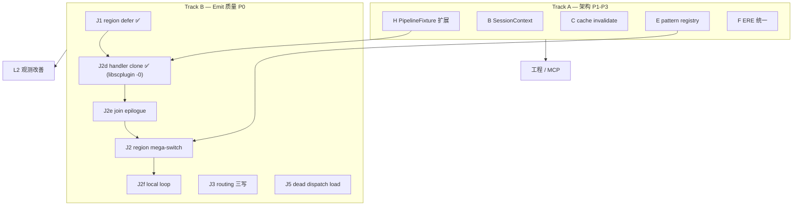

# xdec 架构优化与反编译质量 — 完整可行改进方案

> **文档性质**：xdec 项目 **唯一可执行改进方案**（非外部模型提示词）。详细算法与 API 草图见 [18-architecture-optimization-plan.md](18-architecture-optimization-plan.md)；DispatchRegion 见 [17-dispatch-region.md](17-dispatch-region.md)；核心/插件边界见 [00-core-vs-plugin-prompt.md](00-core-vs-plugin-prompt.md)。
>
> **版本**：2026-08-12（J1 已落地；goto 专项诊断已纳入 §4）
>
> **约束**：核心通用、IL/形状驱动、合成 fixture 证明、**禁止** libscplugin 硬编码；L2 仅观测，不作门禁特判。

---

## 1. 总体判断

| 维度 | 评分 | 说明 |
|------|------|------|
| **架构成熟度** | **7 / 10** | IL / pass / driver 设计扎实；`decompileToC()`、`AnalysisCache`、`PipelineFixture` 已部分落地 |
| **IL 层** | 8 / 10 | 234/234 indirect resolve、jump table、MBA、vars 均 OK |
| **分析层** | 7 / 10** | `DispatchRegion`、dispatcher shape 齐全；**structurizer consumer 不完整** |
| **Emit 层** | **6 / 10** | single-hub dispatcher（`sample_core_mba`）可恢复；scatter-dispatcher（libscplugin）仍 **407 goto** |
| **工程化** | 7 / 10** | 612 单测 + 98 L0 + 5 L1；manifest / FINDINGS 已同步 J1 |

**一句话结论**：xdec 已是「IL 正确、分析可观测、对 honest / bc_lib 类样本合格」的框架；下一阶段 ROI 在 **补齐 structurizer 对 scatter-dispatcher 的消费路径**（Track B），Track A 与 Track B 并行、不互相阻塞。

### 1.1 回归基线（2026-08-12，J1 后）

| 层级 | 内容 | 状态 |
|------|------|------|
| 单元测试 | Catch2，**612** test cases，133664 assertions | 全过 |
| L0 eval | **98** 个 NDK ground-truth | baseline 98/98，typed 38/38 |
| L1 samples | **5** 个真实 `.so` 形状指标 | 5/5 |
| L2 观测 | `sample_libscplugin` @ `0x1164f8` | 非门禁；见 §4 |

### 1.2 已落地项（相对初版 eval 提示词）

| 方向 | 状态 | 落点 |
|------|------|------|
| **A：decompileToC API** | ✅ | `include/xdec/decompile/emit.h` |
| **C：AnalysisCache** | ⚠️ 部分 | `analysis_cache.h`；`dispatchRegions()` 已接入；pass→invalidate 桥接 **未接** |
| **H：PipelineFixture** | ⚠️ 部分 | `tests/fixture/pipeline_fixture.h`；`test_decompile_to_c.cpp` 已用 |
| **J1：region-aware 2-way defer** | ✅ | `StructureOptions`、`switchFor` 门控、`test_structure_dispatch_region.cpp` |
| libscplugin Phase 0–1 | ✅ | `ObfuscationProfile`、`DispatchRegion`、`quantify_c.py` |
| libscplugin Phase 2a/2c/2d | ❌ | J2 / handler clone / join epilogue **未做** |
| libscplugin Phase 3–4 边际 | ⚠️ | H2 Select 折叠有效；路由三写、region mega-switch 未做 |

---

## 2. 项目背景（精简）

**xdec**：自包含 AArch64 多级 IL 反编译器（C++20，CMake + Ninja），目标 Android NDK / AArch64 Linux ELF `.so`。

**能力**：机器码 → Lifted…Vars IL；OLLVM 平坦化、MBA、间接分支/跳转表、syscall、类型导入、尾调用；结构化 C（if/while/switch）；插件 ABI。

**CMake 依赖链**：

```
xdec_il → xdec_analysis → xdec_passes → xdec_decompile → xdec_emit → xdec_tools
```

**Driver**：多轮 discovery + 全量 re-lift；默认 pipeline 止于 **Vars**；structure + print 在 emit 阶段。

**回归分层**：

| 层 | 用途 | 能否写特化逻辑 |
|----|------|----------------|
| L0 `eval/` | 有 C 源码真值 | 否 |
| L1 `samples/` | 形状指标（goto/switch/行数） | 否（仅 `-UpdateBaseline` 收紧阈值） |
| L2 libscplugin | 方向性观测 | **否** |

---

## 3. 架构优化方向评估（A–I + J）

评分：收益 / 成本 / 风险 = 1–5（5 最高）。

| 方向 | 现状 | 收益 | 成本 | 风险 | 优先级 | 理由 |
|------|------|:----:|:----:|:----:|--------|------|
| **A** decompileToC | ✅ 已落地 | 4 | 1 | 1 | 维持 | CLI/MCP/测试共用；薄化 cmd_pipeline |
| **B** SessionContext | ❌ 三处 wiring | 4 | 3 | 2 | **P1** | 减配置漂移 |
| **C** AnalysisCache 全自动 | ⚠️ | 3 | 2 | 2 | **P2** | pass→cache invalidate 桥接 |
| **D** analysis/ 子域 | 单库 30+ 文件 | 3 | 2 | 1 | **P3** | 文档化分区，不必拆 target |
| **E** pattern registry | 硬编码链 | 4 | 4 | 3 | **P2** | J2 需要可插拔位；与 Track B 同步 |
| **F** ERE 统一 | 分散 CContext | 3 | 2 | 2 | **P2** | `analyzeEmitRedundancy()` 一次调度 |
| **G** Structured pass 化 | maturity 缺口 | 2 | 4 | 3 | **P4** | ROI 低，J2 完成前不做 |
| **H** PipelineFixture | ⚠️ 部分 | 4 | 2 | 2 | **P1** | 扩至 emit/structure 测试 |
| **I** api.h | 头文件面大 | 3 | 3 | 2 | **P3** | MCP 集成前 |
| **J** Scatter structurizer | J1✅ 余下❌ | **5** | **4** | 3 | **P0** | libscplugin 主瓶颈 |

**P0–P4 调整**（相对初版 eval 提示词）：

| 原 | 现 |
|----|-----|
| P0 = A decompileToC | **P0 = J（Track B）**；A 已完成 |
| P4 = H PipelineFixture | **H 升至 P1**（J2 fixture 依赖） |

---

## 4. L2 诊断：libscplugin goto 专项（2026-08-12）

`sample_libscplugin`（`0x1164f8`，6368 行）是 **scatter-dispatcher**：234 个 resolved 2-way table dispatch 散落全函数，**无** 统一 merge hub（`sharedTail=false`）。

```
dispatch-regions: 1 region, 234 sites, sharedTail=false
profile: 667 blocks, largest SCC 23, dispatcher fan-in 0
```

### 4.1 J1 后指标

| 指标 | J1 前 | J1 后 | 说明 |
|------|------:|------:|------|
| `switch` | 0 | **234** | table-mode 恢复；符合 §5.2 预期 |
| `goto` | 407 | **407** | **未变** — J1 不处理 goto |
| `while(true)` | 39 | **2** | if 链驱动的 loop 识别消失；方向性下降，非回归 |
| `if` | ~715 | **107** | 大量 dispatch 已变 switch |
| 行数 | 8253 | **6368** | switch 比 if 链更紧凑 |
| L1 门禁 | — | **5/5** | `min_switches:220`；已 `-UpdateBaseline` |

### 4.2 goto 来源分解（407 个）

| 类别 | 数量 | 占比 | 根因 |
|------|-----:|-----:|------|
| `case X: goto L_0x...` | **265** | 65% | `claimCaseBody` / `claimOrCloneSharedCaseBody` 失败 |
| 汇合 / 转发 / 其他 | **142** | 35% | join hub、case 内 forward goto |
| 其中：回边（跳到更早 label） | **149** | — | handler 簇内 micro-loop |
| 其中：≥3 入边的 merge hub | **19 label，57 边** | — | 多路径汇合后再 dispatch |

**典型坏模式**：

```c
// A) 嵌套 switch，内层 case 全 goto（~265 个）
case 0x46:
  state = (... ? 0x125 : 0x208);
  switch (clamp(state)) {
    case 0x125: goto L_0x1167e4;
    case 0x208: goto L_0x116830;
  }

// B) merge hub：3 个 handler 结尾 goto 同一 label
  goto L_0x11753c;
L_0x11753c:
  state = 0x2ac;
  goto L_0x117164;   // 回边 micro-loop

// C) case 内 forward goto 到共享代码（claimCaseBody 必失败）
case 0x0: goto L_0x11a180;
case 0x1ee: ...; 
L_0x11a180: switch (...) { case ...: goto ...; }
```

### 4.3 structurizer 三道硬门槛

`switchFor`（`structure.cpp`）对每个 target：`claimDispatcherCaseBody` → `claimCaseBody` → **`addGotoTarget`**。

| 门槛 | 条件 | libscplugin 影响 |
|------|------|------------------|
| 单前驱 | `predecessors.size()==1 && pred==dispatcher` | 大量 handler 被 2–3 个 site 共享 → **必须 label** |
| 控制流封闭 | `alwaysLeaves(body)` | fall-through / 回边 → 回滚 |
| sharedTail epilogue | `matchDispatcherShape` + merge | **`sharedTail=false`** → `tryDispatcherLoop` 路径不通 |

因此 **407 goto 是 emit 层主动退化，不是 IL 解不开**。

### 4.4 goto 削减路径与预期（可行方案核心）

| 子项 | 针对 | 预期 goto | 工期 | 风险 |
|------|------|----------:|------|------|
| **J2d** region handler clone ✅ | 265 case goto 中多前驱、小 body（不再分发） | **−0**（实测；libscplugin 的共享 handler 几乎全部会再分发，见 §6.2） | ~1.5w（实际约 1d + 排查 0.5d） | 低 |
| **J2e** join block epilogue | 19 merge hub | **−50~−80** | ~1w | 中 |
| **J2** collapseRegionDispatchTree | 234 嵌套 2-case switch 树 | **407→150~250** | ~3w | 中 |
| **J2f** labeled natural loop | 149 回边 | **−60~−100** | ~1w | 低 |
| J3/J4/J5 | 路由三写 / dead load | **−0~−20** | ~2w | 低 |

**理论下限**（`sharedTail=false` 的 scatter 形态）：**~50–100 goto**；无法到 0（与 afRDLog 3642 goto 同类问题）。

**M2 目标**：`goto < 200`（方案 §11.2）；**M3 方向**：`< 250` 稳定下降。

---

## 5. 双轨策略



**原则**：Track B 每项 = **合成 fixture + L0/L1 零回归**；libscplugin 仅 L2 量化，不作实现输入。

---

## 6. Track B 详细设计（可执行）

> 完整 API 草图、伪代码见 [18-architecture-optimization-plan.md §5](18-architecture-optimization-plan.md)。

### 6.1 J1 — switchFor region-aware 2-way defer ✅ 已完成

- **落点**：`include/xdec/emit/structure.h`（`StructureOptions`）、`structure.cpp`（`isMemberOfLargeDispatchRegion`）
- **验收**：`test_structure_dispatch_region.cpp` 4 用例；L1 `min_switches:220`；libscplugin switch 0→234

### 6.2 J2d — Region 级 handler 克隆内联 ✅ 已完成（诚实结果：libscplugin 无可观测收益）

**实际落点**：没有新增 `claimRegionSharedCaseBody`——现有 `claimOrCloneSharedCaseBody`
的形状检查（所有 predecessor 均为同表 resolved 2-way `IndirectBranch`）本就是 region
成员的判定条件，不需要另传 `region` 参数；缺口只在 `switchFor` 的 table-mode/N-way
case 循环从未调用它（该 fallback 之前只接在 if/else 折叠路径上）。落地为一行 wiring
（`structure.cpp` `switchFor`）+ 两层新增防护：

1. **`reachesFurtherDispatch(handler, kMaxSharedBodySize)`**：调用 `emitRegion` 之前，
   纯只读 BFS（只看 `successors`/terminator，不 `mark`）检查预算内是否还会再撞上一个
   `IndirectBranch`——省下真正走一遍才能发现、且失败不退还的 `budget_` 消耗。
2. **`containsSwitch(body)`**：克隆前遍历候选语句树，拒绝任何嵌了 `Switch` 的 body——
   `trail_` 增量（既有 `kMaxSharedBodySize` 的计数口径）不把未声明 case 的子树计入，
   所以"trail 小"不等于"打印小"，这是本项目排查中发现的通用问题，已同时修了
   `sharedCaseBodyCache_` 从不随 `rollback` 撤销的另一个潜在 bug（细节见
   [FINDINGS.md 对应条目](../eval/FINDINGS.md)）。

**测试**（`tests/emit/test_structure_dispatch_region.cpp`，未新建单独文件——复用既有
region fixture 更贴合"这是 J1 同一条 switchFor 路径的延伸"这个事实）：

- 2-site（`deferRegionCollapse`）与 8-site（自然达到 `minRegionSites`）两个正例：共享
  handler（自身不再分发）被克隆进每个 case
- 负例：共享 handler 的一个前驱不是 resolved 2-way table dispatch → 拒绝，两个 case
  仍是未声明插槛

**验收结果（诚实，非预期）**：L0/L1 零回归（619 单测、98/98、5/5）；但 libscplugin
的 case goto **未变化**（407→407）——该函数 234-site region 里几乎每个被共享的
handler 自己也在预算内再次分发，两层防护几乎全数拒绝克隆，行为逐字节回落到 J1
基线。§4.4 表格里"−80~−150"的预期是按"多前驱、小 body"校准的，但 libscplugin 的
真实分布是"多前驱、body 里还有一次分发"——这正是 §4.4 自己列出的、要等 J2
（`collapseRegionDispatchTree`）才能处理的形状，不是 J2d 该覆盖的。J2d 作为通用能力
本身是安全、经测试验证的（合成 fixture 证明可用），只是这一个真实样本恰好不吃这个
形状。

### 6.3 J2e — Join block epilogue（Week 3）

**问题**：19 个 merge hub（如 `L_0x11753c`）被 3 条路径汇入；hub 后是统一 state 更新 + 下一 dispatch。

**方案**（不依赖 `sharedTail`）：

1. 分析：block `H` 满足
   - ≥2 predecessor，且均来自同一 region 内 handler 尾块
   - `H` 后唯一出口为下一 dispatch 或回边 header
   - `H` 无「region 外」额外前驱
2. emit：在 ** enclosing switch 之后** 打印一次 `joinEpilogue(H)`；各 case 内联到 `H` 之前为止
3. 与 `claimDispatcherCaseBody` 的 epilogue 共用 `emitRegion` 路径，但 **不** 包 `while(true)`

**测试**：合成 3-way join + 2-case dispatch；负例：hub 有第四前驱 → 不提取。

**验收**：libscplugin merge hub 相关 goto **显著下降**；无 duplicate epilogue。

### 6.4 J2 — collapseRegionDispatchTree（Week 4–7，最大项）

**目的**：234 个嵌套 2-case switch → **少量 N-way mega-switch**（hex case from `matchDispatchValues`）。

**API**（新建 `src/emit/structure_dispatch_region.cpp`）：

```cpp
struct RegionSwitchPlan {
  il::ExprId discriminant;
  std::vector<uint64_t> caseValues;
  std::vector<il::BlockId> handlers;
  std::vector<StmtPtr> caseBodies;
  std::optional<il::BlockId> defaultTarget;
};

std::optional<RegionSwitchPlan> collapseRegionDispatchTree(
    Structurizer& s, const analysis::DispatchRegion& region, unsigned depth);
```

**算法要点**：

1. 收集 region 内各 site 的 static `caseValues` + targets；不可 static 的 site **跳过**（partial plan 或整 plan 拒绝，文档化）
2. discriminant 统一：`matchDispatchClamp` 剥壳后同一 `state` 局部 / 同一 `ExprId`
3. `Structurizer::run()` 新增 **region pass**（在 RPO emit 之前或之后一轮）：plan 成功则 mark sites `emitted_`
4. **不**在 `sharedTail=false` 时包装 `while(true){ switch }`

**Feature flag**：`StructureOptions::regionStructuring = false` 默认；L2 观测开 true。

**验收**：

- 合成 7-site region → 1 个 ≥7 case switch，L0/L1 零回归
- libscplugin：`goto < 250`；`switch` 数量下降、case 总数上升或合并

### 6.5 J2f — Labeled region natural loop（Week 8，可与 J2 重叠）

**问题**：149 条回边（113 个 loop header），如 `goto L_0x117164`。

**方案**：对 **已 emit 的 label 区域** 做 backward slice → `naturalLoops` → 包 `while`/`do-while`；仅当 body 无「逃出 region 外」的 goto。

**验收**：合成回边 fixture；libscplugin goto 再降 60–100（与 J2d/J2e 有重叠，净效应计入 FINDINGS）。

### 6.6 J3 — 路由三写消除（Week 3–4，边际）

**形状**：`state=(cond)?A:B` + 紧邻同 cond 的 `if`/碎片 `while(true)`。

**现状**：J1 后仅 **2** 个 `while(true)`，收益有限；仍 worth 做（`duplicate-routing-if` 10→0）。

**落点**：`emit/c_stmt.cpp` 或 `emit_redundancy`；仅 `alwaysLeaves` + 同 cond 证明。

### 6.7 J5 — Emit dead dispatch load DCE（Week 2）

**形状**：`t = load(table[clamp(state)]);` 无读者。

**落点**：扩展 `collectDeadOps` / `deadJumpTableLoad`；`--emit-report` 的 `dispatch-load-sites` 下降。

**对 goto**：无直接影响。

---

## 7. Track A 详细设计（并行，不阻塞 B）

| 项 | 内容 | 工期 | 验收 |
|----|------|------|------|
| **H 扩展** | `PipelineFixture::structureFunction()` / 最小 IL→C 片段断言 | ~3d | 新 structure 测试不再复制 dominators 样板 |
| **B SessionContext** | `include/xdec/decompile/session.h`；Manager/Driver/Emit 共用 | ~1w | cmd_pipeline 瘦身；L1 byte-identical |
| **C cache wiring** | `pass::Manager::run` 后读 `PassInfo::invalidates` → `cache.invalidate` | ~3d | `test_analysis_cache.cpp` 增用例 |
| **E registry 骨架** | pattern 列表 + 优先级 = 现 `structure.cpp` 链 | ~1.5w | 行为不变；为 J2 region pass 留 slot |
| **F ERE 统一** | `analyzeEmitRedundancy()` → `CContext` | ~1w | `test_emit_redundancy.cpp` 仍过 |
| **I api.h**（可选 M3） | `decompileFunction(image, entry)` 薄封装 | ~1w | MCP 试点 |

**明确不做（G）**：Structured maturity pass 化 — J2 完成前 ROI 为负。

---

## 8. 三个月实施路线图（自 J1 完成起算）

假设 **1–2 人**；Track B 优先。

### Month 1 — 快速减 goto + 工程底座

| 周 | Track B | Track A | 验收 |
|----|---------|---------|------|
| W1 | ✅ J1（已完成） | H 扩展至 structure 测试 | L1 5/5；switch 234 |
| W2 | ✅ **J2d**（已完成，libscplugin 实测 −0，见 §6.2）+ **J5** dead load | **C** cache invalidate | L0/L1 零回归；case goto 未降（真实原因非缺陷） |
| W3 | **J2e** join epilogue + **J3** routing | **B** SessionContext 草案 | merge hub goto ↓ |
| W4 | J2 设计冻结 + 合成 7-site fixture | **E** registry 骨架 | fixture 绿；L0/L1 零回归 |

**M1 里程碑（更新）**：J2d 作为通用能力已落地且经测试证明可用，但 libscplugin 这个
真实样本的共享 handler 几乎全部会再分发，不吃 J2d 针对的形状——`duplicate-routing-if`
与 dispatch-load-sites 的下降仍要看 J5/J3；libscplugin 的 goto 实质性下降现在完全
落在 J2（`collapseRegionDispatchTree`）身上，这与 §4.4 的形状分析一致，不是新增的
阻塞项。

### Month 2 — 核心 J2

| 周 | Track B | Track A | 验收 |
|----|---------|---------|------|
| W5–W7 | **J2** collapseRegionDispatchTree 实现 + partial libscplugin | E 迁移 diamond/loop | 合成 7-site→1 switch；**goto < 250** |
| W8 | **J2f** local loop + J2 边界 case | **F** ERE 统一 | goto 下降趋势写入 FINDINGS |

**M2 里程碑**：**goto < 200**（方向性）；region mega-switch 在 fixture 端到端。

### Month 3 — 收敛

| 周 | Track B | Track A | 验收 |
|----|---------|---------|------|
| W9 | J2 性能预算（`budget_` / region pass O(n)） | **D** docs/19-analysis-layout.md | structurizer 大函数有界 |
| W10 | L2 报告 → FINDINGS | 可选 **I** api.h | manifest 阈值 **用户确认** 后 `-UpdateBaseline` |
| W11–W12 | 缓冲 / 插件扩展点文档 | MCP 试点 | 架构债务清单 ≥80% 关闭 |

**M3 里程碑**：FINDINGS 含完整 L2 表；是否收紧 `max_gotos` 由维护者决定。

---

## 9. 验收标准

### 9.1 每 PR / Phase 必过门禁

```powershell
cmake --build build/dev --target xdec xdec_tests
build/dev/bin/xdec_tests.exe
cd eval && .\run.ps1 && .\run.ps1 -Typed
cd samples && .\run.ps1
```

- `xdec_tests`：全过（当前 612+ cases）
- L0：98/98 baseline，38/38 typed，vs baseline 无 regressed
- L1：5/5，vs baseline 无 regressed

### 9.2 L2 观测目标（非门禁，directional）

| 指标 | J1 后当前 | M1 | M2 | M3 方向 |
|------|----------:|---:|---:|--------:|
| `switch` | 234 | 稳定 | 合并后 case 数↑、switch 数↓ | 稳定 |
| `goto` | 407 | ~350 | **<200** | <150 |
| `while(true)` | 2 | ~2 | ~2 | 低即可 |
| `duplicate-routing-if` | 10 | 0 | 0 | 0 |
| `dispatch-load-sites` | 37 | ↓ | ↓ | ↓ |
| 行数 | 6368 | — | — | 随 goto↓ 略降 |

*未达成不视为方案失败；须写入 [eval/FINDINGS.md](../eval/FINDINGS.md) 说明阻塞点。*

### 9.3 合成 fixture 最低集（Track B）

| Fixture | 证明 |
|---------|------|
| 3× chained 2-way region site | J1 defer / table switch |
| 3-site shared 8-op handler | J2d clone |
| 3-path join hub | J2e epilogue |
| 7-site static caseValues region | J2 mega-switch |
| labeled back-edge cluster | J2f while 包装 |
| cond 非等价的 routing 三写 | J3 负例 |

---

## 10. 风险与迁移

| 改动 | 风险 | 缓解 |
|------|------|------|
| J2d clone ✅ | 代码体积膨胀（实测踩中：嵌套 switch 被克隆体带出，见 §6.2） | size cap + `containsSwitch` + `reachesFurtherDispatch` 两层防护，已落地并经 libscplugin 验证 |
| J2 mega-switch | 误合并语义 | 仅 static caseValues；负例测试；`regionStructuring` flag |
| J2e join | duplicate epilogue | 前驱集合全证明；`emitted_` 去重 |
| manifest 阈值 | 假回归 | **用户** `-UpdateBaseline`；方向性指标不作硬门禁 |
| E registry 重排 | 输出顺序变 | 优先级与现链一致；golden 对比 |

**回滚**：J2 / J2d / J2e 独立 `.cpp` + `StructureOptions` 开关；CMake option 可选禁用。

**不应做**（[00-core-vs-plugin-prompt.md](00-core-vs-plugin-prompt.md)）：

- libscplugin 地址/常量硬编码
- 为 L2 门禁写核心特化
- 未证明等价的 handler 合并

---

## 11. 文件级变更预测

| 文件 | 子项 | 操作 |
|------|------|------|
| `src/emit/structure.cpp` | J1✅ J2d✅ J2e | 修改（J2d：`containsSwitch`/`reachesFurtherDispatch`/switchFor wiring） |
| `src/emit/structure_dispatch_region.cpp` | J2 | **新建** |
| `src/emit/structurizer.h` | J1✅ J2d✅ J2 region pass | 修改（J2d：`sharedCaseBodyInsertions_`/`reachesFurtherDispatch` 声明） |
| `include/xdec/emit/structure.h` | `regionStructuring` flag | 修改 |
| `src/emit/c_stmt.cpp` | J3 J5 | 修改 |
| `src/analysis/emit_redundancy.cpp` | J5 | 修改 |
| `tests/emit/test_structure_dispatch_region.cpp` | J1✅ J2d✅ | 已有（J2d 追加 4 用例，未新建独立文件） |
| `tests/emit/test_structure_join_epilogue.cpp` | J2e | **新建** |
| `tests/emit/test_structure_region_switch.cpp` | J2 | **新建** |
| `tests/fixture/pipeline_fixture.h` | H | 扩展 |
| `include/xdec/decompile/session.h` | B | **新建** |
| `docs/17-dispatch-region.md` | 消费点 | 随 J 更新 |
| `eval/FINDINGS.md` | L2 数字 | 每 milestone 更新 |
| `samples/manifest.json` | libscplugin | 仅用户确认后收紧 |

---

## 12. 与 redecomp v2 / MCP / finetuning

| 项目 | 定位 | 本方案配合 |
|------|------|------------|
| **xdec** | IL→C 全自动 pipeline | Track B 改善 C；Track A `api.h` 嵌入 |
| **redecomp v2** | 状态块图 = 事实源 | 输出 `StructuredFunction` + `DispatchRegion` 作下游输入 |
| **decomp_mcp** | 交互 CFG | `--emit-report` + region 诊断 |
| **finetuning** | 训练语料 | goto↓ → 语料可读性↑ |

**建议定位**：xdec = **可嵌入的 IL + structured emit 库**；全自动与交互共用 `decompileToC()`。

---

## 13. 维护者 actionable（当前优先级）

1. ✅ **J2d 已完成**（Week 2）：libscplugin case goto 实测未降（真实原因见 §6.2，非
   缺陷）——继续推进前不要在这一项上加码，真正的结构性收敛留给 J2。
2. **并行 J5 + C cache**（Week 2）：无 goto 风险，清理 dead load + 分析缓存正确性。
3. **Week 3 J2e + J3**：攻 merge hub；J3 边际但仍应完成。
4. **Month 2 全力 J2**：scatter-dispatcher **唯一结构性**解法；与 E registry 同构。
5. **文档**：每完成 J 子项 → 更新 `17-dispatch-region.md` 消费点 + `FINDINGS.md` L2 表。
6. **manifest**：`sample_libscplugin` 的 `max_gotos` **仅**在实测 goto 稳定低于阈值后、经 **用户确认** `-UpdateBaseline`。

---

## 附录 A：外部模型评估提示词（可选）

若需第三方架构评审，可将 **§1–§4、§7、§9–§10** 复制给模型，并附问：

1. Track B 优先级（J2d → J2e → J2 → J2f）是否合理？
2. M2 `goto < 200` 对 `sharedTail=false` 是否可达？
3. 是否遗漏架构方向（性能、并发、错误处理）？
4. 612/98/5 回归下，最大 ROI 的 1–2 项是什么？

输出格式：中文；含方向评估表、路线图调整建议、风险项。

---

## 附录 B：与 18 号文档的分工

| 本文档 | [18-architecture-optimization-plan.md](18-architecture-optimization-plan.md) |
|--------|-------------------------------------------------------------------------------|
| **可执行方案**、当前状态、goto 诊断、路线图、验收 | **详细设计**、API 伪代码、mermaid、附录文件表 |
| 维护者日常参照 | 实现 J2/J2d 时的算法细节 |

两文档同步更新 §1.2 落地表与 §9.2 L2 数字；重大分歧以 **本文档 + FINDINGS 实测** 为准。

---

*文档版本：2026-08-12。J1、J2d 已落地（J2d 对 libscplugin 无可观测收益，原因见
§6.2/FINDINGS.md）；下一实现项：J2e 或 J5。*
